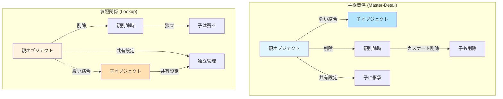

# Salesforceの主従関係と参照関係の違い

## What's this file?
> [!NOTE]
> **What**
> 
> Salesforceの主従関係（Master-Detail Relationship）と参照関係（Lookup Relationship）の違いについて記載しています。

## Conclusion (忙しいとき向け)
> [!IMPORTANT]
> **What** : Salesforceの主従関係と参照関係とは何か
> 
> **Answer** : 主従関係は親子の強い結びつきで、親レコードの削除時に子レコードも削除される。参照関係は緩い結びつきで、親レコードを削除しても子レコードは残る。

## 目次

目次を開く

- [主従関係（Master-Detail Relationship）](#主従関係master-detail-relationship)
- [参照関係（Lookup Relationship）](#参照関係lookup-relationship)
- [主要な違い](#主要な違い)
- [関係性のフローチャート](#関係性のフローチャート)
- [使い分けの指針](#使い分けの指針)

## 主従関係（Master-Detail Relationship）

主従関係は、親オブジェクトと子オブジェクトの間に強い結びつきを作る関係です。

### 特徴
- **親レコードが必須**: 子レコードは必ず親レコードを持つ必要がある
- **カスケード削除**: 親レコードを削除すると、関連する子レコードも自動的に削除される
- **共有設定の継承**: 子レコードは親レコードの共有設定を継承する
- **積み上げ集計項目**: 親オブジェクトで子レコードの集計が可能
- **レコード所有者**: 子レコードの所有者は親レコードの所有者と同じ

### 制限事項
- 標準オブジェクトを子にできない（一部例外あり）
- 関係項目は必須項目となる
- 子オブジェクトは最大2つの主従関係を持てる

## 参照関係（Lookup Relationship）

参照関係は、2つのオブジェクト間に緩い結びつきを作る関係です。

### 特徴
- **親レコードは任意**: 子レコードは親レコードを持たなくても存在できる
- **独立した削除**: 親レコードを削除しても子レコードは残る
- **独立した共有設定**: それぞれのレコードが独自の共有設定を持つ
- **柔軟な関係**: 関係を後から変更・削除が容易
- **レコード所有者**: 子レコードは独自の所有者を持てる

### 制限事項
- 積み上げ集計項目は使用できない（プロセスビルダーやFlowで代替可能）
- カスケード削除はされない

## 主要な違い

| 項目 | 主従関係 | 参照関係 |
|------|----------|----------|
| 親レコードの必須性 | 必須 | 任意 |
| カスケード削除 | あり | なし |
| 共有設定 | 親から継承 | 独立 |
| 積み上げ集計 | 可能 | 不可 |
| 所有者 | 親と同じ | 独立 |
| 関係の変更 | 制限あり | 柔軟 |

## 関係性のフローチャート

## 使い分けの指針

### 主従関係を選ぶべき場合
- 子レコードが親レコードなしでは意味をなさない場合
- 親レコードの削除時に子レコードも削除したい場合
- 積み上げ集計が必要な場合
- セキュリティを親レコードで一元管理したい場合

### 参照関係を選ぶべき場合
- 子レコードが独立して存在できる必要がある場合
- 柔軟な関係設定が必要な場合
- 標準オブジェクトを子にしたい場合
- それぞれのレコードで異なる共有設定が必要な場合

## 関連
- [Salesforce公式ドキュメント - オブジェクトリレーション](https://help.salesforce.com/s/articleView?id=sf.overview_of_custom_object_relationships.htm)
- [積み上げ集計項目の作成方法](https://trailhead.salesforce.com/ja/content/learn/modules/point_click_business_logic/roll_up_summary_fields)