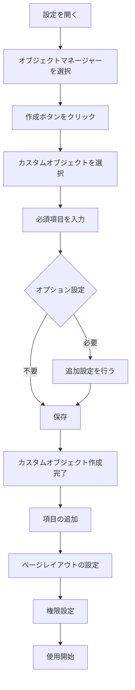

# Salesforceのオブジェクトマネージャーでカスタムオブジェクトを作成する方法

## What's this file?
> [!NOTE]
> **How**
> 
> どのようにSalesforceのオブジェクトマネージャーを使用してカスタムオブジェクトを作成するかについて記載しています。

## Conclusion (忙しいとき向け)
> [!IMPORTANT]
> **How** : どのようにSalesforceでカスタムオブジェクトを作成するか
> 
> **Answer** : 設定 → オブジェクトマネージャー → 作成 → カスタムオブジェクト から、必要な項目を入力して保存する

## 目次

目次を開く

- [カスタムオブジェクトとは](#カスタムオブジェクトとは)
- [カスタムオブジェクト作成の流れ](#カスタムオブジェクト作成の流れ)
- [設定項目の詳細](#設定項目の詳細)
- [作成後の設定](#作成後の設定)
- [ベストプラクティス](#ベストプラクティス)

## カスタムオブジェクトとは

カスタムオブジェクトは、Salesforceの標準オブジェクト（Account、Contact、Opportunityなど）では対応できない独自のビジネス要件に応じて作成するデータベーステーブルです。

### 用途例
- プロジェクト管理
- 在庫管理
- 顧客満足度調査
- 独自の業務プロセス

## カスタムオブジェクト作成の流れ

### 作成フローチャート

### 詳細手順

#### 1. 設定画面へのアクセス
1. Salesforceにログイン
2. 歯車アイコンをクリック
3. 「設定」を選択

#### 2. オブジェクトマネージャーの選択
1. クイック検索に「オブジェクトマネージャー」と入力
2. 「オブジェクトマネージャー」をクリック

#### 3. カスタムオブジェクトの作成
1. 「作成」ボタンをクリック
2. 「カスタムオブジェクト」を選択

## 設定項目の詳細

### 必須項目

| 項目名 | 説明 | 例 |
|--------|------|-----|
| 表示ラベル | UIに表示される名前 | プロジェクト |
| 表示ラベル（複数形） | 複数形での表示名 | プロジェクト |
| オブジェクト名 | API参照用の名前 | Project |
| レコード名 | レコードの識別子の設定 | プロジェクト名 |
| データ型 | レコード名のデータ型 | テキスト/自動採番 |

### オプション項目

| 項目名 | 説明 | 推奨設定 |
|--------|------|----------|
| レポートを許可 | レポートで使用可能にする | ✓ |
| 活動を許可 | ToDo・行動を関連付ける | ✓ |
| 項目履歴管理 | 項目の変更履歴を記録 | ✓ |
| 検索を許可 | グローバル検索の対象にする | ✓ |
| 一括API対応 | API経由での一括処理を許可 | ✓ |
| ストリーミングAPI対応 | リアルタイム通知を有効化 | 必要に応じて |

### 展開状況の選択
- **開発中**: 管理者のみアクセス可能
- **リリース済み**: すべてのユーザーがアクセス可能

## 作成後の設定

### 1. カスタム項目の追加

### 2. ページレイアウトの設定
- 必要な項目を配置
- セクションの作成
- 関連リストの設定

### 3. 権限設定
1. プロファイルまたは権限セットで設定
2. CRUD権限の付与
   - 作成（Create）
   - 参照（Read）
   - 編集（Update）
   - 削除（Delete）

### 4. タブの作成
1. 設定 → タブ → カスタムオブジェクトタブ → 新規
2. オブジェクト、タブスタイル、プロファイルを選択

## ベストプラクティス

### 命名規則
- **表示ラベル**: 日本語でわかりやすく
- **API名**: 英語、キャメルケース使用
- **プレフィックス**: 組織独自の識別子を付ける（例: ABC_Project__c）

### 設計の考慮事項
1. **リレーションシップ**: 他オブジェクトとの関係を事前に設計
2. **項目数**: 必要最小限に抑える（パフォーマンスへの影響）
3. **共有設定**: セキュリティ要件に応じて適切に設定
4. **バックアップ**: メタデータのバックアップを定期的に取得

### よくある間違い
- レコード名を「名前」にすると、検索やリストビューで識別しづらい
- 展開状況を「リリース済み」にする前の十分なテスト不足
- 項目レベルセキュリティの設定忘れ

## 関連
- [Salesforceの標準オブジェクト一覧](./2025.08.12.22.03_what_salesforce_standard_objects_by_records.md)
- [Salesforceのリレーションシップ設定方法](./2025.08.15.08.42_what_salesforce_master_detail_vs_lookup_relationship.md)
- [Salesforceの参照関係フィールド](./2025.08.15.08.38_what_salesforce_lookup_field_reference_relation.md)