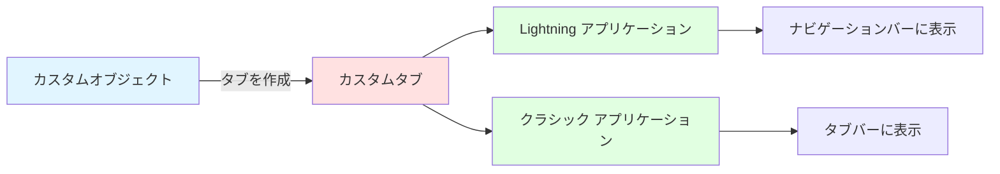
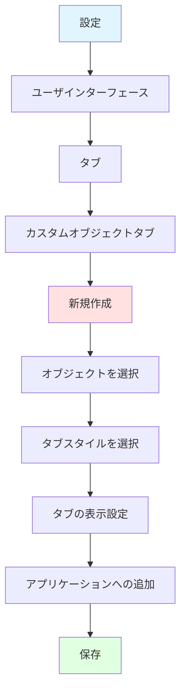
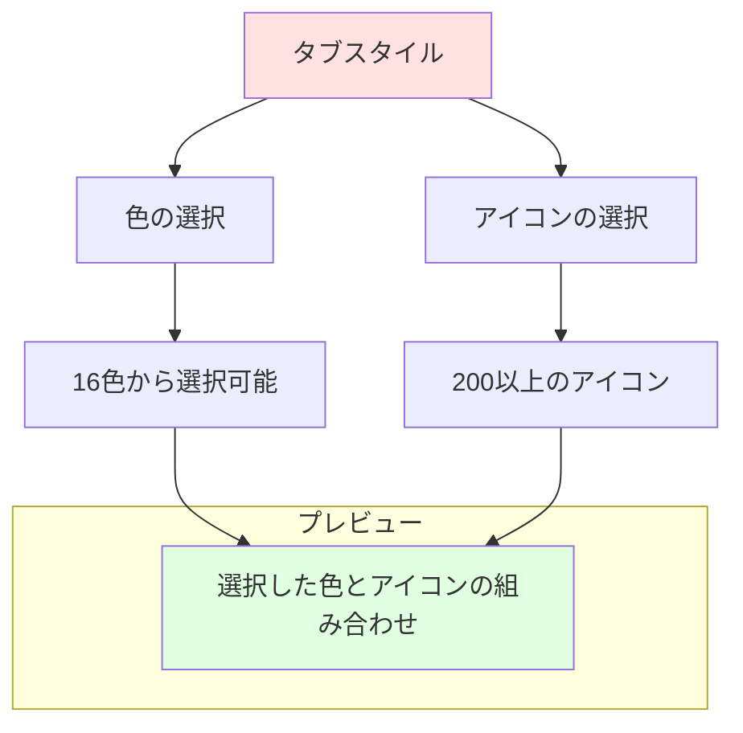
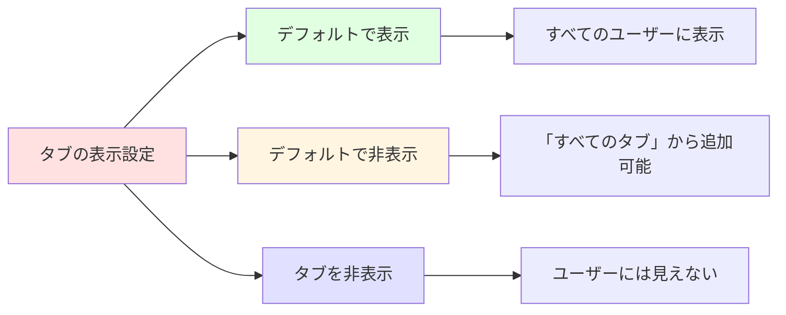
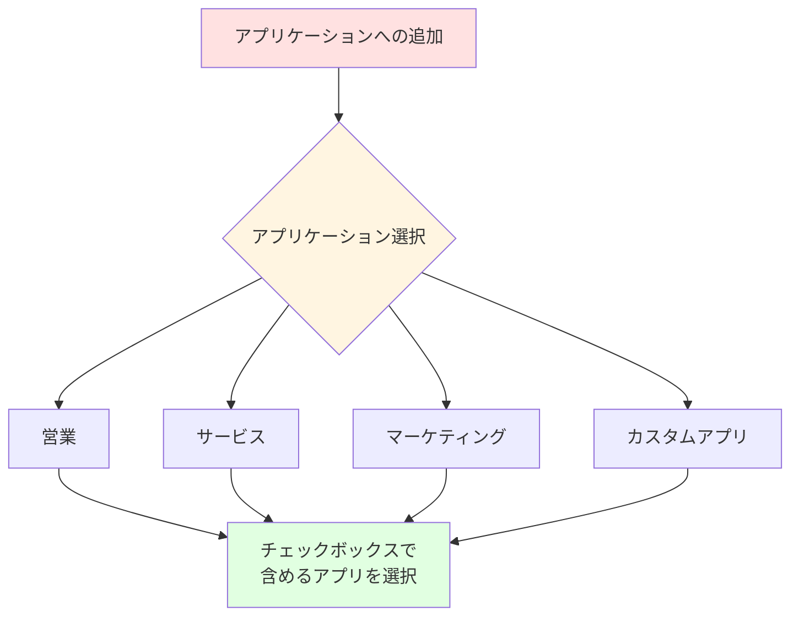
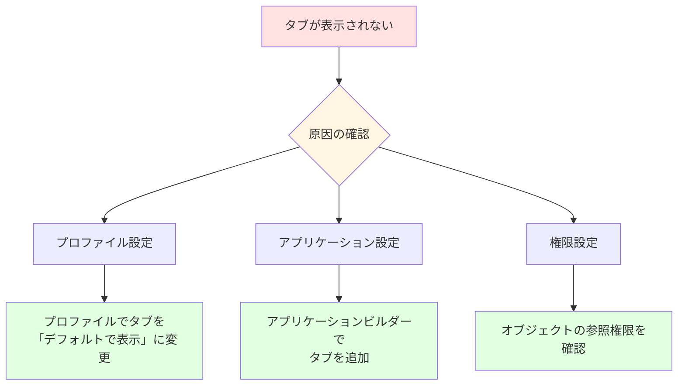

# Salesforceでカスタムオブジェクトのカスタムタブを設定する方法

## What's this file?
> [!NOTE]
> **How**
> 
> どのようにSalesforceでカスタムオブジェクトのカスタムタブを設定するかについて記載しています。

## Conclusion (忙しいとき向け)
> [!IMPORTANT]
> **How** : どのようにカスタムオブジェクトのカスタムタブを設定するか
> 
> **Answer** : 設定→タブ→カスタムオブジェクトタブ→新規作成から、対象オブジェクトを選択し、タブスタイル（色とアイコン）を設定してプロファイルへの表示設定を行う。

## 目次

目次を開く

- [カスタムタブとは](#カスタムタブとは)
- [カスタムタブ作成の前提条件](#カスタムタブ作成の前提条件)
- [カスタムタブの作成手順](#カスタムタブの作成手順)
- [タブスタイルの設定](#タブスタイルの設定)
- [プロファイルへの表示設定](#プロファイルへの表示設定)
- [アプリケーションへの追加](#アプリケーションへの追加)
- [トラブルシューティング](#トラブルシューティング)

## カスタムタブとは

カスタムタブは、カスタムオブジェクトにアクセスするためのナビゲーション要素です。Lightning Experienceやクラシックビューの両方で、ユーザーがオブジェクトのデータにアクセスできるようになります。

## カスタムタブ作成の前提条件

### 必要な権限
- 「アプリケーションのカスタマイズ」権限
- カスタムオブジェクトが既に作成されていること

### 確認事項
1. カスタムオブジェクトのAPI名を確認
2. 使用するユーザープロファイルを把握
3. 配置するアプリケーションを決定

## カスタムタブの作成手順

### 詳細手順

#### 1. 設定画面へのアクセス
1. 設定（歯車アイコン）をクリック
2. 「設定」を選択

#### 2. タブメニューへの移動
1. クイック検索で「タブ」を検索
2. 「タブ」を選択

#### 3. カスタムオブジェクトタブの新規作成
1. 「カスタムオブジェクトタブ」セクションで「新規」をクリック
2. オブジェクトドロップダウンから対象のカスタムオブジェクトを選択

## タブスタイルの設定

### タブスタイルの要素

### 設定項目
1. **タブスタイル**: 色とアイコンの組み合わせを選択
2. **スプラッシュページのカスタムリンク**: オプション（初回アクセス時の説明ページ）
3. **説明**: タブの説明（任意）

## プロファイルへの表示設定

### タブの表示設定オプション

### プロファイル別設定
1. 各プロファイルに対して以下を選択：
   - **デフォルトで表示**: タブが常に表示される
   - **デフォルトで非表示**: ユーザーが手動で追加可能
   - **タブを非表示**: タブへのアクセス不可

## アプリケーションへの追加

### アプリケーション選択画面

### 追加手順
1. 表示させたいアプリケーションをチェック
2. 「保存」をクリック

## トラブルシューティング

### よくある問題と解決方法

#### タブが表示されない場合

### チェックリスト
1. ✓ カスタムオブジェクトに対する参照権限があるか
2. ✓ プロファイルでタブが表示設定になっているか
3. ✓ 使用しているアプリケーションにタブが含まれているか
4. ✓ Lightning Experienceの場合、アプリケーションビルダーで設定されているか

## 関連

- [カスタムオブジェクトの作成方法](https://help.salesforce.com/s/articleView?id=sf.dev_objectcreate_task.htm)
- [プロファイルの管理](https://help.salesforce.com/s/articleView?id=sf.users_profiles_about.htm)
- [Lightning アプリケーションビルダー](https://help.salesforce.com/s/articleView?id=sf.lightning_app_builder_overview.htm)