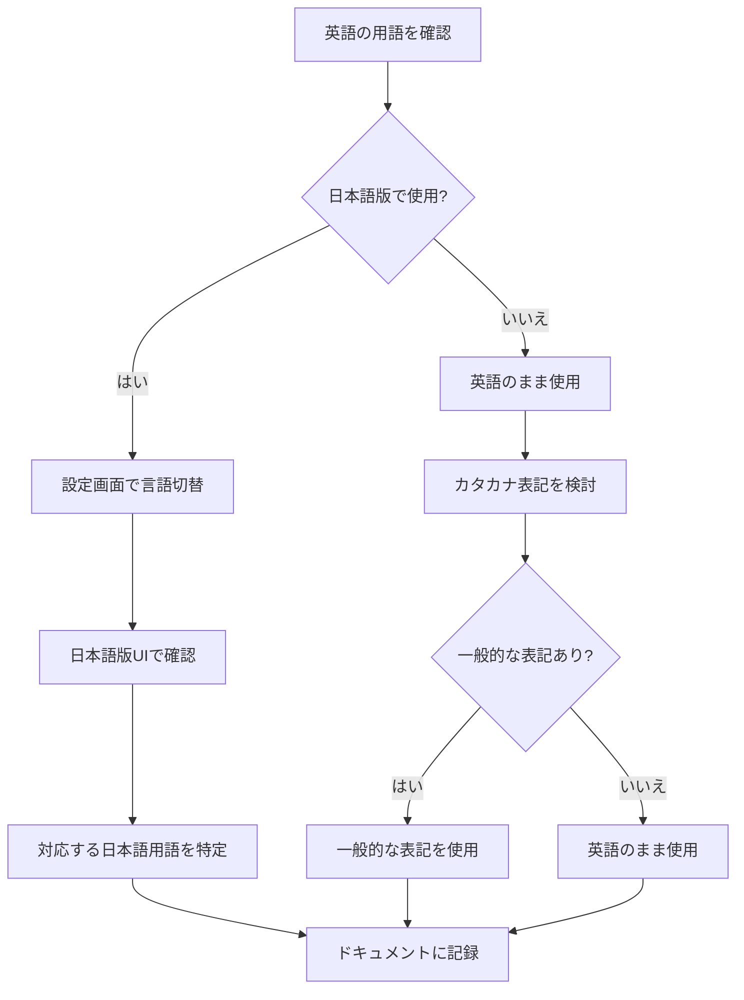

# Salesforceの英日用語対応表

## What's this file?
> [!NOTE]
> **What**
> 
> Salesforceの英日用語対応とは何かについて記載しています。

## Conclusion (忙しいとき向け)
> [!IMPORTANT]
> **What** : Salesforceの英日用語対応とは何か
> 
> **Answer** : Salesforceの英語版と日本語版で使用される用語の対応関係を示した一覧表。UIの言語設定を変更した際や、英語のドキュメントを参照する際に必要となる用語の対照表

## 目次

目次を開く

- [基本的な用語対応](#基本的な用語対応)
- [オブジェクト関連の用語](#オブジェクト関連の用語)
- [機能・設定関連の用語](#機能・設定関連の用語)
- [権限・セキュリティ関連の用語](#権限・セキュリティ関連の用語)
- [開発関連の用語](#開発関連の用語)
- [用語対応の確認フロー](#用語対応の確認フロー)

## 基本的な用語対応

### 主要な標準オブジェクト

| English | 日本語 | 備考 |
|---------|--------|------|
| Account | 取引先 | 企業や組織を表す |
| Contact | 取引先責任者 | 個人の連絡先情報 |
| Lead | リード | 見込み客 |
| Opportunity | 商談 | 営業案件 |
| Case | ケース | サポート案件 |
| Campaign | キャンペーン | マーケティング活動 |
| Contract | 契約 | 契約情報 |
| Product | 商品 | 製品・サービス |
| Price Book | 価格表 | 価格設定情報 |
| Quote | 見積 | 見積書 |
| Order | 注文 | 注文情報 |
| Asset | 納入商品 | 顧客が所有する製品 |

### UI要素・画面関連

| English | 日本語 | 備考 |
|---------|--------|------|
| Tab | タブ | アプリケーション内のナビゲーション |
| Home | ホーム | ホーム画面 |
| List View | リストビュー | レコード一覧表示 |
| Related List | 関連リスト | 関連レコードの一覧 |
| Page Layout | ページレイアウト | レコード詳細画面の配置 |
| Record Type | レコードタイプ | レコードの種類 |
| Compact Layout | コンパクトレイアウト | モバイル用レイアウト |
| Global Search | グローバル検索 | 全体検索機能 |

## オブジェクト関連の用語

### フィールドタイプ

| English | 日本語 | 備考 |
|---------|--------|------|
| Text | テキスト | 文字列項目 |
| Number | 数値 | 数値項目 |
| Currency | 通貨 | 金額項目 |
| Date | 日付 | 日付のみ |
| Date/Time | 日付/時間 | 日時項目 |
| Picklist | 選択リスト | ドロップダウンリスト |
| Multi-Select Picklist | 複数選択リスト | 複数選択可能なリスト |
| Checkbox | チェックボックス | はい/いいえ |
| Formula | 数式 | 計算項目 |
| Lookup Relationship | 参照関係 | 他オブジェクトへの参照 |
| Master-Detail Relationship | 主従関係 | 親子関係 |
| Roll-Up Summary | 積み上げ集計 | 子レコードの集計 |

### オブジェクト設定

| English | 日本語 | 備考 |
|---------|--------|------|
| Field | 項目 | データフィールド |
| Field Set | 項目セット | 項目のグループ |
| Validation Rule | 入力規則 | データ検証ルール |
| Workflow Rule | ワークフロールール | 自動化ルール |
| Process Builder | プロセスビルダー | ビジュアルワークフロー |
| Flow | フロー | 自動化フロー |
| Approval Process | 承認プロセス | 承認ワークフロー |

## 機能・設定関連の用語

### 管理設定

| English | 日本語 | 備考 |
|---------|--------|------|
| Setup | 設定 | 管理者設定画面 |
| Object Manager | オブジェクトマネージャー | オブジェクト管理 |
| App Manager | アプリケーションマネージャー | アプリ管理 |
| User | ユーザ | システムユーザー |
| Profile | プロファイル | ユーザー権限セット |
| Permission Set | 権限セット | 追加権限 |
| Role | ロール | 階層ロール |
| Public Group | 公開グループ | ユーザーグループ |
| Organization | 組織 | Salesforce組織 |

### データ管理

| English | 日本語 | 備考 |
|---------|--------|------|
| Import | インポート | データ取り込み |
| Export | エクスポート | データ出力 |
| Data Loader | データローダ | 大量データ処理ツール |
| Mass Update | 一括更新 | 複数レコード更新 |
| Duplicate Management | 重複管理 | 重複データ制御 |
| Record Owner | レコード所有者 | データの所有者 |
| Sharing Rule | 共有ルール | データ共有設定 |

## 権限・セキュリティ関連の用語

### アクセス権限

| English | 日本語 | 備考 |
|---------|--------|------|
| Read | 参照 | 読み取り権限 |
| Create | 作成 | 新規作成権限 |
| Edit | 編集 | 更新権限 |
| Delete | 削除 | 削除権限 |
| View All | すべて参照 | 全データ参照 |
| Modify All | すべて変更 | 全データ変更 |
| Field-Level Security | 項目レベルセキュリティ | 項目単位の権限 |
| Object Permissions | オブジェクト権限 | オブジェクト単位の権限 |

### セキュリティ設定

| English | 日本語 | 備考 |
|---------|--------|------|
| Login IP Ranges | ログインIPアドレスの制限 | IP制限 |
| Session Settings | セッションの設定 | セッション管理 |
| Password Policies | パスワードポリシー | パスワード規則 |
| Single Sign-On | シングルサインオン | SSO設定 |
| Two-Factor Authentication | 2要素認証 | 2段階認証 |

## 開発関連の用語

### 開発ツール・機能

| English | 日本語 | 備考 |
|---------|--------|------|
| Apex | Apex | プログラミング言語 |
| Visualforce | Visualforce | UIフレームワーク |
| Lightning Component | Lightningコンポーネント | コンポーネントフレームワーク |
| Lightning Web Component | Lightning Webコンポーネント | モダンWebコンポーネント |
| SOQL | SOQL | クエリ言語 |
| SOSL | SOSL | 検索言語 |
| Trigger | トリガ | データベーストリガー |
| Batch Apex | バッチApex | バッチ処理 |
| Scheduled Apex | スケジュール済みApex | 定期実行処理 |

### 開発環境

| English | 日本語 | 備考 |
|---------|--------|------|
| Developer Console | 開発者コンソール | 開発ツール |
| Sandbox | Sandbox | テスト環境 |
| Change Set | 変更セット | メタデータ移行ツール |
| Deployment | リリース | 本番環境への反映 |
| Debug Log | デバッグログ | 実行ログ |

## 用語対応の確認フロー

### 注意事項

1. **バージョンによる違い**
   - Salesforceのバージョンアップにより、用語が変更される場合がある
   - Classic版とLightning Experience版で異なる場合がある

2. **コンテキストによる違い**
   - 同じ英語でも文脈により異なる日本語訳になる場合がある
   - 例: "Record" → "レコード" または "記録"

3. **カスタマイズによる影響**
   - 組織の設定により、標準の日本語訳と異なる場合がある
   - カスタム表示ラベルが設定されている可能性

4. **英語のまま使用される用語**
   - 技術的な用語は英語のまま使用されることが多い
   - 例: Apex, SOQL, API, Sandbox

## 関連
- [Salesforceの標準オブジェクト一覧](./2025.08.12.22.03_what_salesforce_standard_objects_by_records.md)
- [Salesforceオブジェクトの関連性](./2025.08.12.22.25_how_salesforce_objects_relate_each_other.md)
- [Salesforceのシステム項目](./2025.08.13.06.48_what_salesforce_system_audit_fields.md)