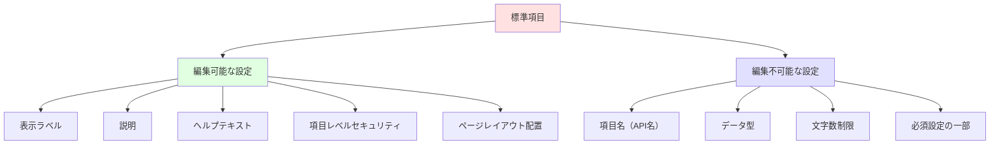
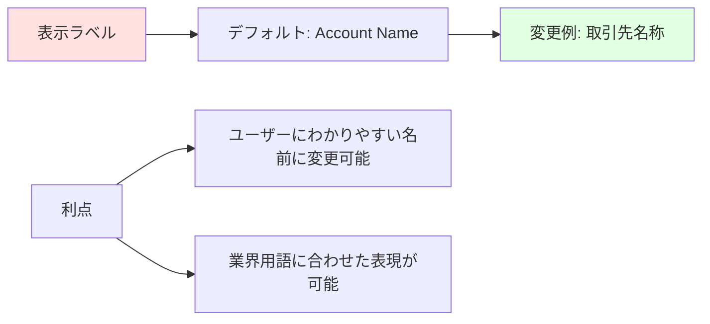
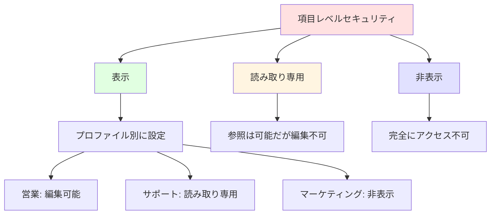
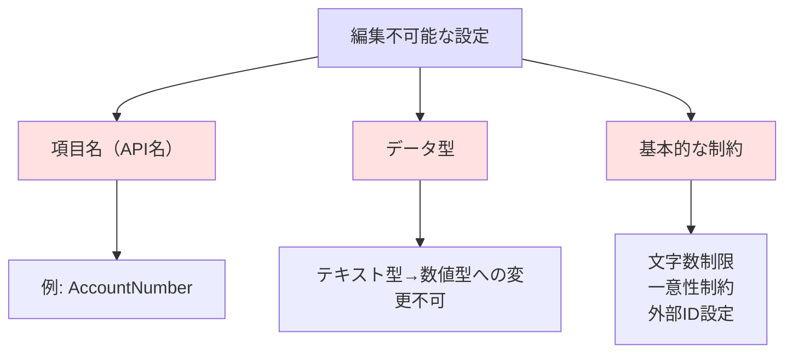
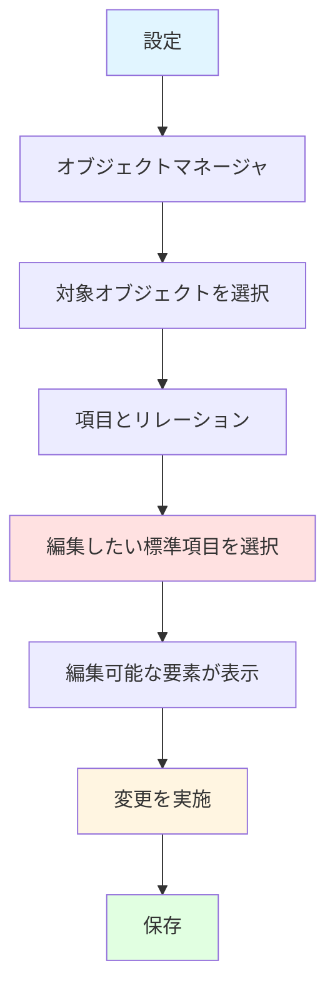
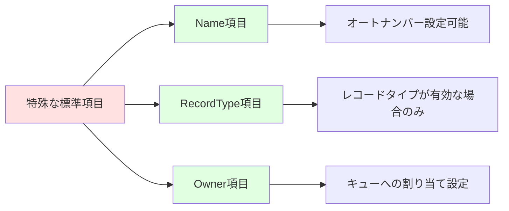
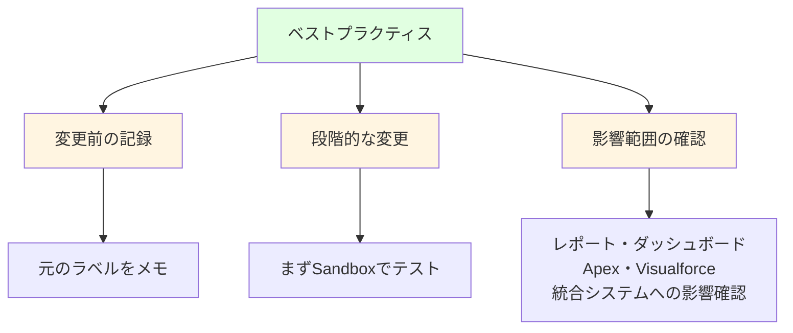

# Salesforceの標準項目で編集可能な設定項目

## What's this file?
> [!NOTE]
> **What**
> 
> Salesforceの標準項目で編集可能な設定項目とは何かについて記載しています。

## Conclusion (忙しいとき向け)
> [!IMPORTANT]
> **What** : Salesforceの標準項目で編集可能な設定項目とは何か
> 
> **Answer** : 標準項目では、表示ラベル、説明、ヘルプテキスト、項目レベルセキュリティ、ページレイアウトへの配置は編集可能だが、項目名（API名）、データ型、文字数制限などの基本的な属性は変更できない。

## 目次

目次を開く

- [標準項目の概要](#標準項目の概要)
- [編集可能な設定項目](#編集可能な設定項目)
- [編集不可能な設定項目](#編集不可能な設定項目)
- [標準項目の編集方法](#標準項目の編集方法)
- [オブジェクト別の注意事項](#オブジェクト別の注意事項)
- [ベストプラクティス](#ベストプラクティス)

## 標準項目の概要

標準項目は、Salesforceがあらかじめ用意している項目で、各標準オブジェクトに含まれています。これらの項目は基本的な機能を提供しますが、一部の設定は組織のニーズに合わせてカスタマイズ可能です。

## 編集可能な設定項目

### 1. 表示ラベル

### 2. 説明
- 項目の用途や入力ルールを記載
- 管理者向けのメモとして活用
- 最大255文字まで入力可能

### 3. ヘルプテキスト
- ユーザーが項目の横の「?」アイコンをクリックすると表示
- 入力方法や例を提供
- 最大510文字まで入力可能

### 4. 項目レベルセキュリティ

### 5. ページレイアウトへの配置
- 項目の表示位置を調整
- 必須/読み取り専用の設定（レイアウトレベル）
- セクションへのグループ化

## 編集不可能な設定項目

### 固定される設定

### 制限事項の例

| 標準項目 | データ型 | 変更可否 | 備考 |
|---------|---------|----------|------|
| Name | テキスト(80) | 型変更不可 | ラベルのみ変更可能 |
| CreatedDate | 日時 | 完全に編集不可 | システム管理項目 |
| OwnerId | 参照 | 型変更不可 | 所有者の概念は固定 |
| Phone | 電話 | 型変更不可 | 形式は固定 |

## 標準項目の編集方法

### 編集手順

### 具体的な編集例

1. **取引先の「電話」項目**
   - 表示ラベル: 「電話」→「代表電話番号」
   - ヘルプテキスト: 「ハイフンなしで入力してください」
   - 項目レベルセキュリティ: 特定プロファイルに非表示

2. **商談の「確度」項目**
   - 表示ラベル: 「確度」→「受注確率(%)」
   - 説明: 「営業担当者の判断による受注可能性」

## オブジェクト別の注意事項

### 特殊な標準項目

### オブジェクト固有の制限

1. **ユーザオブジェクト**
   - Username: ラベル変更不可
   - Email: 必須設定変更不可

2. **活動オブジェクト**
   - Subject: データ型固定
   - ActivityDate: 必須設定はタスクのみ

3. **商品オブジェクト**
   - ProductCode: 一意性制約あり
   - IsActive: ブール型固定

## ベストプラクティス

### 推奨事項

### チェックリスト

- [ ] 変更の目的と範囲を明確化
- [ ] Sandboxでの事前テスト
- [ ] ユーザーへの変更通知準備
- [ ] ドキュメントの更新
- [ ] トレーニング資料の修正
- [ ] 関連するレポートの確認

## 関連

- [項目レベルセキュリティの設定](https://help.salesforce.com/s/articleView?id=sf.users_fields_security.htm)
- [ページレイアウトのカスタマイズ](https://help.salesforce.com/s/articleView?id=sf.customize_layout.htm)
- [標準オブジェクトリファレンス](https://developer.salesforce.com/docs/atlas.ja-jp.object_reference.meta/object_reference/sforce_api_objects_list.htm)