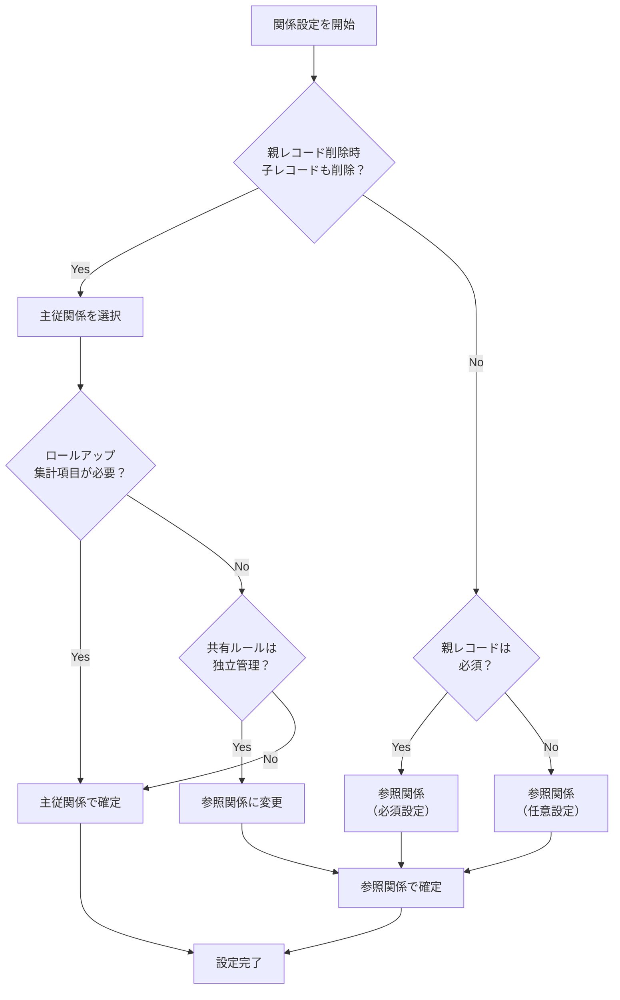
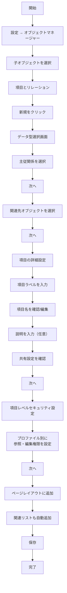
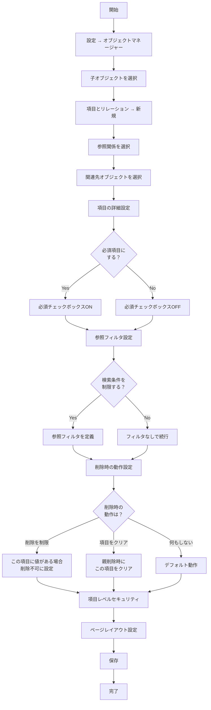
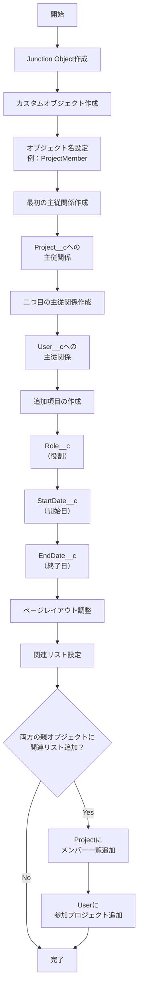
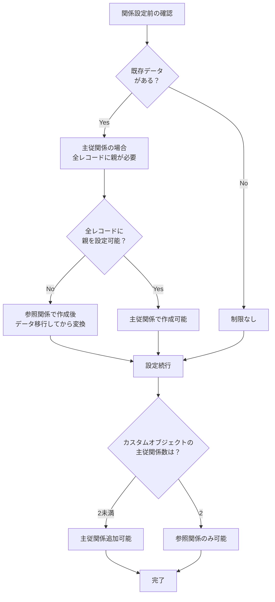
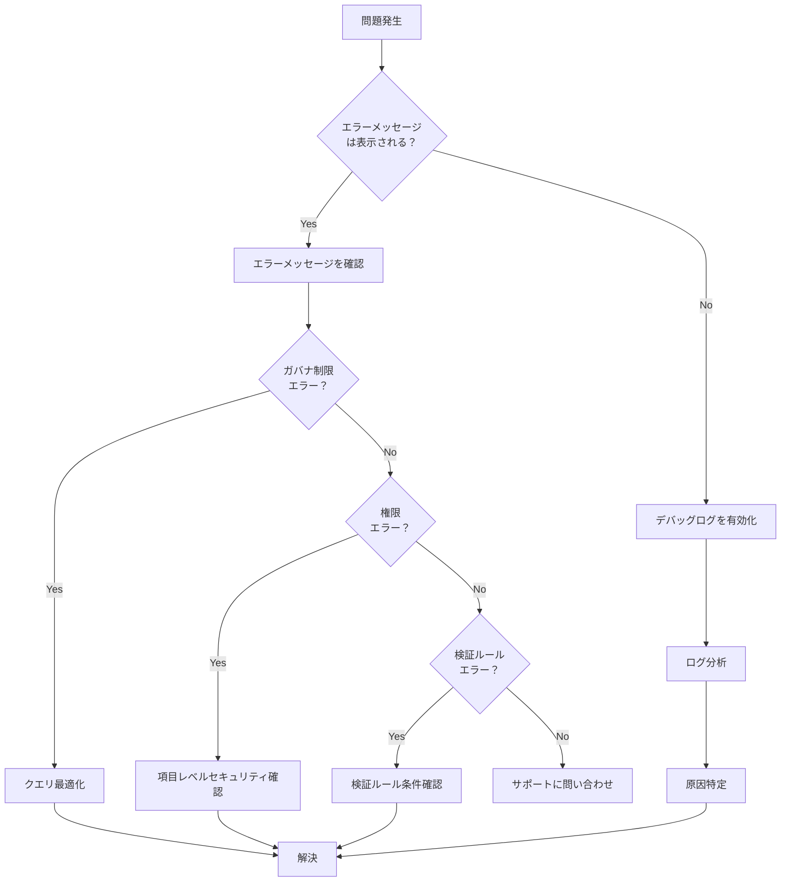

# Salesforceでカスタムオブジェクトの関係を設定する方法

## What's this file?
> [!NOTE]
> **How**
> 
> どのようにSalesforceでカスタムオブジェクトの関係を設定するかについて記載しています。

## Conclusion (忙しいとき向け)
> [!IMPORTANT]
> **How** : どのようにSalesforceでカスタムオブジェクトの関係を設定するか
> 
> **Answer** : オブジェクトマネージャーでカスタム項目を作成し、データ型として「主従関係」または「参照関係」を選択。関連オブジェクトを指定し、項目レベルセキュリティとページレイアウトを設定することで実現。

## 目次

<details>
<summary>目次を開く</summary>

- [前提知識](#前提知識)
- [関係の種類](#関係の種類)
- [主従関係の設定手順](#主従関係の設定手順)
- [参照関係の設定手順](#参照関係の設定手順)
- [多対多関係の設定手順](#多対多関係の設定手順)
- [関係設定後の作業](#関係設定後の作業)
- [設定時の注意点](#設定時の注意点)
- [トラブルシューティング](#トラブルシューティング)

</details>

## 前提知識

### Salesforceの関係タイプ
1. **主従関係（Master-Detail）**
   - 親レコードが削除されると子レコードも削除
   - 子レコードは親レコードが必須
   - 最大2つまで設定可能

2. **参照関係（Lookup）**
   - 親レコードが削除されても子レコードは残る
   - 親レコードは任意（必須にも設定可能）
   - 制限なく設定可能

3. **多対多関係（Many-to-Many）**
   - Junction Objectを介して実現
   - 2つの主従関係で構成

## 関係の種類

### 選択基準フローチャート



## 主従関係の設定手順

### 手順詳細



### 設定項目の詳細

1. **項目ラベル**
   - ユーザーに表示される名前
   - 日本語対応可能
   - 例：「親取引先」「関連商談」

2. **項目名（API参照名）**
   - プログラムで使用する名前
   - 英数字とアンダースコアのみ
   - 例：`Parent_Account__c`

3. **共有設定**
   - 「読み取り/書き込み」：子レコードの編集可能
   - 「読み取り専用」：子レコードの参照のみ

## 参照関係の設定手順

### 基本設定フロー



### 参照フィルタの設定例

```
条件例：
- 有効な取引先のみ選択可能
  フィルタ条件：Active__c = true
  
- 同じレコードタイプのみ選択可能
  フィルタ条件：RecordTypeId = {!RecordTypeId}
  
- 特定の部門のみ選択可能
  フィルタ条件：Department__c = 'Sales'
```

## 多対多関係の設定手順

### Junction Objectの作成



### Junction Objectの命名規則
- 両方のオブジェクト名を含める
- 例：`AccountContact`、`ProjectMember`
- 関係の性質を表す名前も可
- 例：`Assignment`、`Enrollment`

## 関係設定後の作業

### 必須設定項目

1. **関連リストの配置**
   ```
   親オブジェクトのページレイアウト編集
   → 関連リストセクション
   → 新しい関連リストをドラッグ&ドロップ
   → 表示項目を選択
   → 保存
   ```

2. **項目レベルセキュリティ**
   ```
   プロファイル別設定：
   - システム管理者：参照・編集可
   - 標準ユーザー：参照のみ
   - ゲストユーザー：非表示
   ```

3. **検証ルール**
   ```
   例：親レコードのステータスチェック
   AND(
     ISPICKVAL(Parent__r.Status__c, 'Closed'),
     ISCHANGED(Amount__c)
   )
   エラーメッセージ：クローズ済みの親レコードの子レコードは編集できません
   ```

### 推奨設定項目

1. **ワークフロールール**
   - 親レコード更新時の子レコード自動更新
   - 関係作成時の通知設定

2. **レポートタイプ作成**
   - 親子関係を含むカスタムレポートタイプ
   - クロスオブジェクトレポートの有効化

3. **権限セット**
   - 関係項目への特別なアクセス権限
   - 一時的な編集権限の付与

## 設定時の注意点

### 制限事項チェックリスト



### パフォーマンス考慮事項

1. **インデックス設定**
   - 外部IDとして設定
   - 一意性の強制
   - 検索パフォーマンスの向上

2. **ガバナ制限**
   - SOQLクエリでの結合数制限
   - 関連レコードの取得数制限
   - トリガーでの再帰処理注意

3. **データスキュー対策**
   - 1つの親に10,000件以上の子レコードを避ける
   - 必要に応じて中間オブジェクトを検討

## トラブルシューティング

### よくある問題と解決方法

1. **「このオブジェクトはすでに2つの主従関係を持っています」**
   - 解決：参照関係を使用するか、既存の主従関係を参照関係に変換

2. **「必須の主従関係項目に値がありません」**
   - 解決：データローダーで一括更新、または一時的に参照関係として作成

3. **「循環参照が検出されました」**
   - 解決：階層関係の見直し、自己参照の場合は参照関係を使用

4. **「親レコードを削除できません」**
   - 解決：子レコードを先に削除、または参照関係の削除設定を変更

### デバッグ手順



## 関連

### 関連機能
- **スキーマビルダー**: 視覚的に関係を設定・確認
- **データローダー**: 関係データの一括インポート
- **フロービルダー**: 関係に基づく自動化処理
- **Apex トリガー**: 関係変更時のカスタムロジック

### 関連概念
- **オブジェクトリレーション**: データモデルの基本
- **ERD（Entity Relationship Diagram）**: 関係の設計図
- **正規化**: データベース設計の原則
- **親子関係のベストプラクティス**: 設計パターン

### 次のステップ
- ロールアップ集計項目の作成
- クロスオブジェクト数式の活用
- 関係に基づくレポート作成
- プロセスビルダーでの関係活用