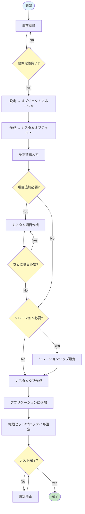
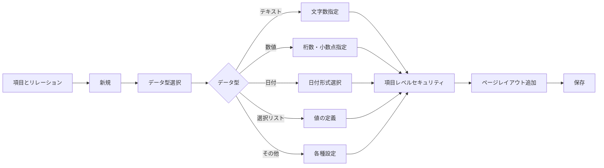
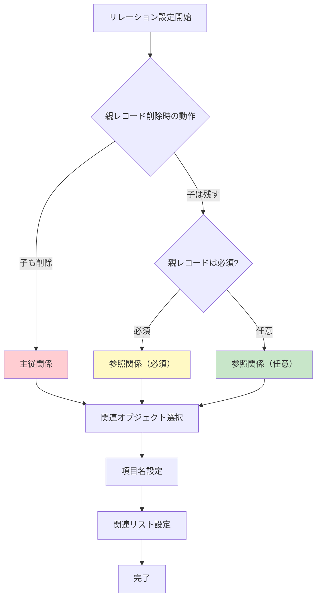
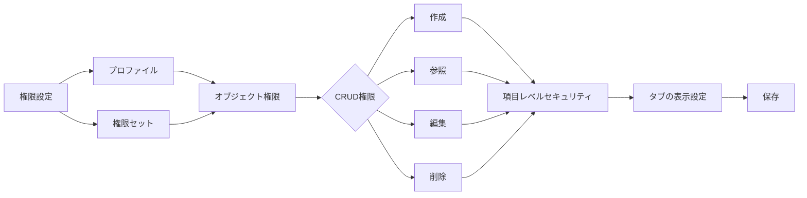

# Salesforceでカスタムオブジェクトを作成する際のフローチャート

## What's this file?
> [!NOTE]
> **How**
> 
> どのようにSalesforceでカスタムオブジェクトを作成するかについて記載しています。

## Conclusion (忙しいとき向け)
> [!IMPORTANT]
> **How** : どのようにSalesforceでカスタムオブジェクトを作成するか
> 
> **Answer** : オブジェクトマネージャから作成 → 基本設定 → 項目作成 → リレーション設定 → タブ作成 → 権限設定の順で進める

## 目次

目次を開く

- [カスタムオブジェクト作成の全体フロー](#カスタムオブジェクト作成の全体フロー)
- [ステップ1: 事前準備](#ステップ1-事前準備)
- [ステップ2: オブジェクトの作成](#ステップ2-オブジェクトの作成)
- [ステップ3: カスタム項目の追加](#ステップ3-カスタム項目の追加)
- [ステップ4: リレーションシップの設定](#ステップ4-リレーションシップの設定)
- [ステップ5: カスタムタブの作成](#ステップ5-カスタムタブの作成)
- [ステップ6: 権限とアクセスの設定](#ステップ6-権限とアクセスの設定)
- [作成時の注意点](#作成時の注意点)

## カスタムオブジェクト作成の全体フロー

## ステップ1: 事前準備

### 要件定義のチェックリスト
- [ ] オブジェクトの目的と用途を明確化
- [ ] 必要な項目をリストアップ
- [ ] 他オブジェクトとの関係性を整理
- [ ] データ型の決定
- [ ] 命名規則の確認

## ステップ2: オブジェクトの作成

### 作成手順
1. **設定** → **オブジェクトマネージャー**を選択
2. **作成** → **カスタムオブジェクト**をクリック
3. 以下の基本情報を入力：

| 項目 | 説明 | 例 |
|------|------|-----|
| 表示ラベル | UIに表示される名前 | プロジェクト |
| 表示ラベル（複数形） | 複数形の表示名 | プロジェクト |
| オブジェクト名 | API参照名 | Project |
| レコード名 | レコードの識別名 | プロジェクト名 |
| データ型 | テキストまたは自動採番 | 自動採番 |

## ステップ3: カスタム項目の追加

## ステップ4: リレーションシップの設定

### リレーションタイプの選択フロー

## ステップ5: カスタムタブの作成

### タブ作成手順
1. **設定** → **タブ**を選択
2. **カスタムオブジェクトタブ**の**新規**をクリック
3. 設定項目：
   - オブジェクトを選択
   - タブスタイル（色・アイコン）を選択
   - タブの表示設定

## ステップ6: 権限とアクセスの設定

### 権限の種類
- **作成（Create）**: 新規レコード作成
- **参照（Read）**: レコード閲覧
- **編集（Edit）**: レコード更新
- **削除（Delete）**: レコード削除
- **すべて表示**: 組織全体のレコード参照
- **すべて変更**: 組織全体のレコード編集

## 作成時の注意点

### 命名規則
- **表示ラベル**: 日本語可、わかりやすい名前
- **API名**: 英数字とアンダースコア、末尾に__cが自動付加
- **項目名**: 末尾に__cが自動付加

### ベストプラクティス
1. **項目数の制限**: 1オブジェクトあたり最大800項目
2. **リレーション数の制限**: 考慮が必要
3. **インデックスの活用**: 検索性能向上のため
4. **説明欄の活用**: 後のメンテナンスのため

### よくある落とし穴
- 権限設定の漏れ
- タブ作成の忘れ
- 関連リストの設定漏れ
- 項目レベルセキュリティの未設定

## 関連
- [Salesforce公式ドキュメント - カスタムオブジェクト](https://help.salesforce.com/s/articleView?id=sf.dev_objectcreate_task_lex.htm)
- [主従関係と参照関係の違い](./2025.08.15.08.42_what_salesforce_master_detail_vs_lookup_relationship.md)
- [カスタムタブの設定方法](./2025.08.15.08.46_how_setting_custom_tab_for_custom_object_salesforce.md)