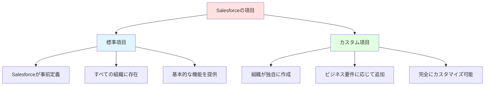
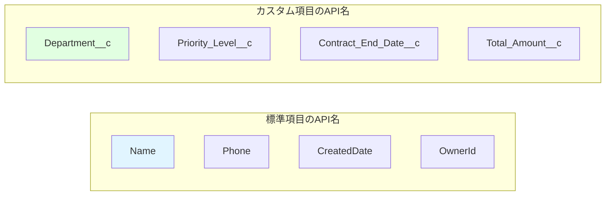
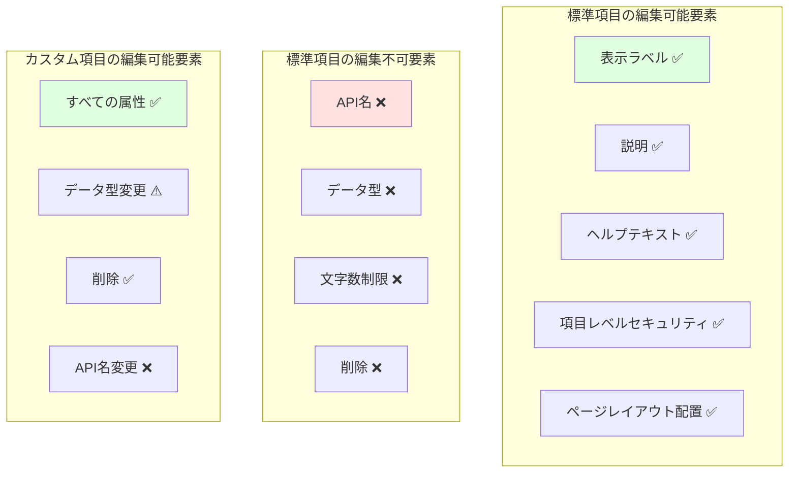
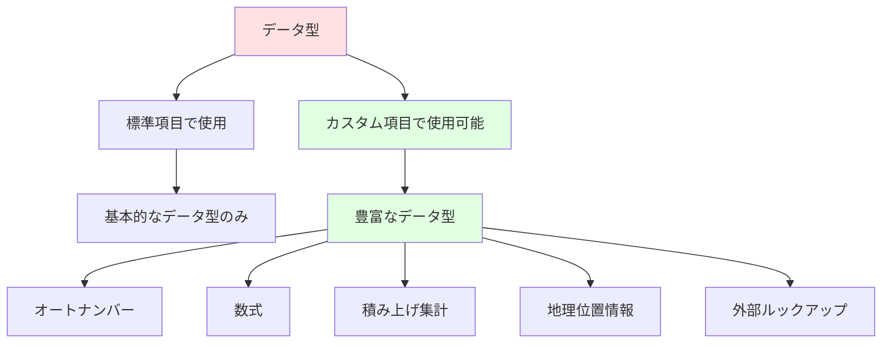
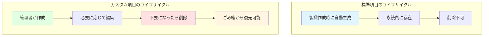
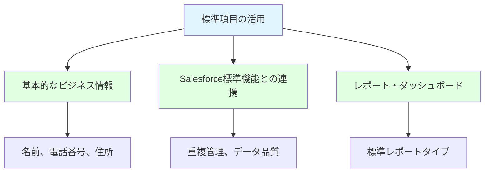
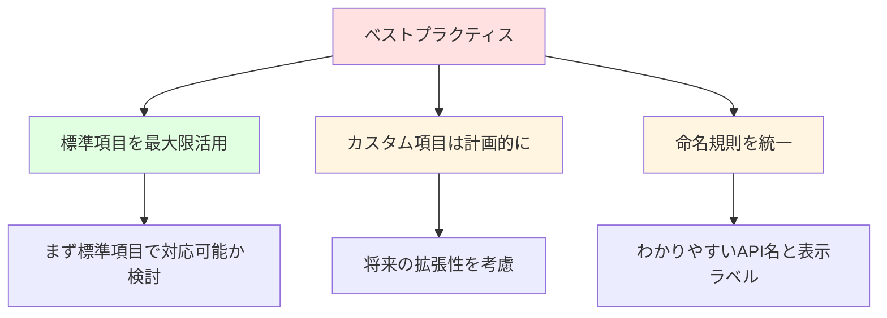

# Salesforceにおける標準項目とカスタム項目の違い

## What's this file?
> [!NOTE]
> **How**
> 
> どのようにSalesforceの標準項目とカスタム項目が異なるかについて記載しています。

## Conclusion (忙しいとき向け)
> [!IMPORTANT]
> **How** : どのように標準項目とカスタム項目が異なるか
> 
> **Answer** : 標準項目はSalesforceが提供する変更制限のある項目で、カスタム項目は組織が自由に作成・編集・削除できる項目。主な違いは編集可能範囲、API名の形式、削除可否、データ型の選択肢にある。

## 目次

目次を開く

- [標準項目とカスタム項目の概要](#標準項目とカスタム項目の概要)
- [主要な違いの比較](#主要な違いの比較)
- [API名の違い](#api名の違い)
- [編集可能範囲の違い](#編集可能範囲の違い)
- [データ型の違い](#データ型の違い)
- [管理上の違い](#管理上の違い)
- [使い分けのガイドライン](#使い分けのガイドライン)

## 標準項目とカスタム項目の概要

## 主要な違いの比較

### 総合比較表

| 特徴 | 標準項目 | カスタム項目 |
|------|---------|-------------|
| 作成者 | Salesforce | 組織の管理者 |
| 削除可否 | ❌ 削除不可 | ✅ 削除可能 |
| API名の形式 | 固定（例: Name） | __c で終わる（例: CustomField__c） |
| データ型の変更 | ❌ 変更不可 | ⚠️ 一部制限あり |
| 表示ラベルの変更 | ✅ 可能 | ✅ 可能 |
| 項目数の制限 | 制限なし | オブジェクトあたり最大800個 |

## API名の違い

### 命名規則の違い

1. **標準項目**
   - パスカルケース（例: AccountNumber）
   - アンダースコアなし
   - __c サフィックスなし

2. **カスタム項目**
   - アンダースコア区切り可能
   - 必ず __c で終わる
   - 日本語ラベルでもAPI名は英数字

## 編集可能範囲の違い

## データ型の違い

### 利用可能なデータ型

### データ型の比較

| データ型 | 標準項目 | カスタム項目 |
|---------|---------|-------------|
| テキスト | ✅ | ✅ |
| 数値 | ✅ | ✅ |
| 日付/日時 | ✅ | ✅ |
| 選択リスト | ✅ | ✅ |
| オートナンバー | ⚠️ 一部のみ | ✅ |
| 数式 | ❌ | ✅ |
| 積み上げ集計 | ❌ | ✅ |
| 地理位置情報 | ❌ | ✅ |

## 管理上の違い

### ライフサイクル管理

### 移行とデプロイメント

1. **標準項目**
   - すべての環境に自動的に存在
   - メタデータに含まれない
   - 設定の移行は制限あり

2. **カスタム項目**
   - 変更セットで移行可能
   - メタデータAPIで完全管理
   - Sandboxでのテストが容易

## 使い分けのガイドライン

### 標準項目を活用すべきケース

### カスタム項目を作成すべきケース

1. **業界固有の情報**
   - 製品コード
   - 契約条項
   - 特殊な識別番号

2. **計算が必要な項目**
   - 利益率（数式）
   - 合計金額（積み上げ集計）
   - 経過日数（数式）

3. **複雑なビジネスロジック**
   - 承認ステータス
   - カスタム分類
   - 外部システムID

### ベストプラクティス

## 関連

- [カスタム項目の作成方法](https://help.salesforce.com/s/articleView?id=sf.adding_fields.htm)
- [標準オブジェクトリファレンス](https://developer.salesforce.com/docs/atlas.ja-jp.object_reference.meta/object_reference/sforce_api_objects_list.htm)
- [項目の制限事項](https://help.salesforce.com/s/articleView?id=sf.limits_fields.htm)