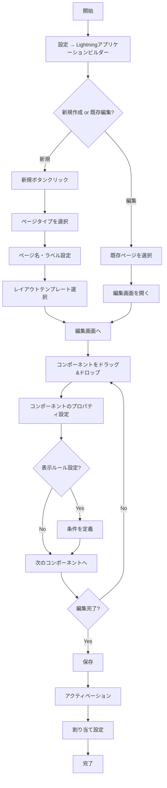
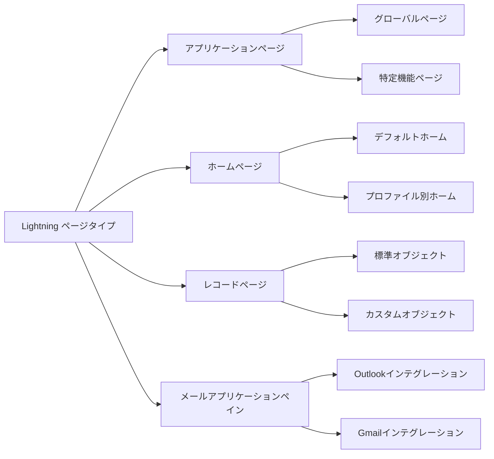
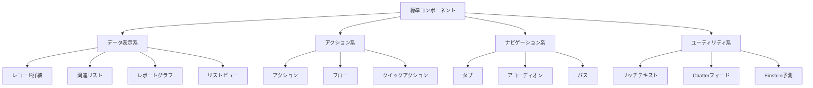
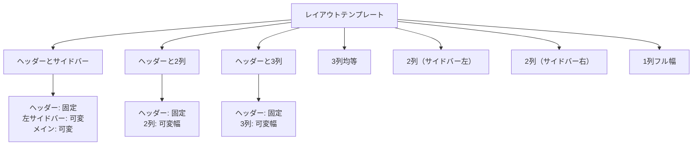
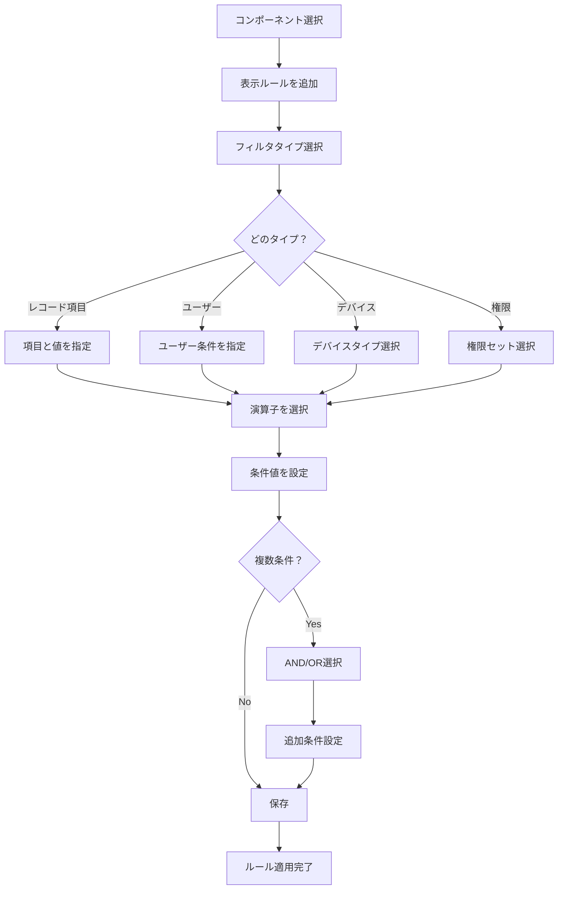
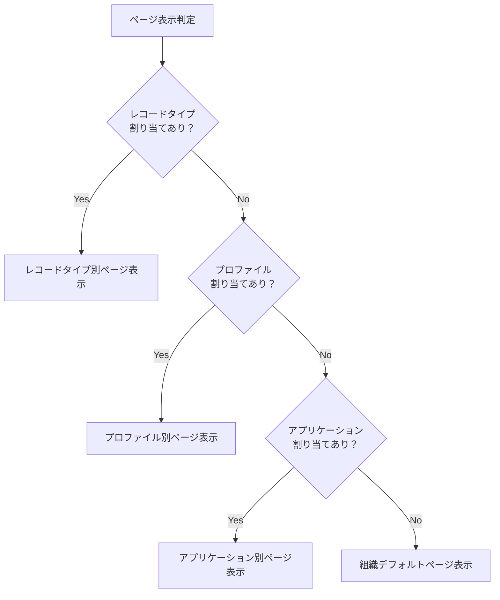
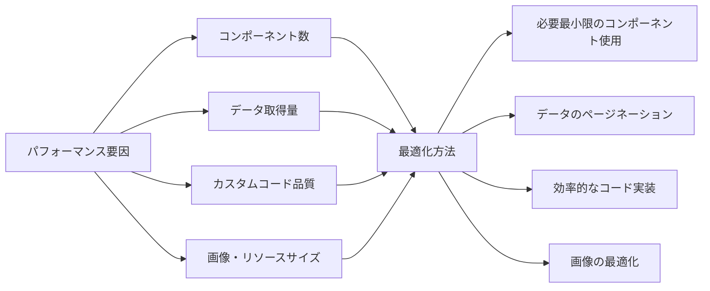

# Salesforce Lightning アプリケーションビルダーとは何か

## What's this file?
> [!NOTE]
> **What**
> 
> Salesforce Lightning アプリケーションビルダーとは何かについて記載しています。

## Conclusion (忙しいとき向け)
> [!IMPORTANT]
> **What** : Salesforce Lightning アプリケーションビルダーとは何か
> 
> **Answer** : ドラッグ&ドロップ操作でLightningページをカスタマイズできるノーコード開発ツール。標準コンポーネントやカスタムコンポーネントを組み合わせて、レコードページ、アプリケーションページ、ホームページを視覚的に構築できる。

## 目次

目次を開く

- [Lightning アプリケーションビルダーの概要](#lightning-アプリケーションビルダーの概要)
- [主な機能と特徴](#主な機能と特徴)
- [作成可能なページタイプ](#作成可能なページタイプ)
- [使用可能なコンポーネント](#使用可能なコンポーネント)
- [ページレイアウトテンプレート](#ページレイアウトテンプレート)
- [動的フォームと表示ルール](#動的フォームと表示ルール)
- [アクセス権限とページ割り当て](#アクセス権限とページ割り当て)
- [制限事項と考慮事項](#制限事項と考慮事項)

## Lightning アプリケーションビルダーの概要

Lightning アプリケーションビルダーは、Salesforce Lightning Experience のページをカスタマイズするためのビジュアル開発ツールです。

### 基本的な特徴
- **ノーコード開発**: プログラミング不要でページ作成
- **ドラッグ&ドロップ**: 直感的な操作でコンポーネント配置
- **リアルタイムプレビュー**: 変更内容を即座に確認
- **レスポンシブデザイン**: デバイスに応じた表示最適化

### Classic との違い
| 機能 | Lightning アプリケーションビルダー | Classic ページレイアウト |
|------|-----------------------------------|------------------------|
| 操作方法 | ドラッグ&ドロップ | フィールド配置のみ |
| カスタマイズ範囲 | ページ全体 | 詳細セクションのみ |
| コンポーネント | 多様なコンポーネント | 標準項目・関連リスト |
| 動的表示 | 条件付き表示可能 | 固定表示 |
| デバイス対応 | レスポンシブ | デスクトップのみ |

## 主な機能と特徴

### 作成・編集フロー

### 主要な機能一覧

1. **ビジュアルエディタ**
   - コンポーネントパレット
   - キャンバスエリア
   - プロパティパネル
   - プレビューモード

2. **カスタマイズ機能**
   - レイアウト変更
   - コンポーネント追加・削除
   - 表示順序の調整
   - 条件付き表示設定

3. **デバイス最適化**
   - デスクトップビュー
   - タブレットビュー
   - モバイルビュー

## 作成可能なページタイプ

### ページタイプ別特徴

### 各ページタイプの用途

1. **アプリケーションページ**
   - ダッシュボード専用ページ
   - カスタム機能の集約ページ
   - 部門別ポータルページ

2. **ホームページ**
   - ユーザー別スタートページ
   - お知らせ・通知の表示
   - クイックアクセスリンク集

3. **レコードページ**
   - オブジェクト詳細画面のカスタマイズ
   - 関連情報の統合表示
   - アクション・プロセスの配置

4. **メールアプリケーションペイン**
   - メールクライアント内でのSalesforce情報表示
   - コンテキストに応じた関連データ表示

## 使用可能なコンポーネント

### 標準コンポーネント

### カスタムコンポーネント

1. **Lightning Web Components (LWC)**
   - モダンなWeb標準ベース
   - 高パフォーマンス
   - 再利用可能

2. **Aura Components**
   - 従来のLightningコンポーネント
   - 豊富な実装例
   - LWCへの移行推奨

3. **サードパーティコンポーネント**
   - AppExchangeからインストール
   - パートナー提供のソリューション
   - 特殊な機能実装

## ページレイアウトテンプレート

### 利用可能なテンプレート

### レスポンシブ動作

| デバイス | 表示動作 |
|---------|---------|
| デスクトップ | 全列表示 |
| タブレット | 一部列を縮小/非表示 |
| モバイル | 単一列にスタック |

## 動的フォームと表示ルール

### 動的フォームの特徴

1. **項目レベルの制御**
   - 個別項目の表示/非表示
   - セクション単位の制御
   - 条件に基づく動的表示

2. **設定可能な条件**
   - レコードの項目値
   - ユーザー情報
   - デバイスタイプ
   - 権限セット

### 表示ルール設定フロー

## アクセス権限とページ割り当て

### アクティベーション設定

1. **組織のデフォルト**
   - 全ユーザーに適用
   - 最も基本的な設定

2. **Lightningアプリケーション**
   - 特定アプリケーションでのみ使用
   - アプリケーション別カスタマイズ

3. **プロファイル別**
   - プロファイルごとに異なるページ
   - 役割に応じた最適化

4. **レコードタイプ別**
   - レコードタイプに応じた表示
   - ビジネスプロセス別カスタマイズ

### 割り当て優先順位

## 制限事項と考慮事項

### 技術的制限

1. **コンポーネント数制限**
   - 1ページあたり最大100コンポーネント
   - パフォーマンスへの影響を考慮

2. **ページサイズ制限**
   - 最大サイズ: 5MB
   - 画像や大量データの扱いに注意

3. **ブラウザ要件**
   - モダンブラウザ必須
   - IE11はサポート終了

### パフォーマンス考慮事項

### ベストプラクティス

1. **設計段階**
   - ユーザー要件の明確化
   - デバイス別の使用シナリオ検討
   - パフォーマンス目標の設定

2. **実装段階**
   - 標準コンポーネント優先使用
   - カスタムコンポーネントの再利用
   - 適切な表示ルール設定

3. **テスト段階**
   - 全デバイスでの動作確認
   - 異なるプロファイルでのテスト
   - パフォーマンステスト実施

4. **運用段階**
   - 定期的な使用状況分析
   - ユーザーフィードバック収集
   - 継続的な改善実施

## 関連

### 関連ツール・機能
- **Lightning コンポーネント**: カスタムコンポーネント開発
- **フロービルダー**: 画面フローの作成とページへの埋め込み
- **アプリケーションマネージャー**: Lightningアプリケーションの管理
- **ページレイアウト**: Classic環境でのページカスタマイズ

### 開発者向けリソース
- **Lightning Web Components**: モダンなコンポーネント開発
- **Aura Components**: 従来のLightningコンポーネント
- **SLDS（Salesforce Lightning Design System）**: デザインガイドライン
- **開発者コンソール**: カスタムコンポーネントのデバッグ

### 関連する概念
- **Lightning Experience**: 新しいユーザーインターフェース
- **モバイルファースト設計**: レスポンシブデザインの重要性
- **コンポーネントベース開発**: 再利用可能な部品による構築
- **宣言的開発**: コード不要の開発アプローチ