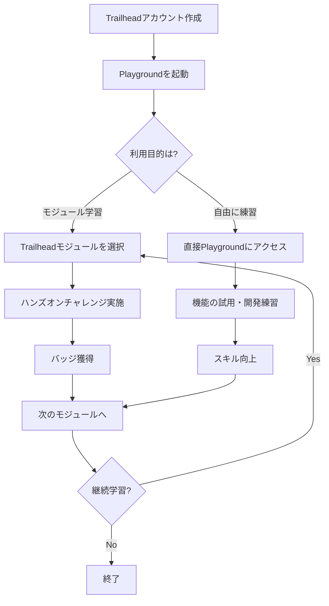
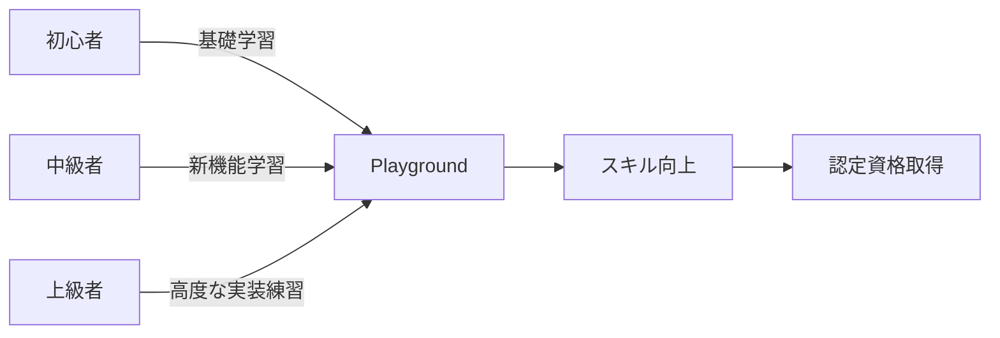

# Trailhead Playground

## What's this file?
> [!NOTE]
> **What**
> 
> Trailhead Playgroundとは何かについて記載しています。

## Conclusion (忙しいとき向け)
> [!IMPORTANT]
> **What** : Trailhead Playgroundとは何か
> 
> **Answer** : Salesforceの学習用無料開発環境。ハンズオン学習やテスト開発に使用できる完全機能のSalesforce組織

## 目次

目次を開く

- [概要](#概要)
- [特徴](#特徴)
- [利用フロー](#利用フロー)
- [Developer Editionとの違い](#developer-editionとの違い)
- [制限事項](#制限事項)
- [利用シーン](#利用シーン)

## 概要

Trailhead PlaygroundはSalesforceが提供する学習用の開発環境です。Trailheadの学習モジュールを実践するために設計された、完全機能を持つSalesforce組織（org）です。

### 主な用途
- Trailheadモジュールのハンズオン演習
- Salesforce機能の学習とテスト
- 開発スキルの練習
- 新機能の試用

## 特徴

### 1. 無料で利用可能
- アカウント作成のみで即座に利用開始
- 追加料金なし
- 複数のPlaygroundを作成可能

### 2. 完全な機能
- Production環境と同等の機能
- 最新リリースの機能を含む
- カスタマイズ可能

### 3. 学習に特化
- Trailheadモジュールと連携
- サンプルデータ付属
- リセット可能

## 利用フロー

## Developer Editionとの違い

| 項目 | Trailhead Playground | Developer Edition |
|------|---------------------|-------------------|
| 用途 | 学習・練習用 | 開発・テスト用 |
| 有効期限 | 6ヶ月（更新可能） | 無期限 |
| データ容量 | 200MB | 5MB |
| ユーザー数 | 最大100 | 最大2 |
| API制限 | 緩い | 厳しい |
| リセット | 可能 | 不可 |

## 制限事項

### 1. 有効期限
- 6ヶ月間のアクティビティがない場合は削除
- ログインで自動延長

### 2. 本番利用不可
- 学習・開発目的のみ
- 実際のビジネスデータの保存は非推奨

### 3. バックアップなし
- データの永続性は保証されない
- 重要なカスタマイズは別途保存推奨

## 利用シーン

### 学習シーン

### 1. Trailheadモジュール
- ステップバイステップの学習
- チャレンジの実践
- バッジの獲得

### 2. 開発練習
- Apex開発
- Lightning Component開発
- Integration実装

### 3. 新機能検証
- 最新リリースの機能確認
- ベストプラクティスの学習
- POC（概念実証）

### 4. 認定試験準備
- 実機での操作練習
- シナリオベースの学習
- 試験範囲の機能確認

## 関連
- [Salesforce Developer Edition](https://developer.salesforce.com/signup)
- [Trailhead](https://trailhead.salesforce.com/)
- [Salesforce認定資格](https://trailhead.salesforce.com/credentials)
- [Salesforce開発者ドキュメント](https://developer.salesforce.com/docs)