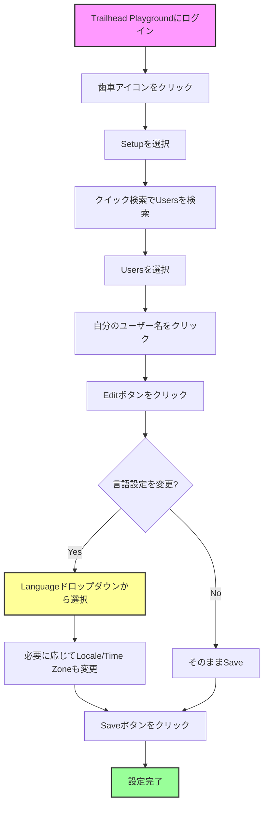

# Trailhead Playgroundでの言語設定方法

## What's this file?
> [!NOTE]
> **How**
> 
> どのようにTrailhead Playgroundで言語設定を行うかについて記載しています。

## Conclusion (忙しいとき向け)
> [!IMPORTANT]
> **How** : どのようにTrailhead Playgroundで言語設定を変更するか
> 
> **Answer** : 設定 → 私の個人情報 → 言語とタイムゾーン から言語を変更できます。ただし、Trailhead Playgroundのインターフェース言語は英語固定で、データの表示言語のみ変更可能です。

## 目次

目次を開く

- [言語設定の概要](#言語設定の概要)
- [言語設定の手順](#言語設定の手順)
- [設定可能な項目](#設定可能な項目)
- [注意事項](#注意事項)
- [言語設定のフローチャート](#言語設定のフローチャート)

## 言語設定の概要

Trailhead PlaygroundはSalesforceの無料学習環境です。言語設定により、データの表示言語を変更できますが、システムインターフェース自体は英語のままです。

## 言語設定の手順

### 1. 設定画面へのアクセス
1. Trailhead Playgroundにログイン
2. 右上の歯車アイコンをクリック
3. 「Setup」を選択

### 2. 個人情報設定への移動
1. クイック検索ボックスに「Users」と入力
2. 「Users」を選択
3. 自分のユーザー名をクリック

### 3. 言語設定の変更
1. 「Edit」ボタンをクリック
2. 「Locale Settings」セクションを確認
3. 「Language」ドロップダウンから希望の言語を選択
4. 「Save」をクリック

## 設定可能な項目

### Language（言語）
- 日本語（Japanese）
- 英語（English）
- その他多数の言語に対応

### Locale（ロケール）
- 日本（Japanese (Japan)）
- 数値・日付の表示形式に影響

### Time Zone（タイムゾーン）
- (GMT+09:00) Japan Standard Time (Asia/Tokyo)
- レポートやメールの時刻表示に影響

## 注意事項

### インターフェース言語の制限
- Trailhead Playgroundのメニューやボタンは**英語のまま**
- 変更されるのは**データの表示言語のみ**

### 設定反映のタイミング
- 言語設定は即座に反映
- 一部の画面では再読み込みが必要

### トレイルとの関係
- Trailheadのモジュール内容は言語設定に関わらず**英語**
- 日本語版トレイルは別途用意されている

## 言語設定のフローチャート

## 関連
- [Salesforce公式ドキュメント - 個人設定](https://help.salesforce.com/s/articleView?id=sf.personalizing_your_salesforce_experience.htm)
- [Trailhead - Salesforce Platform Basics](https://trailhead.salesforce.com/content/learn/modules/starting_force_com)
- [言語サポート一覧](https://help.salesforce.com/s/articleView?id=sf.faq_getstart_what_languages_does.htm)