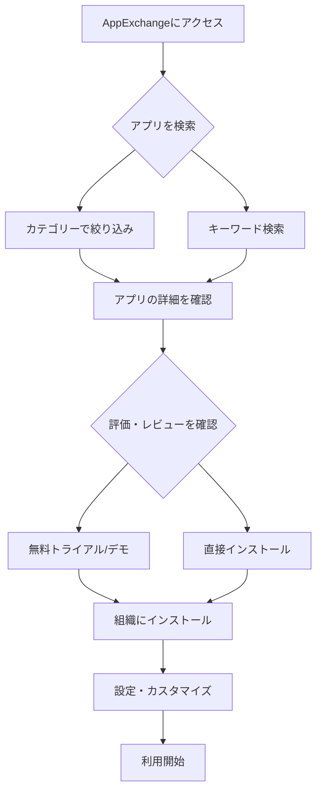

# SalesforceのAppExchangeとは何か

## What's this file?

> [!NOTE]
> **What**
> 
> AppExchangeとは何かについて記載しています。

## Conclusion (忙しいとき向け)

> [!IMPORTANT]
> **What** : AppExchangeとは何か
> 
> **Answer** : SalesforceのAppExchangeは、Salesforceエコシステム向けの世界最大のビジネスアプリケーションマーケットプレイスです。様々なアプリケーション、コンポーネント、コンサルティングサービスを提供し、Salesforceの機能を拡張できるプラットフォームです。

## 目次

目次を開く

- [概要](#概要)
- [AppExchangeの特徴](#appexchangeの特徴)
- [提供されるコンテンツの種類](#提供されるコンテンツの種類)
- [利用方法](#利用方法)
- [AppExchangeのメリット](#appexchangeのメリット)
- [AppExchangeアプリの仕組み](#appexchangeアプリの仕組み)
- [関連](#関連)

## 概要

AppExchangeは、Salesforceが提供するクラウドベースのマーケットプレイスで、2005年にローンチされました。これは、Salesforceプラットフォーム上で動作するアプリケーション、コンポーネント、サービスを検索、試用、インストールできる場所です。

## AppExchangeの特徴

- **豊富なアプリケーション**: 4,000以上のアプリケーションやコンポーネントが利用可能
- **カテゴリー別検索**: 業界、業務プロセス、製品別に整理されている
- **レビューと評価**: ユーザーによるレビューと評価システム
- **無料・有料の選択肢**: 無料アプリから有料のエンタープライズソリューションまで幅広く提供
- **セキュリティレビュー**: Salesforceによるセキュリティレビューを通過したアプリ

## 提供されるコンテンツの種類

1. **アプリケーション**
   - CRM機能を拡張する完全なアプリケーション
   - 業界特化型ソリューション
   - 統合ツール

2. **コンポーネント**
   - Lightning Component
   - Flow Solutions
   - ダッシュボードやレポートテンプレート

3. **コンサルタント**
   - 実装サービス
   - カスタマイズサービス
   - トレーニングサービス

4. **インダストリーソリューション**
   - 金融、ヘルスケア、小売など業界別ソリューション

## 利用方法

## AppExchangeのメリット

### ビジネスユーザー向け

- 迅速な機能拡張が可能
- 開発コストの削減
- 実績のあるソリューションの活用
- トライアル期間での評価が可能

### 開発者向け

- アプリケーションの配布プラットフォーム
- マネタイズの機会
- グローバルな顧客基盤へのアクセス
- Salesforceのマーケティング支援

### 管理者向け

- セキュリティレビュー済みアプリの安心感
- 簡単なインストールとアップデート
- ライセンス管理の一元化

## AppExchangeアプリの仕組み

### インストールプロセス

1. **パッケージの選択**: 管理パッケージまたは未管理パッケージ
2. **権限の確認**: 必要な権限とアクセス範囲の確認
3. **インストール**: Production環境またはSandbox環境へのインストール
4. **設定**: 組織固有の設定とカスタマイズ

### セキュリティ

- Salesforceセキュリティレビュープロセス
- OWASPガイドラインに準拠
- 定期的なセキュリティアップデート

### ライセンスモデル

- **サイトライセンス**: 組織全体での利用
- **ユーザーライセンス**: ユーザー数に基づく課金
- **使用量ベース**: 利用量に応じた課金
- **無料**: 基本機能の無料提供

## 関連

- [Salesforce Platform](https://developer.salesforce.com/)
- [Salesforce Trailhead - AppExchange Basics](https://trailhead.salesforce.com/content/learn/modules/appexchange_basics)
- [ISVパートナープログラム](https://partners.salesforce.com/)