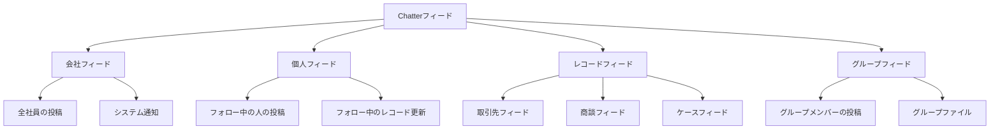

# SalesforceのChatterとは何か

## What's this file?

> [!NOTE]
> **What**
> 
> Chatterとは何かについて記載しています。

## Conclusion (忙しいとき向け)

> [!IMPORTANT]
> **What** : Chatterとは何か
> 
> **Answer** : Chatterは、Salesforce内で利用できるエンタープライズソーシャルコラボレーションツールです。リアルタイムでの情報共有、コミュニケーション、コラボレーションを可能にし、組織全体の生産性向上を支援します。

## 目次

<details>
<summary>目次を開く</summary>

- [概要](#概要)
- [Chatterの主な機能](#chatterの主な機能)
- [Chatterの構成要素](#chatterの構成要素)
- [Chatterの使用場面](#chatterの使用場面)
- [Chatterのフィード種類](#chatterのフィード種類)
- [Chatterの投稿フロー](#chatterの投稿フロー)
- [Chatterのメリット](#chatterのメリット)
- [セキュリティとプライバシー](#セキュリティとプライバシー)
- [関連](#関連)

</details>

## 概要

Chatterは、2010年にSalesforceが導入したエンタープライズ向けのソーシャルコラボレーションプラットフォームです。FacebookやTwitterのようなソーシャルメディアの機能を、ビジネス環境に最適化した形で提供します。

## Chatterの主な機能

### 1. フィード機能
- リアルタイムの更新情報の表示
- テキスト、画像、リンクの投稿
- @メンションによる特定ユーザーへの通知
- ハッシュタグによるトピックの整理

### 2. グループ機能
- 公開グループ・非公開グループの作成
- 部門・プロジェクト・トピック別のコミュニケーション
- ファイル共有とドキュメント管理
- グループ内での議論とアイデア共有

### 3. プロファイル機能
- ユーザープロファイルの表示
- スキル、経験、専門知識の共有
- 組織図の可視化
- 連絡先情報の管理

### 4. ファイル機能
- ドキュメントの共有と管理
- バージョン管理
- プレビュー機能
- Salesforceファイルとの統合

## Chatterの構成要素

### フィード
- **会社フィード**: 組織全体の更新情報
- **個人フィード**: フォローしている人やレコードの更新
- **レコードフィード**: 特定のレコード（取引先、商談など）に関する更新

### 投稿タイプ
- **テキスト投稿**: 通常のメッセージ
- **ファイル投稿**: ドキュメントや画像の共有
- **リンク投稿**: 外部リソースへのリンク
- **投票**: 簡単なアンケート機能

### アクション
- **いいね**: 投稿への賛同表明
- **コメント**: 投稿への返信
- **共有**: 他のユーザーへの投稿の再共有
- **フォロー**: ユーザーやレコードの更新を追跡

## Chatterの使用場面

### 営業活動
- 商談の進捗状況の共有
- 顧客情報の更新通知
- チーム間での情報連携
- 成功事例の共有

### プロジェクト管理
- タスクの進捗報告
- 課題の議論と解決
- マイルストーンの共有
- リソースの調整

### ナレッジ共有
- ベストプラクティスの共有
- 問題解決のディスカッション
- 新製品・サービスの情報共有
- トレーニング資料の配布

## Chatterのフィード種類



## Chatterの投稿フロー

```mermaid
flowchart LR
    A[投稿作成] --> B{投稿タイプ選択}
    B --> C[テキスト入力]
    B --> D[ファイル添付]
    B --> E[リンク追加]
    
    C --> F[@メンション追加]
    D --> F
    E --> F
    
    F --> G[#ハッシュタグ追加]
    G --> H[投稿先選択]
    
    H --> I[個人フィード]
    H --> J[グループ]
    H --> K[レコード]
    
    I --> L[投稿公開]
    J --> L
    K --> L
    
    L --> M[通知送信]
    M --> N[フォロワーに表示]
```

## Chatterのメリット

### ビジネス面のメリット
- **情報の透明性向上**: リアルタイムでの情報共有
- **コラボレーション強化**: 部門を超えた協力体制
- **意思決定の迅速化**: 必要な情報への素早いアクセス
- **知識の蓄積**: 組織のナレッジベース構築

### 技術面のメリット
- **Salesforceとの完全統合**: CRMデータとの連携
- **モバイル対応**: どこからでもアクセス可能
- **API連携**: 外部システムとの統合
- **カスタマイズ性**: 組織のニーズに合わせた設定

### ユーザー体験のメリット
- **使いやすいインターフェース**: 直感的な操作
- **リアルタイム通知**: 重要な更新を見逃さない
- **検索機能**: 過去の投稿やファイルの検索
- **エンゲージメント向上**: 社内コミュニケーションの活性化

## セキュリティとプライバシー

### アクセス制御
- Salesforceの権限モデルと統合
- レコードレベルのセキュリティ
- グループのプライバシー設定
- 投稿の可視性制御

### コンプライアンス
- 監査証跡の記録
- データ保持ポリシー
- 規制要件への対応
- エクスポート機能

### モデレーション
- 不適切なコンテンツの報告
- キーワードフィルタリング
- 管理者による監視
- コミュニティガイドライン

## 関連

- [Salesforce公式 - Chatter](https://www.salesforce.com/jp/products/chatter/overview/)
- [Chatter実装ガイド](https://help.salesforce.com/s/articleView?id=sf.collab_intro.htm)
- [Chatter REST API](https://developer.salesforce.com/docs/atlas.en-us.chatterapi.meta/chatterapi/)