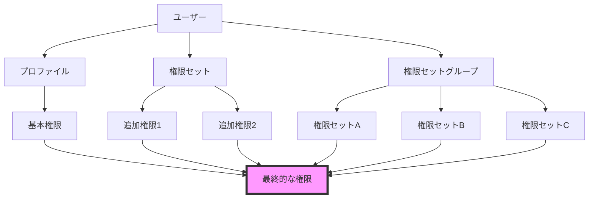
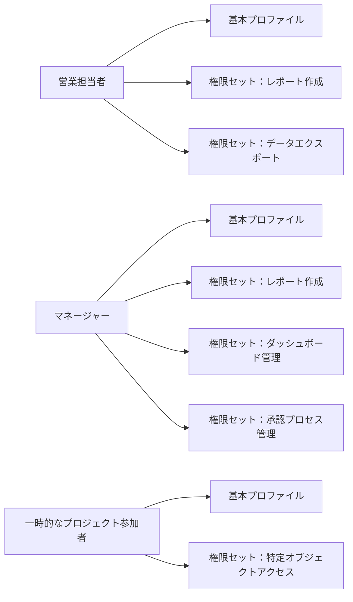
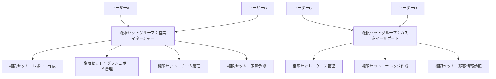

# Salesforceの権限セットと権限セットグループとは何か

## What's this file?

> [!NOTE]
> **What**
> 
> 権限セットと権限セットグループとは何かについて記載しています。

## Conclusion (忙しいとき向け)

> [!IMPORTANT]
> **What** : 権限セットと権限セットグループとは何か
> 
> **Answer** : 権限セットは、ユーザーに追加の権限を付与するための設定の集合です。権限セットグループは、複数の権限セットをまとめて管理し、ユーザーに一括で割り当てることができる機能です。プロファイルの制限を補完し、より柔軟な権限管理を実現します。

## 目次

目次を開く

- [概要](#概要)
- [権限セットとは](#権限セットとは)
- [権限セットグループとは](#権限セットグループとは)
- [プロファイルとの違い](#プロファイルとの違い)
- [権限セットの構成要素](#権限セットの構成要素)
- [権限管理の階層構造](#権限管理の階層構造)
- [権限セットの使用例](#権限セットの使用例)
- [権限セットグループの使用例](#権限セットグループの使用例)
- [ベストプラクティス](#ベストプラクティス)
- [関連](#関連)

## 概要

Salesforceの権限管理システムは、プロファイル、権限セット、権限セットグループの3つの主要コンポーネントで構成されています。これらを適切に組み合わせることで、セキュアで柔軟なアクセス制御を実現できます。

## 権限セットとは

### 定義
権限セットは、ユーザーに追加の権限を付与するための設定の集合です。プロファイルでは付与できない、または付与したくない権限を、特定のユーザーに対して個別に付与できます。

### 特徴
- **追加的な権限付与**: プロファイルの基本権限に追加で権限を付与
- **再利用可能**: 一度作成すれば複数のユーザーに割り当て可能
- **柔軟な管理**: ユーザーごとに必要な権限セットを選択して付与
- **権限の積み上げ**: 複数の権限セットを同一ユーザーに割り当て可能

### 主な用途
- 特定の機能へのアクセス権限の付与
- 一時的な権限の付与
- 部門横断的な権限の管理
- 特殊な業務要件への対応

## 権限セットグループとは

### 定義
権限セットグループは、複数の権限セットをまとめて管理するコンテナです。関連する権限セットをグループ化し、ユーザーへの割り当てを簡素化します。

### 特徴
- **権限セットの集約**: 複数の権限セットを1つのグループに
- **一括割り当て**: グループ単位でユーザーに権限を付与
- **管理の簡素化**: 権限の組み合わせをテンプレート化
- **変更の一元管理**: グループ内の権限セットを変更すると全ユーザーに反映

### 導入時期
権限セットグループは、Spring '20リリースで導入された比較的新しい機能です。

## プロファイルとの違い

### プロファイル
- **必須**: すべてのユーザーに1つのプロファイルが必要
- **基本権限**: 最小限の権限セットを定義
- **制限的**: 権限の削除はできるが追加は限定的
- **1対1の関係**: 1ユーザーに1プロファイル

### 権限セット・権限セットグループ
- **オプション**: 必要に応じて割り当て
- **追加権限**: プロファイルの権限に追加で付与
- **柔軟性**: 権限の追加が主な目的
- **1対多の関係**: 1ユーザーに複数割り当て可能

## 権限セットの構成要素

### 1. オブジェクト権限
- オブジェクトへのCRUD権限
- すべて表示、すべて変更権限

### 2. 項目権限
- 項目レベルのセキュリティ設定
- 参照、編集権限

### 3. アプリケーション権限
- カスタムアプリケーションへのアクセス
- 接続アプリケーションの使用権限

### 4. システム権限
- API有効化
- レポート・ダッシュボードの作成
- データのエクスポート

### 5. Apexクラス・Visualforceページアクセス
- カスタムコードへのアクセス権限

### 6. タブ設定
- 標準タブ、カスタムタブの表示設定

## 権限管理の階層構造

## 権限セットの使用例

## 権限セットグループの使用例

## ベストプラクティス

### 1. 命名規則
- **明確な名前**: 権限セットの目的が分かる名前を使用
- **プレフィックス**: 部門や機能別にプレフィックスを付ける
- **説明の記載**: 詳細な説明を必ず記入

### 2. 設計原則
- **単一責任**: 1つの権限セットは1つの目的に
- **最小権限**: 必要最小限の権限のみを付与
- **再利用性**: 汎用的に使える権限セットを作成

### 3. 管理方法
- **定期的な棚卸し**: 不要な権限セットの削除
- **ドキュメント化**: 権限セットの用途を文書化
- **変更管理**: 権限変更の履歴を記録

### 4. 権限セットグループの活用
- **役割ベース**: 職務や役割に基づいてグループ化
- **プロジェクトベース**: 一時的なプロジェクト用のグループ
- **段階的な権限付与**: 新入社員の段階的な権限拡張

### 5. セキュリティ考慮事項
- **権限の累積に注意**: 複数の権限セットによる過剰な権限付与を防ぐ
- **定期的な監査**: ユーザーの権限を定期的にレビュー
- **職務分離**: 相反する権限の分離

## 関連

- [Salesforce Help - 権限セット](https://help.salesforce.com/s/articleView?id=sf.perm_sets_overview.htm)
- [Salesforce Help - 権限セットグループ](https://help.salesforce.com/s/articleView?id=sf.perm_set_groups.htm)
- [Trailhead - データセキュリティ](https://trailhead.salesforce.com/ja/content/learn/modules/data_security)