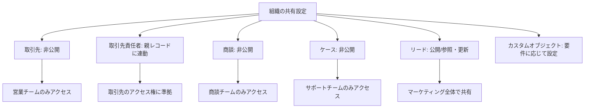
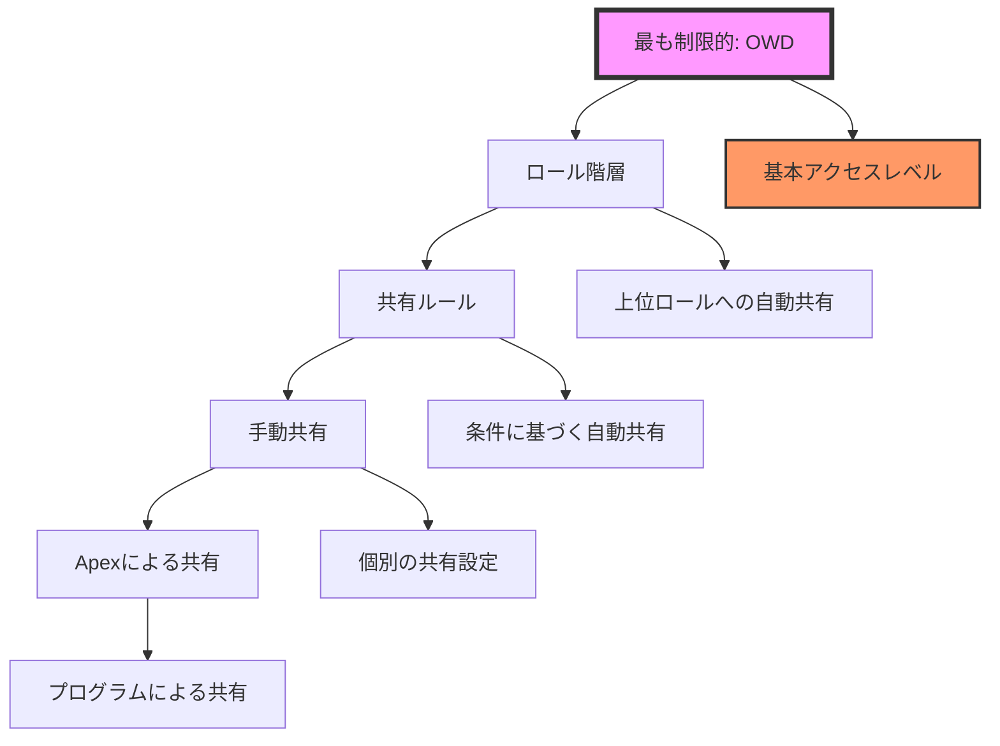
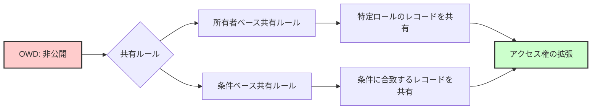
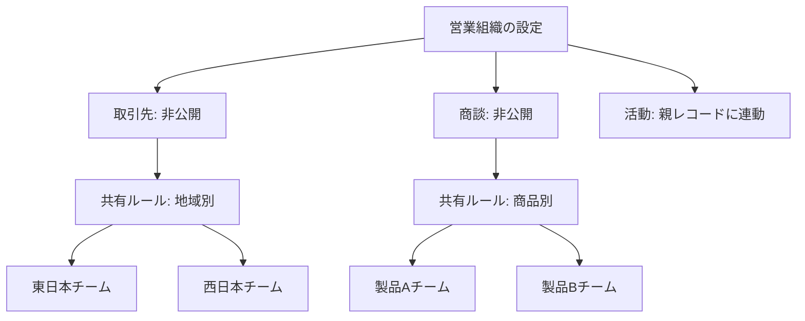
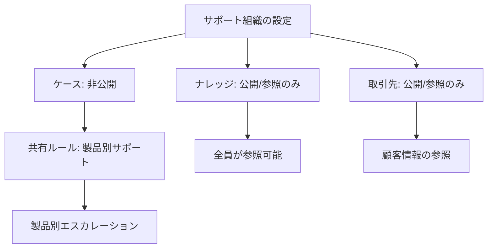

# Salesforceの組織の共有設定とは何か

## What's this file?

> [!NOTE]
> **What**
> 
> 組織の共有設定とは何かについて記載しています。

## Conclusion (忙しいとき向け)

> [!IMPORTANT]
> **What** : 組織の共有設定とは何か
> 
> **Answer** : 組織の共有設定（Organization-Wide Defaults、OWD）は、Salesforceにおけるデータアクセスの基本レベルを定義する設定です。オブジェクトごとにデフォルトのアクセスレベルを設定し、組織全体のデータセキュリティの基盤となります。

## 目次

目次を開く

- [概要](#概要)
- [組織の共有設定の役割](#組織の共有設定の役割)
- [アクセスレベルの種類](#アクセスレベルの種類)
- [オブジェクトごとの設定](#オブジェクトごとの設定)
- [共有設定の階層](#共有設定の階層)
- [共有ルールとの関係](#共有ルールとの関係)
- [設定時の考慮事項](#設定時の考慮事項)
- [具体的な設定例](#具体的な設定例)
- [ベストプラクティス](#ベストプラクティス)
- [関連](#関連)

## 概要

組織の共有設定（OWD）は、Salesforceのデータセキュリティモデルの基礎となる設定です。各オブジェクトに対して、組織内のユーザーがデフォルトでどのレベルのアクセス権を持つかを定義します。これは「最も制限的な設定から始める」という原則に基づいています。

## 組織の共有設定の役割

### 基本的な役割
- **ベースラインの設定**: データアクセスの最低レベルを定義
- **セキュリティの確保**: 不必要なデータ露出を防止
- **パフォーマンスの最適化**: アクセス制御の計算を効率化
- **コンプライアンス対応**: 規制要件に応じたデータ保護

### セキュリティモデル内での位置づけ
1. **最も制限的な層**: OWDで基本アクセスを制限
2. **権限の拡張**: ロール階層、共有ルール、手動共有で拡張
3. **細かい制御**: 項目レベルセキュリティで詳細制御

## アクセスレベルの種類

### 標準オブジェクトの設定オプション

#### 1. 非公開（Private）
- レコード所有者とそれより上位のロールのみアクセス可能
- 最も制限的な設定
- 機密データに適用

#### 2. 公開/参照のみ（Public Read Only）
- すべてのユーザーが参照可能
- 編集は所有者とそれより上位のロールのみ
- 情報共有が必要だが編集は制限したい場合

#### 3. 公開/参照・更新（Public Read/Write）
- すべてのユーザーが参照・編集可能
- 削除と所有者変更は制限
- コラボレーションが必要なデータ

#### 4. 公開/フルアクセス（Public Full Access）
- すべてのユーザーが全操作可能
- 削除と所有者変更も可能
- 最も開放的な設定

### カスタムオブジェクトの追加オプション

#### 親レコードに連動（Controlled by Parent）
- 主従関係の従オブジェクトで使用
- 親レコードのアクセス権に従う
- 親子関係のデータ整合性を保持

## オブジェクトごとの設定

### 一般的な設定パターン

## 共有設定の階層

## 共有ルールとの関係

### OWDと共有ルールの連携

### 重要な原則
- **拡張のみ可能**: 共有ルールはOWDより制限的にできない
- **累積的な効果**: 複数の共有ルールの効果は累積される
- **パフォーマンス考慮**: 共有ルールの数はパフォーマンスに影響

## 設定時の考慮事項

### セキュリティの観点
- **最小権限の原則**: 必要最小限のアクセス権から開始
- **データ分類**: 機密度に応じた設定
- **規制要件**: コンプライアンス要件の確認

### パフォーマンスの観点
- **共有計算**: 制限的な設定ほど計算負荷が高い
- **レコード数**: 大量データでの影響を考慮
- **ユーザー数**: 多数のユーザーでの影響を評価

### ビジネス要件
- **部門間の協力**: 必要な情報共有レベル
- **競合情報**: 部門間での情報隔離
- **外部共有**: パートナーや顧客との共有要件

## 具体的な設定例

### 営業組織の例

### サポート組織の例

## ベストプラクティス

### 1. 設計原則
- **制限的に開始**: 最も制限的な設定から始めて必要に応じて緩和
- **定期的な見直し**: ビジネス要件の変化に応じて調整
- **文書化**: 設定理由と影響範囲を記録

### 2. 実装手順
1. **現状分析**: 既存のデータアクセス要件を整理
2. **設計**: オブジェクトごとの適切なレベルを決定
3. **テスト**: Sandboxで十分にテスト
4. **段階的展開**: 影響の少ないオブジェクトから実施

### 3. 運用管理
- **アクセスログ**: 不正アクセスの監視
- **定期監査**: 設定の妥当性を定期的に確認
- **変更管理**: 設定変更の承認プロセス

### 4. トラブルシューティング
- **アクセス問題**: 共有設定の階層を順に確認
- **パフォーマンス**: 過度に制限的な設定を見直し
- **エラー対応**: 共有再計算の実行

### 5. 移行時の注意
- **既存データ**: 大量データの共有再計算に注意
- **ユーザー影響**: 事前の影響分析と通知
- **ロールバック計画**: 問題発生時の復旧手順

## 関連

- [Salesforce Help - 組織の共有設定](https://help.salesforce.com/s/articleView?id=sf.sharing_model_overview.htm)
- [Salesforce Help - データセキュリティ](https://help.salesforce.com/s/articleView?id=sf.security_data_access.htm)
- [Trailhead - データセキュリティ](https://trailhead.salesforce.com/ja/content/learn/modules/data_security)