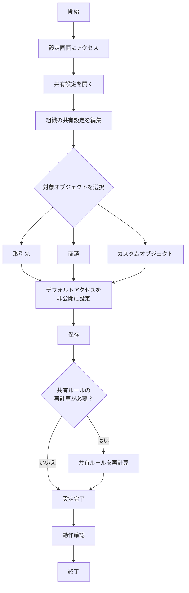
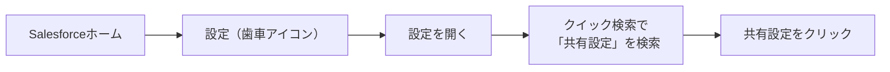
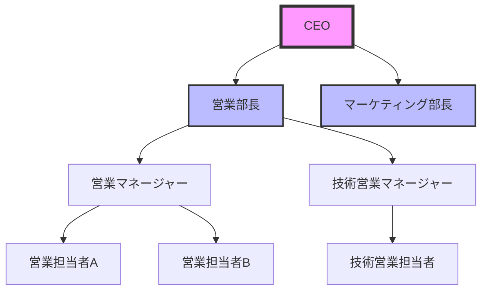
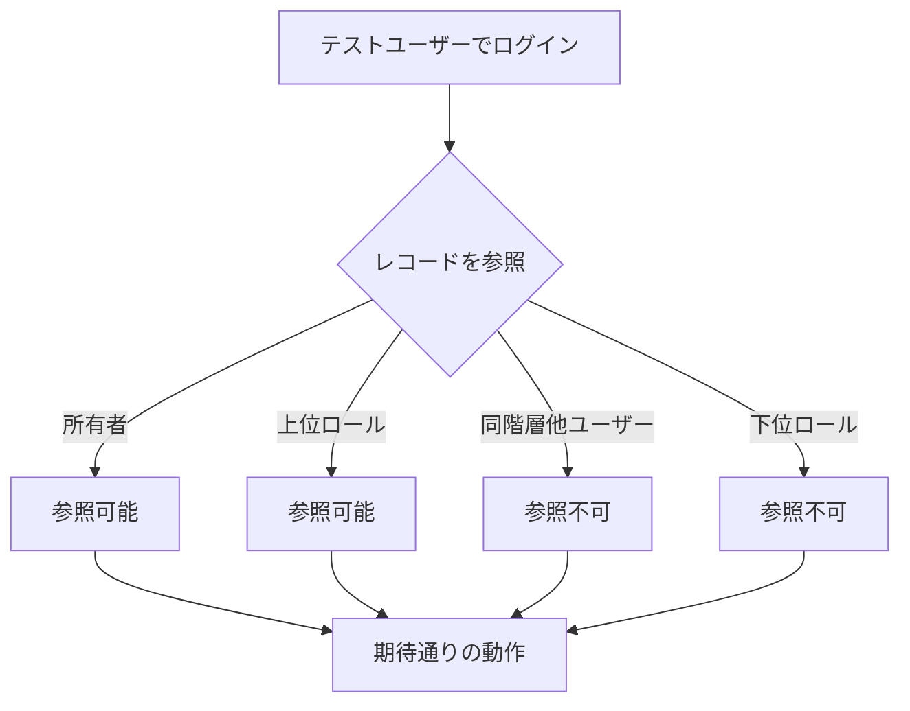
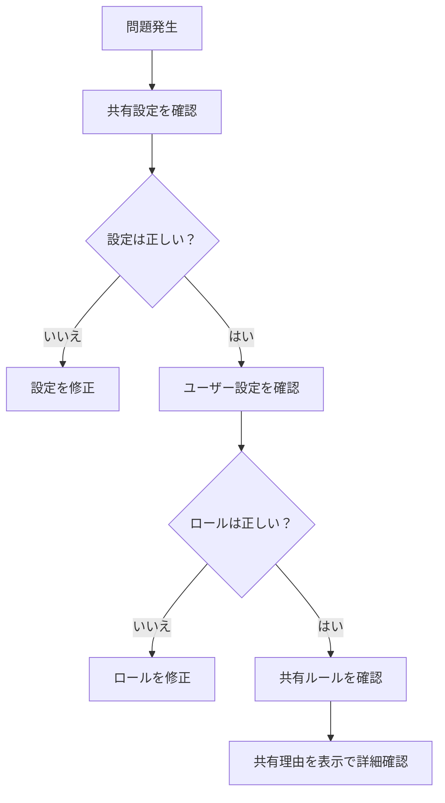
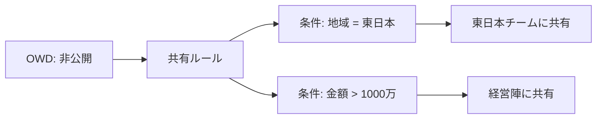
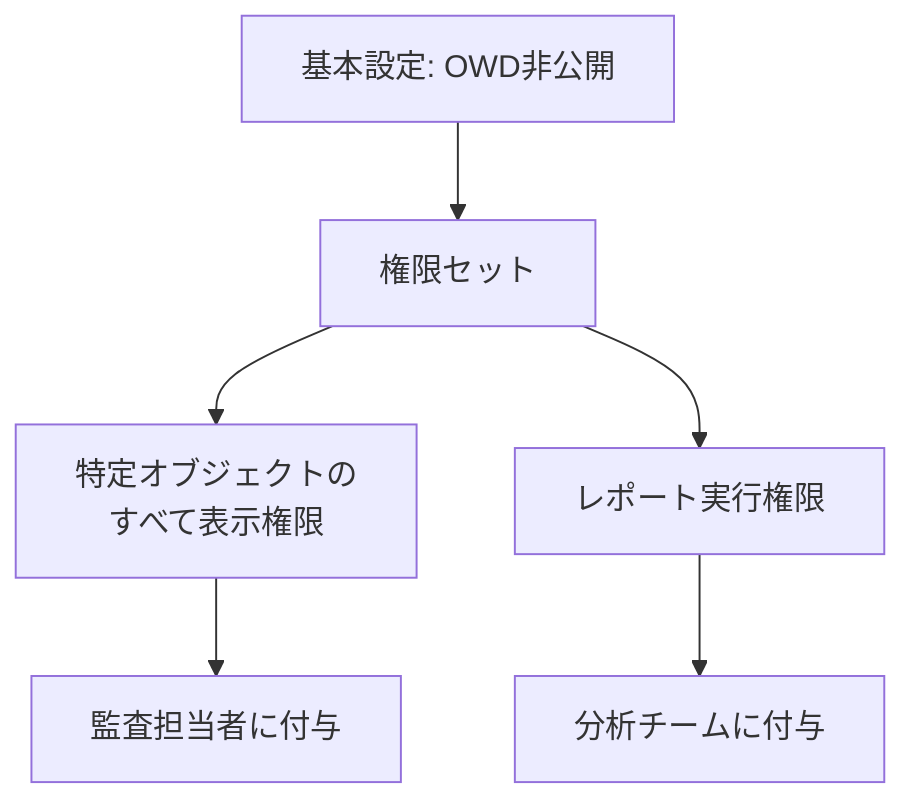

# Salesforceでレコード所有者と上位ロールのみに表示制限する設定方法

## What's this file?

> [!NOTE]
> **How**
> 
> どのようにレコードを所有者と上位ロールのユーザーのみに表示制限するかについて記載しています。

## Conclusion (忙しいとき向け)

> [!IMPORTANT]
> **How** : どのようにレコードを所有者と上位ロールのみに表示制限するか
> 
> **Answer** : 組織の共有設定（OWD）で対象オブジェクトを「非公開（Private）」に設定します。これにより、レコード所有者とロール階層で上位にいるユーザーのみがレコードにアクセスできるようになります。

## 目次

<details>
<summary>目次を開く</summary>

- [前提知識](#前提知識)
- [設定手順](#設定手順)
- [設定の流れ（フローチャート）](#設定の流れフローチャート)
- [詳細な設定方法](#詳細な設定方法)
- [設定後の動作確認](#設定後の動作確認)
- [注意事項](#注意事項)
- [トラブルシューティング](#トラブルシューティング)
- [応用設定](#応用設定)
- [関連](#関連)

</details>

## 前提知識

### 必要な権限
- システム管理者プロファイル
- 「共有設定の参照」および「共有設定の編集」権限

### 関連する概念
- **組織の共有設定（OWD）**: データアクセスの基本レベル
- **ロール階層**: 組織の階層構造を反映したアクセス権管理
- **レコード所有者**: レコードを作成または割り当てられたユーザー

## 設定手順

### 基本的な手順

1. **設定画面へのアクセス**
   - 設定 → セキュリティ → 共有設定

2. **組織の共有設定の編集**
   - 「組織の共有設定」セクションで「編集」をクリック

3. **オブジェクトの設定**
   - 対象オブジェクトのデフォルトアクセスを「非公開」に設定

4. **保存と適用**
   - 「保存」をクリックして設定を適用

## 設定の流れ（フローチャート）



## 詳細な設定方法

### ステップ1: 設定画面へのアクセス



### ステップ2: 組織の共有設定の編集

1. **現在の設定を確認**
   - 各オブジェクトの現在のアクセスレベルを確認
   - 変更による影響を事前に把握

2. **編集モードに移行**
   - 「組織の共有設定」セクションの「編集」ボタンをクリック

3. **オブジェクトごとの設定**
   ```
   取引先: 非公開
   取引先責任者: 親レコードに連動
   商談: 非公開
   ケース: 非公開
   カスタムオブジェクト: 非公開
   ```

### ステップ3: ロール階層の確認



上位ロールは下位ロールのレコードを自動的に参照可能

## 設定後の動作確認

### 確認項目チェックリスト

- [ ] レコード所有者がレコードを参照・編集できる
- [ ] 上位ロールのユーザーがレコードを参照できる
- [ ] 同階層の他ユーザーがレコードを参照できない
- [ ] 下位ロールのユーザーがレコードを参照できない

### テスト手順



## 注意事項

### パフォーマンスへの影響
- **大量データの場合**: 共有ルールの再計算に時間がかかる
- **推奨事項**: 業務時間外での設定変更

### 既存の共有設定への影響
- 共有ルールは維持されるが、より制限的になる場合は無効化
- 手動共有は影響を受けない

### システム管理者の特例
- システム管理者は設定に関わらず全レコードにアクセス可能
- 「すべてのデータの参照」権限を持つユーザーも同様

## トラブルシューティング

### よくある問題と解決方法

#### 問題1: 上位ロールでもレコードが見えない

**原因と解決策**:
- ロール階層が正しく設定されていない → ロール階層を確認・修正
- ユーザーにロールが割り当てられていない → ユーザー設定でロールを割り当て

#### 問題2: 共有ルールの再計算が終わらない

**原因と解決策**:
- レコード数が多すぎる → 段階的に設定を変更
- システムリソース不足 → Salesforceサポートに相談

### デバッグ方法



## 応用設定

### 例外的なアクセス権の付与

#### 共有ルールの活用
特定の条件下で追加のアクセス権を付与:



#### 手動共有
個別のレコードを特定ユーザーと共有:

1. レコード詳細ページを開く
2. 「共有」ボタンをクリック
3. ユーザーまたはグループを選択
4. アクセスレベルを設定（参照のみ/参照・更新）

### 権限セットによる補完



## 関連

- [Salesforce Help - 組織の共有設定](https://help.salesforce.com/s/articleView?id=sf.admin_sharing.htm)
- [Salesforce Help - ロール階層](https://help.salesforce.com/s/articleView?id=sf.user_role_hierarchy.htm)
- [Trailhead - データセキュリティ](https://trailhead.salesforce.com/ja/content/learn/modules/data_security)