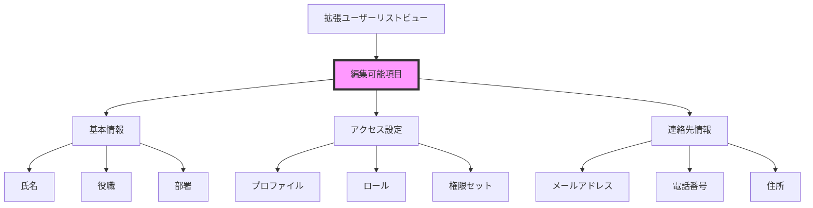
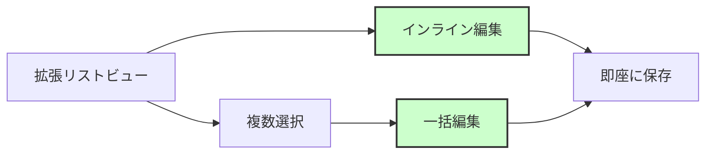
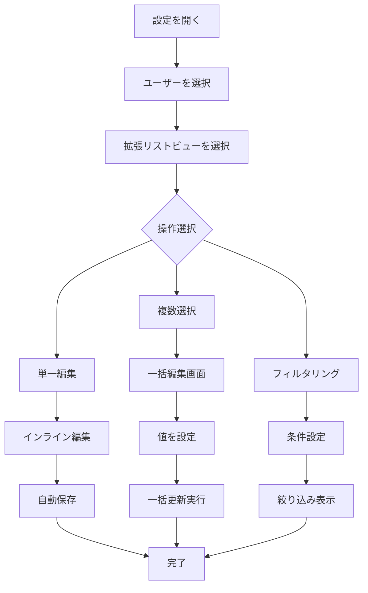

# Salesforceの拡張ユーザーリストビューとは何か

## What's this file?

> [!NOTE]
> **What**
> 
> 拡張ユーザーリストビューとは何かについて記載しています。

## Conclusion (忙しいとき向け)

> [!IMPORTANT]
> **What** : 拡張ユーザーリストビューとは何か
> 
> **Answer** : 拡張ユーザーリストビューは、Salesforceのユーザー管理画面で利用できる高度な表示・編集機能です。複数のユーザー情報を一覧表示し、インライン編集や一括更新が可能で、ユーザー管理の効率を大幅に向上させます。

## 目次

目次を開く

- [概要](#概要)
- [主な機能](#主な機能)
- [表示可能な項目](#表示可能な項目)
- [編集可能な項目](#編集可能な項目)
- [従来のビューとの違い](#従来のビューとの違い)
- [利用シーン](#利用シーン)
- [操作フロー](#操作フロー)
- [注意事項と制限](#注意事項と制限)
- [ベストプラクティス](#ベストプラクティス)
- [関連](#関連)

## 概要

拡張ユーザーリストビューは、Salesforceの設定画面で「ユーザー」セクションから利用できる高機能なユーザー管理インターフェースです。従来のユーザー管理画面よりも多くの情報を一度に表示し、効率的な編集作業を可能にします。

## 主な機能

### 1. インライン編集
- リストビュー上で直接値を編集
- ページ遷移なしで複数項目の更新が可能
- リアルタイムでの変更保存

### 2. 一括更新
- 複数ユーザーの選択
- 選択したユーザーの一括編集
- 同一値の一括設定

### 3. カスタマイズ可能な表示
- 表示項目の選択と並び替え
- フィルタリング機能
- 検索機能の強化

### 4. 高度なソート機能
- 複数列でのソート
- 昇順・降順の切り替え
- カスタム項目でのソート対応

## 表示可能な項目

### 基本情報
- ユーザー名
- 氏名（姓・名）
- メールアドレス
- 役職
- 部署

### アクセス情報
- プロファイル
- ロール
- ライセンス種別
- 有効/無効ステータス
- 最終ログイン日時

### 連絡先情報
- 電話番号
- 携帯電話
- 住所
- マネージャー

### システム情報
- ユーザーID
- 作成日
- 最終更新日
- ログイン履歴

## 編集可能な項目

## 従来のビューとの違い

### 従来のユーザー管理

### 拡張ユーザーリストビュー

## 利用シーン

### 1. 新入社員の一括登録
- 複数ユーザーの同時作成
- 共通プロファイルの一括設定
- 部署・ロールの効率的な割り当て

### 2. 組織変更時の更新
- 部署名の一括変更
- マネージャーの一括更新
- ロール階層の再編成

### 3. 定期的なメンテナンス
- 無効ユーザーの確認
- ライセンスの最適化
- 権限の棚卸し

### 4. 監査とコンプライアンス
- ログイン履歴の確認
- アクセス権限のレビュー
- セキュリティ設定の確認

## 操作フロー

## 注意事項と制限

### システム制限
- **表示上限**: 一度に表示できるユーザー数は2,000件まで
- **編集制限**: 一括編集は最大200ユーザーまで
- **項目制限**: システム項目の一部は編集不可

### セキュリティ考慮事項
- システム管理者権限が必要
- 監査証跡の記録
- 変更履歴の保持

### パフォーマンス
- 大量データ処理時の遅延
- 同時編集の競合
- ブラウザのメモリ使用量

## ベストプラクティス

### 1. 事前準備
- **バックアップ**: 大規模変更前のデータエクスポート
- **テスト**: Sandboxでの動作確認
- **計画**: 変更内容の文書化

### 2. 効率的な使用方法
- **フィルタの活用**: 必要なユーザーのみを表示
- **ビューの保存**: よく使う条件をビューとして保存
- **段階的な更新**: 大量更新は分割して実行

### 3. 安全な運用
- **権限の確認**: 編集前に権限を再確認
- **変更の検証**: 更新後の動作確認
- **ロールバック計画**: 問題発生時の復旧手順

### 4. チーム運用
- **作業の調整**: 複数管理者での作業調整
- **変更の通知**: 影響を受けるユーザーへの事前通知
- **ドキュメント化**: 変更履歴の記録

## 関連

- [Salesforce Help - ユーザー管理](https://help.salesforce.com/s/articleView?id=sf.users_overview.htm)
- [Salesforce Help - リストビュー](https://help.salesforce.com/s/articleView?id=sf.customviews.htm)
- [Trailhead - ユーザー管理](https://trailhead.salesforce.com/ja/content/learn/modules/lex_implementation_user_setup_mgmt)