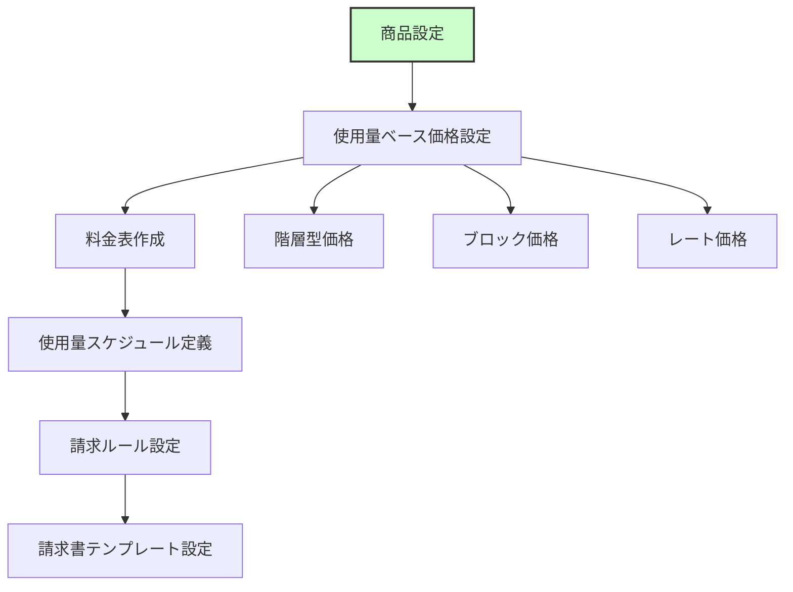
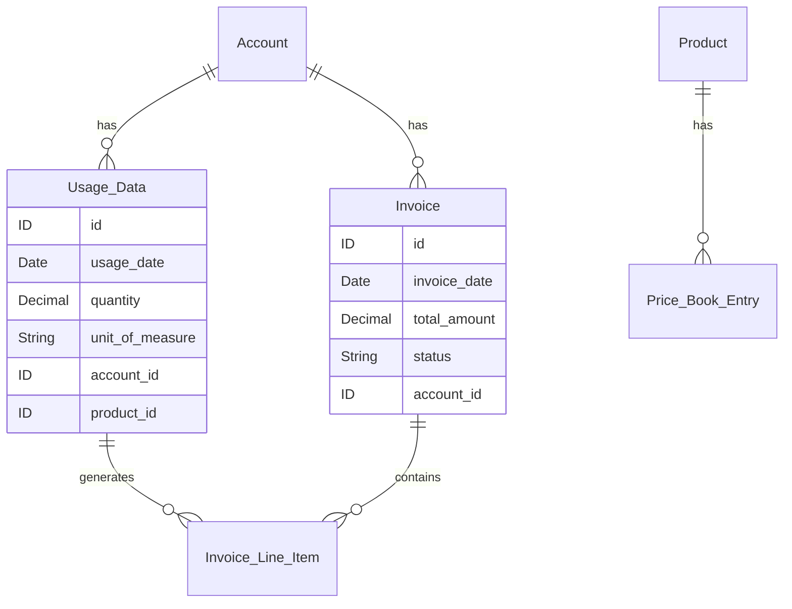
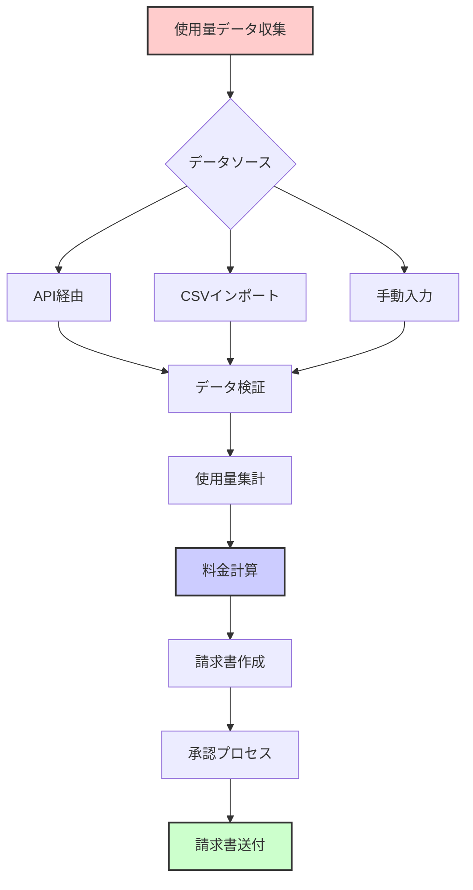
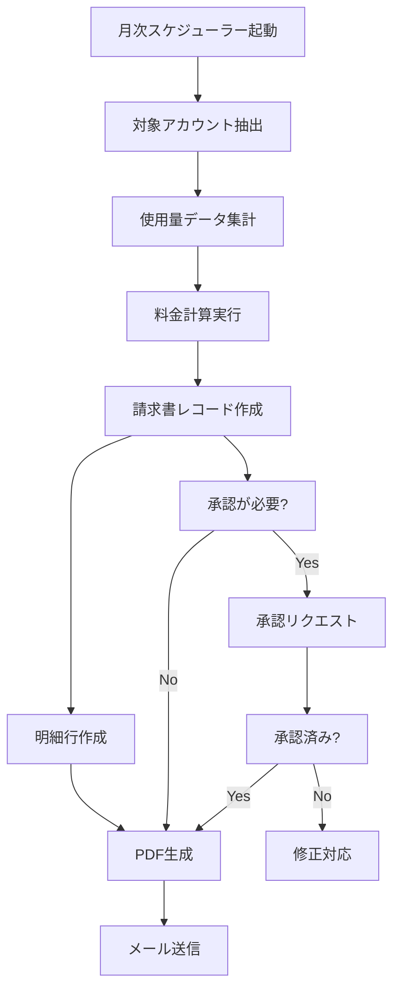
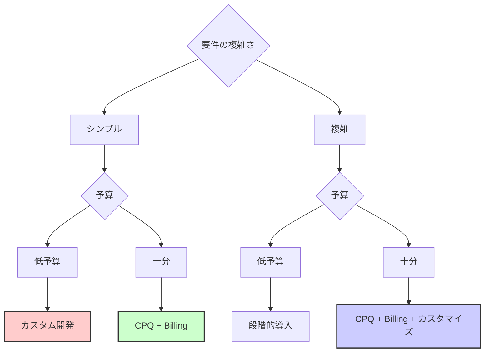

# Salesforceで従量課金を管理する方法

## What's this file?

> [!NOTE]
> **How**
> 
> どのようにSalesforceで従量課金（使用量ベース課金）を管理するかについて記載しています。

## Conclusion (忙しいとき向け)

> [!IMPORTANT]
> **How** : どのようにSalesforceで従量課金を管理するか
> 
> **Answer** : Salesforceで従量課金を管理することは可能です。Salesforce CPQ (Configure Price Quote)、Salesforce Billing、カスタムオブジェクトを使った開発、サードパーティ製品との連携など、複数の実装方法があります。要件の複雑さと予算に応じて最適な方法を選択できます。

## 目次

<details>
<summary>目次を開く</summary>

- [従量課金管理の可否](#従量課金管理の可否)
- [実装方法の選択肢](#実装方法の選択肢)
- [Salesforce CPQ + Billingでの実装](#salesforce-cpq--billingでの実装)
- [カスタム開発での実装](#カスタム開発での実装)
- [実装フロー](#実装フロー)
- [使用量データの管理](#使用量データの管理)
- [料金計算の仕組み](#料金計算の仕組み)
- [請求書生成プロセス](#請求書生成プロセス)
- [導入時の考慮事項](#導入時の考慮事項)
- [関連](#関連)

</details>

## 従量課金管理の可否

### 結論：可能

Salesforceで従量課金管理は**完全に可能**です。以下の方法で実現できます：

- **ネイティブ機能**: Salesforce CPQ + Billing
- **カスタム開発**: カスタムオブジェクトとApex
- **サードパーティ連携**: 専門的な課金システムとの統合
- **ハイブリッド**: 上記の組み合わせ

## 実装方法の選択肢

### 1. Salesforce CPQ + Billing (推奨)


**メリット**:
- 標準機能として提供
- 複雑な料金体系に対応
- 請求書自動生成
- サポート体制が充実

**デメリット**:
- ライセンスコストが高い
- 初期設定が複雑
- カスタマイズに制限

### 2. カスタム開発

**メリット**:
- 完全にカスタマイズ可能
- 追加ライセンス不要
- 既存システムとの柔軟な連携

**デメリット**:
- 開発工数が大きい
- メンテナンスが必要
- 専門知識が必要

### 3. サードパーティ製品

**メリット**:
- 専門的な機能が豊富
- 実績のあるソリューション
- APIでの連携が容易

**デメリット**:
- 追加コスト
- データの二重管理
- 統合の複雑さ

## Salesforce CPQ + Billingでの実装

### 設定手順



### 価格モデルの種類

1. **階層型価格 (Tiered Pricing)**
   - 使用量の範囲ごとに異なる単価
   - 例: 0-100GB: ¥10/GB、101-500GB: ¥8/GB

2. **ブロック価格 (Block Pricing)**
   - 使用量の範囲全体に適用される単価
   - 例: 0-100GB: 全体¥1,000、101-500GB: 全体¥4,000

3. **レート価格 (Per Unit Pricing)**
   - 使用量に関わらず一定の単価
   - 例: ¥10/GB（使用量に関わらず）

## カスタム開発での実装

### オブジェクト構成



### 実装コンポーネント

1. **カスタムオブジェクト**
   - 使用量データ (Usage_Data__c)
   - 料金テーブル (Price_Table__c)
   - 請求明細 (Billing_Detail__c)

2. **Apexクラス**
   - UsageCalculator: 使用量計算
   - PriceCalculator: 料金計算
   - InvoiceGenerator: 請求書生成

3. **自動化**
   - スケジュールジョブ: 定期的な請求処理
   - プロセスビルダー: ステータス管理

## 実装フロー



## 使用量データの管理

### データ取込方法

1. **API統合**
   ```apex
   // REST APIでの使用量データ受信例
   @RestResource(urlMapping='/usage/*')
   global class UsageDataAPI {
       @HttpPost
       global static String createUsage() {
           // 使用量データの処理
       }
   }
   ```

2. **バッチ処理**
   - データローダーでのCSV取込
   - スケジュールバッチでの定期取込

3. **リアルタイム連携**
   - Platform Events
   - Streaming API

## 料金計算の仕組み

### 計算フロー


### 計算例

```apex
public class UsageCalculator {
    public static Decimal calculateTieredPrice(Decimal usage) {
        Decimal totalPrice = 0;
        
        // 階層型価格の計算例
        if (usage > 0) {
            // 0-100: ¥10/unit
            Decimal tier1 = Math.min(usage, 100) * 10;
            totalPrice += tier1;
        }
        
        if (usage > 100) {
            // 101-500: ¥8/unit
            Decimal tier2 = Math.min(usage - 100, 400) * 8;
            totalPrice += tier2;
        }
        
        if (usage > 500) {
            // 501+: ¥6/unit
            Decimal tier3 = (usage - 500) * 6;
            totalPrice += tier3;
        }
        
        return totalPrice;
    }
}
```

## 請求書生成プロセス

### 自動生成フロー



## 導入時の考慮事項

### 技術的考慮事項

- **データボリューム**: 大量の使用量データの処理性能
- **計算精度**: 小数点以下の取り扱い
- **リアルタイム性**: データ反映のタイミング
- **エラーハンドリング**: 異常データの処理

### ビジネス考慮事項

- **料金体系の複雑さ**: 将来の拡張性を考慮
- **請求サイクル**: 月次、四半期、年次など
- **通貨対応**: 多通貨対応の必要性
- **コンプライアンス**: 税制や規制への対応

### 選択基準



## 関連

- [Salesforce CPQ Documentation](https://help.salesforce.com/s/articleView?id=sf.cpq_overview.htm)
- [Salesforce Billing Documentation](https://help.salesforce.com/s/articleView?id=sf.blng_overview.htm)
- [Trailhead - Quote-to-Cash with Salesforce CPQ](https://trailhead.salesforce.com/ja/content/learn/trails/cpq)