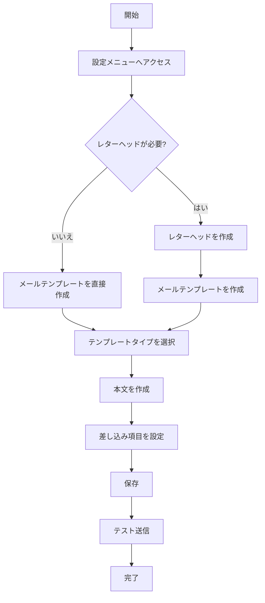

# Salesforceでメールレターヘッドとメールテンプレートを設定する方法

## What's this file?
> [!NOTE]
> **How**
> 
> どのようにSalesforceでメールレターヘッドとメールテンプレートを設定するかについて記載しています。

## Conclusion (忙しいとき向け)
> [!IMPORTANT]
> **How** : どのようにSalesforceでメールレターヘッドとメールテンプレートを設定するか
> 
> **Answer** : レターヘッドで共通のヘッダー・フッターを作成し、メールテンプレートでレターヘッドを使用してメール本文を作成する

## 目次

<details>
<summary>目次を開く</summary>

- [メールレターヘッドとは](#メールレターヘッドとは)
- [メールテンプレートとは](#メールテンプレートとは)
- [設定フロー](#設定フロー)
- [レターヘッドの設定手順](#レターヘッドの設定手順)
- [メールテンプレートの設定手順](#メールテンプレートの設定手順)
- [使用時の注意点](#使用時の注意点)

</details>

## メールレターヘッドとは

メールレターヘッドは、Salesforceのメールテンプレートで使用される共通のヘッダーとフッターのデザインテンプレートです。

### 主な特徴
- 会社ロゴやブランドカラーを統一できる
- ヘッダーとフッターのデザインを一元管理
- 複数のメールテンプレートで再利用可能

## メールテンプレートとは

メールテンプレートは、繰り返し使用するメールの雛形です。レターヘッドと組み合わせて使用することで、ブランド統一されたメールを効率的に作成できます。

### テンプレートの種類
1. **テキストテンプレート** - プレーンテキスト形式
2. **HTMLテンプレート（レターヘッド使用）** - HTMLメールでレターヘッドを使用
3. **カスタムHTMLテンプレート** - 完全カスタムHTML
4. **Visualforceテンプレート** - 高度なカスタマイズ用

## 設定フロー



## レターヘッドの設定手順

### 1. 設定画面へのアクセス
1. 設定 > クイック検索で「レターヘッド」を検索
2. 「レターヘッド」をクリック
3. 「新規レターヘッド」をクリック

### 2. レターヘッドの作成
```
基本情報：
- レターヘッド名: 会社名_レターヘッド
- フォルダ: 適切なフォルダを選択
- 有効: チェック
```

### 3. デザイン設定
- **ヘッダープロパティ**
  - 背景色の設定
  - ロゴ画像のアップロード
  - テキストの配置
  
- **フッタープロパティ**
  - 会社情報の入力
  - 著作権表示
  - リンクの設定

## メールテンプレートの設定手順

### 1. テンプレート作成画面へのアクセス
1. 設定 > クイック検索で「メールテンプレート」を検索
2. 「メールテンプレート」をクリック
3. 「新規テンプレート」をクリック

### 2. テンプレートタイプの選択
レターヘッドを使用する場合は「HTMLメール（レターヘッドを使用）」を選択

### 3. テンプレートの作成
```
基本設定：
- フォルダ: 適切なフォルダを選択
- 有効: チェック
- テンプレート名: わかりやすい名前
- エンコーディング: 通常は「日本語(Shift_JIS)」
- 件名: メールの件名
- レターヘッド: 作成したレターヘッドを選択
```

### 4. 本文の作成
#### 差し込み項目の使用例
```
{!Contact.LastName} 様

お世話になっております。
{!User.Name}です。

商談名: {!Opportunity.Name}
金額: {!Opportunity.Amount}

よろしくお願いいたします。
```

### 5. HTMLエディタでの編集
- リッチテキストエディタで視覚的に編集
- HTMLソースを直接編集も可能
- 画像の挿入やリンクの設定

## 使用時の注意点

### レターヘッドの注意点
1. **画像サイズ**: ロゴ画像は適切なサイズに最適化
2. **レスポンシブ対応**: モバイルでの表示を考慮
3. **フォルダ管理**: 適切なフォルダで管理し、権限設定を確認

### メールテンプレートの注意点
1. **差し込み項目**: 使用前に項目の存在を確認
2. **文字エンコーディング**: 日本語の場合はShift_JISを推奨
3. **テスト送信**: 本番使用前に必ずテスト
4. **添付ファイル**: テンプレートに添付可能（最大5MB）

### セキュリティ考慮事項
- 個人情報を含む差し込み項目の使用は慎重に
- 外部画像リンクはHTTPSを使用
- 送信前に宛先の確認を徹底

## 関連
- [Salesforceのメール送信制限](https://help.salesforce.com/s/articleView?id=sf.email_limits.htm)
- [差し込み項目の使い方](https://help.salesforce.com/s/articleView?id=sf.merge_fields.htm)
- [Visualforceメールテンプレート](https://developer.salesforce.com/docs/atlas.ja-jp.pages.meta/pages/pages_email_templates.htm)