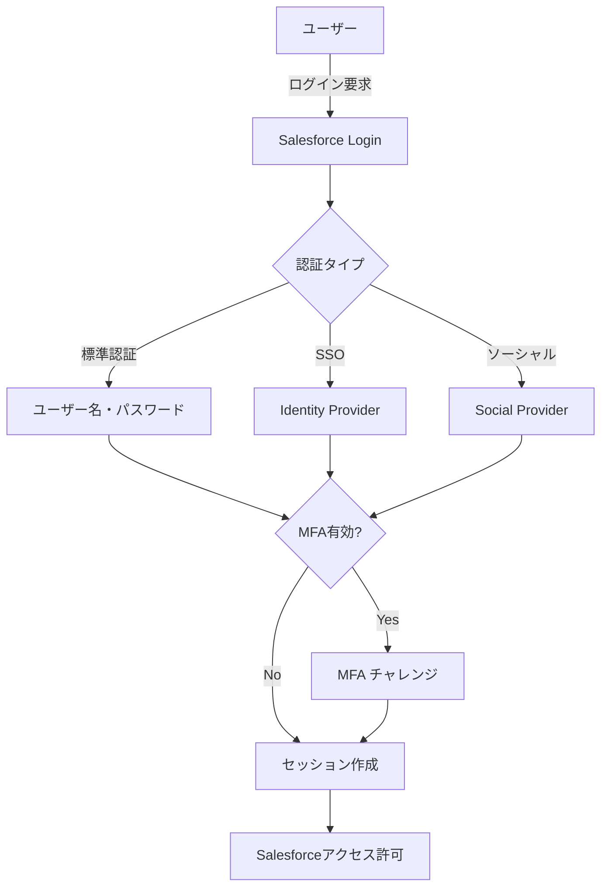
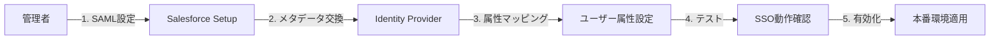

# Salesforce Identityとは

## What's this file?
> [!NOTE]
> **What**
> 
> Salesforce Identityとは何かについて記載しています。

## Conclusion (忙しいとき向け)
> [!IMPORTANT]
> **What** : Salesforce Identityとは何か
> 
> **Answer** : Salesforceのアイデンティティ・アクセス管理(IAM)ソリューション。シングルサインオン(SSO)、多要素認証(MFA)、ソーシャルログインなど、ユーザー認証と管理の包括的な機能を提供するプラットフォーム。

## 目次

<details>
<summary>目次を開く</summary>

- [概要](#概要)
- [主要コンポーネント](#主要コンポーネント)
- [認証フロー](#認証フロー)
- [メリット](#メリット)
- [実装例](#実装例)

</details>

## 概要

Salesforce Identityは、組織内外のユーザーに対して安全で効率的なアクセス管理を提供するIDソリューションです。

### 主な特徴
- **統合アイデンティティ管理**: 単一のプラットフォームで全ユーザーのアイデンティティを管理
- **柔軟な認証オプション**: パスワード、MFA、生体認証など多様な認証方法をサポート
- **カスタマイズ可能**: 組織のニーズに合わせて認証フローをカスタマイズ

## 主要コンポーネント

### 1. Identity Connect
- オンプレミスのActive DirectoryとSalesforceを同期
- ユーザー情報の自動同期と管理

### 2. Single Sign-On (SSO)
- SAML、OAuth、OpenID Connectをサポート
- 複数のアプリケーションへのシームレスなアクセス

### 3. My Domain
- 組織専用のログインURLを作成
- ブランディングとセキュリティの向上

### 4. Multi-Factor Authentication (MFA)
- Salesforce Authenticatorアプリ
- SMS、Email、U2Fセキュリティキーなどをサポート

## 認証フロー



## メリット

### セキュリティ面
- **強化された認証**: MFAによる不正アクセスの防止
- **統合監査証跡**: すべてのログインアクティビティを記録
- **リスクベース認証**: 異常なアクセスパターンの検出

### 運用面
- **管理コストの削減**: 統一されたユーザー管理
- **ユーザー体験の向上**: SSOによるパスワード疲労の軽減
- **コンプライアンス対応**: 業界標準への準拠

## 実装例

### SAML SSOの設定フロー


### API統合
```
// OAuth 2.0フローの例
1. 認可エンドポイントへリダイレクト
2. ユーザー認証と認可
3. 認可コード取得
4. アクセストークン交換
5. APIアクセス
```

## 関連
- [Salesforce Shield](./salesforce_shield.md) - 高度なセキュリティ機能
- [Experience Cloud](./experience_cloud.md) - 外部ユーザー向けポータル
- [Connected App](./connected_app.md) - 外部アプリケーション統合