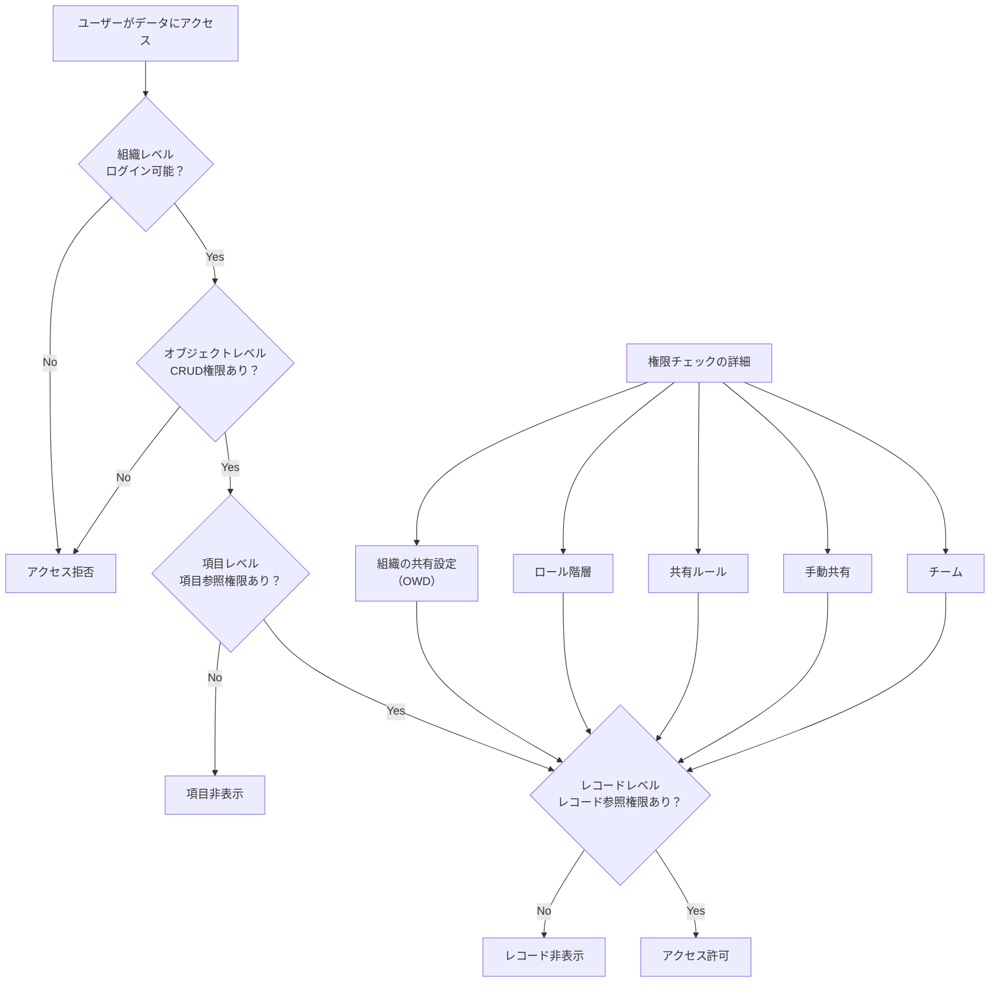

# Salesforceで組織・オブジェクト・項目・レコードレベルでデータアクセスを制御する方法

## What's this file?
> [!NOTE]
> **How**
> 
> どのようにSalesforceで階層別にデータアクセスを制御するかについて記載しています。

## Conclusion (忙しいとき向け)
> [!IMPORTANT]
> **How** : どのようにSalesforceで組織・オブジェクト・項目・レコードレベルでデータアクセスを制御するか
> 
> **Answer** : 組織レベルではプロファイル、オブジェクトレベルでは権限セット、項目レベルでは項目レベルセキュリティ、レコードレベルでは組織の共有設定・ロール階層・共有ルールを使用して、段階的にアクセス制御を行います。

## 目次

目次を開く

- [データアクセス制御の階層構造](#データアクセス制御の階層構造)
- [組織レベルのアクセス制御](#組織レベルのアクセス制御)
- [オブジェクトレベルのアクセス制御](#オブジェクトレベルのアクセス制御)
- [項目レベルのアクセス制御](#項目レベルのアクセス制御)
- [レコードレベルのアクセス制御](#レコードレベルのアクセス制御)
- [アクセス制御フローチャート](#アクセス制御フローチャート)

## データアクセス制御の階層構造

Salesforceのデータアクセス制御は以下の4つのレベルで構成されています：

1. **組織レベル** - 最も広範囲のアクセス制御
2. **オブジェクトレベル** - 特定のオブジェクトへのアクセス制御
3. **項目レベル** - オブジェクト内の特定項目へのアクセス制御
4. **レコードレベル** - 個別レコードへのアクセス制御

## 組織レベルのアクセス制御

### プロファイル
- ユーザーの基本的な権限を定義
- アプリケーション、タブ、レコードタイプへのアクセスを制御
- システム権限（設定へのアクセス、データのエクスポート等）を管理

### ライセンス
- ユーザーが利用できる機能の範囲を決定
- プロファイルと連動して動作

## オブジェクトレベルのアクセス制御

### オブジェクト権限
- CRUD（作成・参照・更新・削除）権限の設定
- すべて表示、すべて変更の権限

### 権限セット
- プロファイルの権限を拡張
- 特定のユーザーに追加権限を付与

### 権限セットグループ
- 複数の権限セットをグループ化
- 管理の効率化

## 項目レベルのアクセス制御

### 項目レベルセキュリティ
- 特定の項目への参照・編集権限を制御
- プロファイルまたは権限セットで設定

### ページレイアウト
- UIレベルでの項目の表示/非表示を制御
- セキュリティ機能ではないことに注意

## レコードレベルのアクセス制御

### 組織の共有設定（OWD）
- オブジェクトごとのデフォルト共有設定
- 非公開、参照のみ、参照・更新から選択

### ロール階層
- 上位ロールは下位ロールのレコードにアクセス可能
- 階層による自動的なレコード共有

### 共有ルール
- 条件に基づく自動共有
- 所有者ベース、条件ベースの共有ルール

### 手動共有
- 個別レコードを特定ユーザーと共有
- レコード所有者が実行可能

### チーム
- 取引先チーム、商談チーム、ケースチーム
- 複数ユーザーでのレコード管理

## アクセス制御フローチャート

## 関連
- [Salesforceの権限セットとグループ](./2025.08.17.23.21_what_salesforce_permission_set_and_group.md)
- [Salesforceの組織の共有設定](./2025.08.17.23.26_what_salesforce_organization_sharing_settings.md)
- [レコードの表示を所有者と上位ロールのみに制限する方法](./2025.08.17.23.42_how_restrict_record_visibility_owner_and_super_role_salesforce.md)