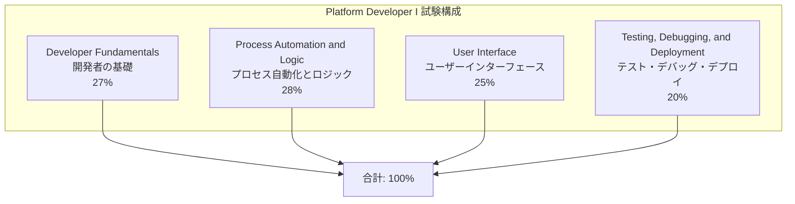
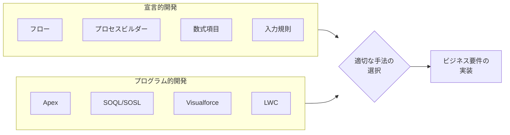
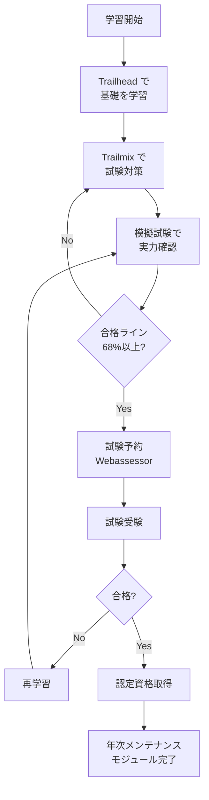

# Salesforce Platform Developer 認定資格

## What's this file?
> [!NOTE]
> **What**
>
> Salesforce Platform Developer 認定資格とは何かについて記載しています。

## Conclusion (忙しいとき向け)
> [!IMPORTANT]
> **What** : Salesforce Platform Developer 認定資格とは何か
>
> **Answer** : Lightning Platformのプログラミング機能（Apex、Visualforce）を使用してカスタムビジネスロジックやカスタムインターフェースを開発・デプロイする能力を証明するSalesforce公式認定資格

## 目次

目次を開く

- [概要](#概要)
- [試験の出題範囲と配点](#試験の出題範囲と配点)
- [試験の詳細](#試験の詳細)
- [必要なスキル](#必要なスキル)
- [資格取得の流れ](#資格取得の流れ)
- [維持要件](#維持要件)
- [学習リソース](#学習リソース)

## 概要

Salesforce Platform Developer I（PD1）は、Lightning Platformでのカスタムアプリケーション開発スキルを証明する認定資格である。

宣言的機能とプログラミング的機能（Apex、Visualforce）の両方を理解し、適切な方法を選択してビジネス要件を実装できる能力が求められる。

## 試験の出題範囲と配点

試験は4つの主要分野から構成される。

| 分野 | 配点 | 主な内容 |
|------|------|----------|
| Developer Fundamentals | 27% | データモデリング、SOQLクエリ、DML操作 |
| Process Automation and Logic | 28% | Apexトリガー、フロー、プロセスビルダー |
| User Interface | 25% | Visualforce、Lightning Web Components |
| Testing, Debugging, and Deployment | 20% | Apexテスト、デバッグ、変更セット |

## 試験の詳細

| 項目 | 内容 |
|------|------|
| 問題数 | 60問（+5問のスコア対象外問題） |
| 合格ライン | 68% |
| 問題形式 | 多肢選択式・複数選択式 |
| 試験時間 | 105分 |
| 受験料 | $200 USD（再受験: $100 USD） |
| 前提資格 | なし（ただし実務経験推奨） |

## 必要なスキル

主要なスキル要件:

- **Apex**: クラス、トリガー、バッチ処理、スケジュール実行
- **SOQL/SOSL**: データクエリの最適化、ガバナ制限の理解
- **Visualforce**: ページ作成、コントローラー拡張
- **Lightning Web Components**: 基本的なコンポーネント開発
- **データモデリング**: オブジェクト関係、マスター詳細/参照関係

## 資格取得の流れ

## 維持要件

認定資格を維持するには、年に3回のSalesforceリリース（Spring、Summer、Winter）に合わせてメンテナンスモジュールを完了する必要がある。

- メンテナンスは無料
- Trailhead上で完了
- 期限内に完了しないと資格が失効

## 学習リソース

| リソース | 説明 |
|----------|------|
| [Salesforce公式資格一覧](https://tandc.salesforce.com/credentials) | 全認定資格の概要 |
| [Platform Developer I 認定ページ](https://trailhead.salesforce.com/en/credentials/platformdeveloperi) | 公式試験情報 |
| [日本語対策Trailmix](https://trailhead.salesforce.com/users/welcome4/trailmixes/salesforce-platform-dev-1) | 日本語学習パス |
| [Trailhead Academy](https://trailheadacademy.salesforce.com/certificate/exam-platform-dev1---Plat-Dev-201) | 公式トレーニング |

## 関連

- Salesforce認定アドミニストレーター
- Salesforce認定上級アドミニストレーター
- Salesforce認定Platform Developer II
- Salesforce認定JavaScript Developer I
