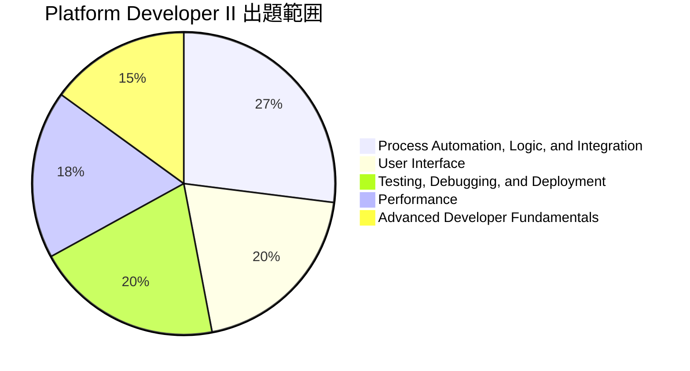
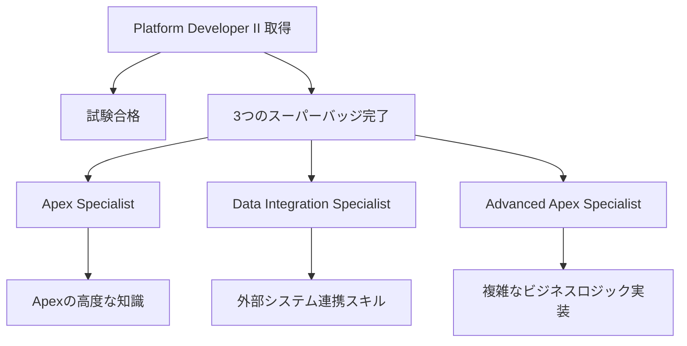
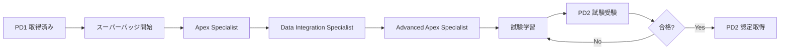

# Salesforce Platform Developer II 認定資格

## What's this file?
> [!NOTE]
> **What**
>
> Salesforce Platform Developer II 認定資格とは何かについて記載しています。

## Conclusion (忙しいとき向け)
> [!IMPORTANT]
> **What** : Salesforce Platform Developer II 認定資格とは何か
>
> **Answer** : Salesforce Platformの高度なプログラミング機能に精通し、複雑なビジネスロジックやインターフェースを構築できる開発者を認定する上級資格。Platform Developer I の上位資格であり、3つのスーパーバッジと試験の合格が必要。

## 目次

目次を開く

- [概要](#概要)
- [試験詳細](#試験詳細)
- [受験要件](#受験要件)
- [出題範囲と配点](#出題範囲と配点)
- [必須スーパーバッジ](#必須スーパーバッジ)
- [取得までのフロー](#取得までのフロー)
- [推奨される経験](#推奨される経験)
- [学習リソース](#学習リソース)

## 概要

Salesforce Platform Developer II（PD2）は、Salesforce Platform上での高度なカスタムアプリケーション開発スキルを証明する上級認定資格である。データモデリングを活用した複雑なビジネスロジックとインターフェースの開発能力が問われる。

## 試験詳細

| 項目 | 詳細 |
|------|------|
| 問題数 | 60問（＋最大5問の採点対象外問題） |
| 試験時間 | 120分 |
| 合格ライン | 70% |
| 受験料 | $200（税別） |
| 再受験料 | $100 |
| 受験形式 | オンラインプロクター監督 または テストセンター |

## 受験要件

Platform Developer II を受験するには、以下の前提条件を満たす必要がある：

1. **Platform Developer I 認定資格を保持していること**
2. **3つの必須スーパーバッジを完了していること**

## 出題範囲と配点

| トピック | 配点 |
|----------|------|
| Process Automation, Logic, and Integration | 27% |
| User Interface | 20% |
| Testing, Debugging, and Deployment | 20% |
| Performance | 18% |
| Advanced Developer Fundamentals | 15% |

### 各トピックの詳細

1. **Advanced Developer Fundamentals (15%)**
   - ローカライゼーションとマルチ通貨機能
   - 共有オブジェクトとApex管理共有の適切な使用

2. **Process Automation, Logic, and Integration (27%)**
   - Apexトリガーのベストプラクティス
   - エラーハンドリングとトランザクション整合性
   - 高度なSOQLクエリ構造

3. **User Interface (20%)**
   - Lightning Componentの高度な実装
   - Visualforceの高度なパターン

4. **Testing, Debugging, and Deployment (20%)**
   - テスト戦略とベストプラクティス
   - デバッグツールの活用
   - デプロイメントプロセス

5. **Performance (18%)**
   - パフォーマンス最適化技術
   - ガバナ制限の管理

## 必須スーパーバッジ

| スーパーバッジ | 主な学習内容 |
|----------------|--------------|
| Apex Specialist | Apexトリガー、非同期Apex、Apexテスト |
| Data Integration Specialist | REST/SOAP連携、外部システム統合 |
| Advanced Apex Specialist | 高度なトリガー設計、データ操作パターン |

## 取得までのフロー

## 推奨される経験

Platform Developer II の取得を目指す候補者には、以下の経験が推奨される：

- **開発経験**: 2〜4年のSalesforce開発経験
- **実務経験**: 最低1年以上のSalesforce Platformでのソリューション設計・実装・デプロイ経験
- **スキルセット**:
  - 高度なApexプログラミング
  - Lightning Component開発
  - 外部システム連携
  - パフォーマンスチューニング

## 学習リソース

1. **公式リソース**
   - Salesforce公式試験ガイド
   - Trailhead PD2 準備用Trailmix

2. **実践的学習**
   - Developer Edition組織での実装練習
   - 実際のプロジェクトでの経験

3. **コミュニティ**
   - Salesforce Developer Community
   - 模擬試験・練習問題

## 関連

- [Salesforce Platform Developer I 認定資格](./2025.12.22.09.35_what_salesforce_platform_developer_certification.md)
- [Salesforce Apex](./2025.08.12.09.09_what_salesforce_apex.md)
- [Salesforce 認定資格メンテナンス](./2025.08.12.09.27_what_salesforce_certificate_maintenance_schedule.md)

---

**参考ソース:**
- [Salesforce Trailhead - Platform Developer II](https://trailhead.salesforce.com/credentials/platformdeveloperii)
- [Salesforce Ben - Platform Developer 2 Certification Guide](https://www.salesforceben.com/salesforce-platform-developer-2-certification-guide-tips/)
- [Focus on Force - Platform Developer 2](https://focusonforce.com/salesforce-certifications/platform-developer-2/)
