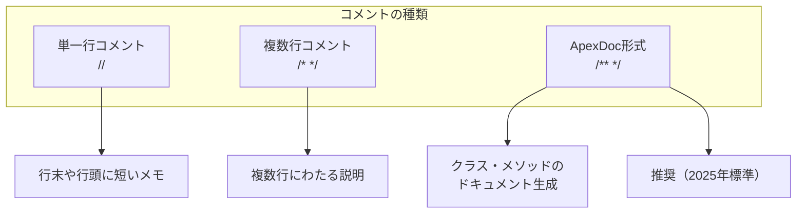
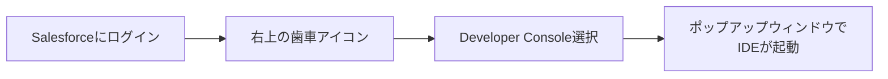
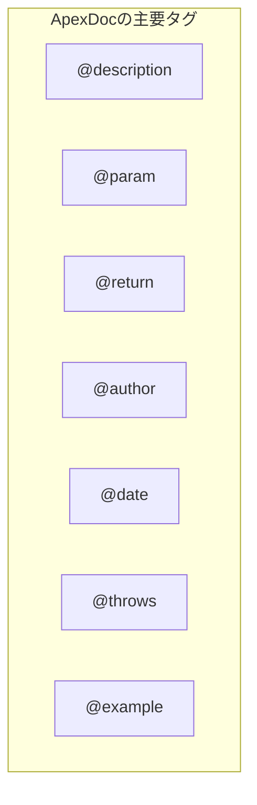
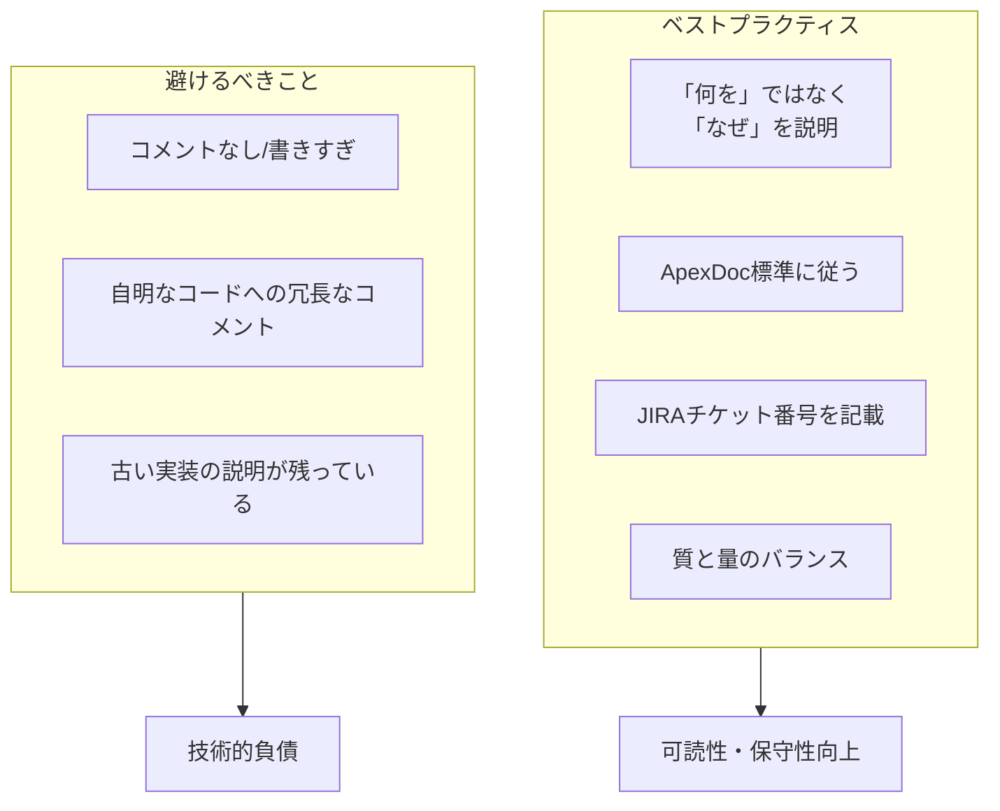

# Salesforce Developer Consoleでコメントを記述する方法

## What's this file?
> [!NOTE]
> **How**
>
> どのようにSalesforce Developer Consoleでコメントを記述するかについて記載しています。

## Conclusion (忙しいとき向け)
> [!IMPORTANT]
> **How** : どのようにSalesforce Developer Consoleでコメントを記述するか
>
> **Answer** : Apexコードでは単一行コメント(`//`)、複数行コメント(`/* */`)、ApexDoc形式(`/** */`)の3種類を使い分ける。ApexDoc形式が2025年現在の推奨標準。

## 目次

<details>
<summary>目次を開く</summary>

- [コメントの種類](#コメントの種類)
- [Developer Consoleへのアクセス方法](#developer-consoleへのアクセス方法)
- [ApexDoc形式のコメント](#apexdoc形式のコメント)
- [コメントのベストプラクティス](#コメントのベストプラクティス)

</details>

## コメントの種類

Apexコードでは以下の3種類のコメント形式が利用可能。



### 単一行コメント

```apex
// これは単一行コメントです
Integer count = 10; // 行の途中からもコメント可能
```

### 複数行コメント

```apex
/*
  これは複数行コメントです
  複数行にわたってコメントを
  記述できます
*/
```

## Developer Consoleへのアクセス方法



### Developer Consoleの特徴

| 機能 | 説明 |
|------|------|
| 構文カラーリング | コメント、キーワード、文字列リテラルが色分け表示 |
| 行番号表示 | 各行に行番号が自動表示 |
| 自動コンパイル | 保存時に自動コンパイル |

> [!WARNING]
> - Developer Consoleには**バージョン管理機能**がない
> - Lightning Web Componentの開発はDeveloper Consoleでは不可

## ApexDoc形式のコメント

Winter '26リリースから公式推奨されている標準コメント形式。



### ApexDocの記述例

```apex
/**
 * @description アカウント情報を取得するメソッド
 * @param accountId 取得対象のアカウントID
 * @return Account アカウントオブジェクト
 * @example
 * Account acc = getAccountById('001xxxxxxxxxxxxx');
 */
public Account getAccountById(Id accountId) {
    return [SELECT Id, Name FROM Account WHERE Id = :accountId];
}
```

### クラスレベルのApexDoc

```apex
/**
 * @description クラスの説明
 * @author 作成者名
 * @date 作成日
 * @group グループ名
 */
public class MyClass {
    // クラスの実装
}
```

## コメントのベストプラクティス



### 推奨事項

1. **「何を」ではなく「なぜ」を説明する**
   - コードが何をしているかではなく、なぜそのコードを書いたのかを説明

2. **ApexDoc標準に従う**
   - メソッド行に明示的なスコープ（global, public, private, testMethod, webService）が必要

3. **チケット番号の記載**
   - JIRAなどのチケット番号をコメントに含める

4. **質と量のバランス**
   - クラスとメソッドのヘッダーには必ずドキュメントコメントを記述
   - インラインコメントは複雑なロジックを明確にする場合のみ使用

## 関連

- [Apex Developer Guide - Comments](https://developer.salesforce.com/docs/atlas.en-us.apexcode.meta/apexcode/langCon_apex_expressions_comments.htm)
- [ApexDoc Comment Structure and Tags](https://developer.salesforce.com/docs/atlas.en-us.apexcode.meta/apexcode/apex_doc_format.htm)
- [Developer Console | Trailhead](https://trailhead.salesforce.com/content/learn/modules/developer_console/developer_console_intro)
