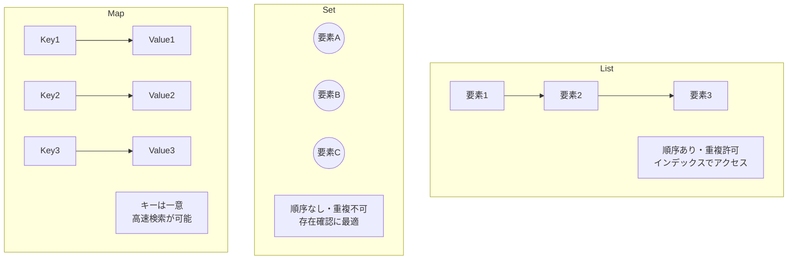
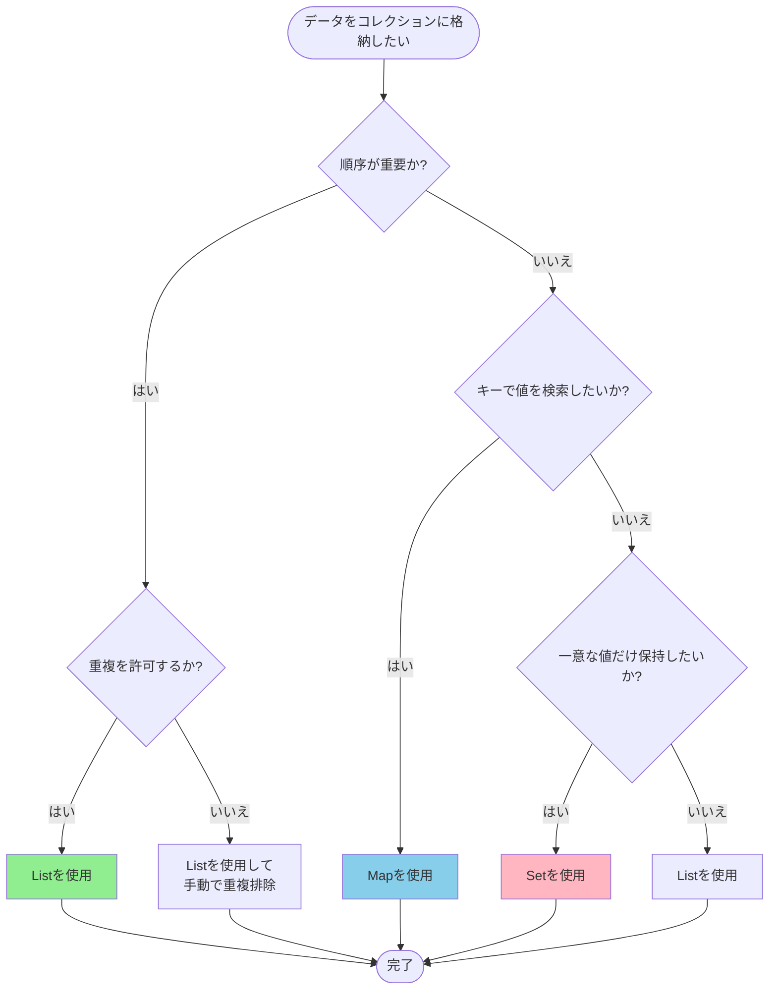

# Salesforce Apex コレクション: List, Set, Map

## What's this file?
> [!NOTE]
> **What**
>
> Salesforce ApexのList、Set、Mapとは何かについて記載しています。

## Conclusion (忙しいとき向け)
> [!IMPORTANT]
> **What** : Salesforce ApexのList、Set、Mapとは何か
>
> **Answer** : Apexにおけるコレクションは、複数のデータを効率的に管理・操作するためのデータ構造。Listは順序付き重複許可、Setは順序なし重複不可、Mapはキーと値のペアで管理する。

## 目次

<details>
<summary>目次を開く</summary>

- [コレクションの概要](#コレクションの概要)
- [List（リスト）](#listリスト)
- [Set（セット）](#setセット)
- [Map（マップ）](#mapマップ)
- [コレクション比較図](#コレクション比較図)
- [使い分けフローチャート](#使い分けフローチャート)
- [関連](#関連)

</details>

## コレクションの概要

Salesforce Apexでは、以下の3種類のコレクションが提供されている：

| コレクション | 順序 | 重複 | アクセス方法 |
|-------------|------|------|-------------|
| List | あり | 許可 | インデックス |
| Set | なし | 不可 | 要素の存在確認 |
| Map | なし | キーは不可 | キー |

> [!TIP]
> コレクションには格納できるアイテム数の制限はないが、ヒープサイズには一般的な制限がある。

## List（リスト）

### 概要

Listは**順序付けられた要素のコレクション**で、インデックスによって区別される。

### 宣言構文

```apex
// 空のListを宣言
List<データ型> リスト名 = new List<データ型>();

// 初期値付きで宣言
List<String> colors = new List<String>{'Red', 'Blue', 'Green'};

// 配列記法でも宣言可能
String[] colors = new String[]{'Red', 'Blue', 'Green'};
```

### 主要メソッド

| メソッド | 説明 |
|---------|------|
| `add(element)` | 要素を末尾に追加 |
| `add(index, element)` | 指定位置に要素を挿入 |
| `get(index)` | 指定位置の要素を取得 |
| `set(index, element)` | 指定位置の要素を置換 |
| `remove(index)` | 指定位置の要素を削除 |
| `size()` | 要素数を取得 |
| `isEmpty()` | 空かどうかを確認 |
| `clear()` | 全要素を削除 |
| `contains(element)` | 要素の存在を確認 |

### 使用例

```apex
// 取引先リストの作成と操作
List<Account> accounts = new List<Account>();
accounts.add(new Account(Name='Company A'));
accounts.add(new Account(Name='Company B'));

// インデックスでアクセス
Account firstAccount = accounts.get(0);
// または accounts[0] でもアクセス可能

// SOQLの結果をListに格納
List<Contact> contacts = [SELECT Id, Name FROM Contact LIMIT 10];
```

## Set（セット）

### 概要

Setは**重複を含まない要素の順序なしコレクション**である。

### 宣言構文

```apex
// 空のSetを宣言
Set<データ型> セット名 = new Set<データ型>();

// 初期値付きで宣言
Set<String> uniqueColors = new Set<String>{'Red', 'Blue', 'Green'};
```

### 主要メソッド

| メソッド | 説明 |
|---------|------|
| `add(element)` | 要素を追加（重複は無視） |
| `addAll(collection)` | コレクションの全要素を追加 |
| `contains(element)` | 要素の存在を確認 |
| `remove(element)` | 要素を削除 |
| `size()` | 要素数を取得 |
| `isEmpty()` | 空かどうかを確認 |
| `clear()` | 全要素を削除 |

### 使用例

```apex
// 重複するIDを除外
Set<Id> accountIds = new Set<Id>();
for(Contact c : contacts) {
    accountIds.add(c.AccountId);
}

// Setを使ったSOQLクエリ（IN句）
List<Account> relatedAccounts = [
    SELECT Id, Name
    FROM Account
    WHERE Id IN :accountIds
];
```

## Map（マップ）

### 概要

Mapは**一意のキーが単一の値にマップされるキーと値のペアのコレクション**である。

### 宣言構文

```apex
// 空のMapを宣言
Map<キーの型, 値の型> マップ名 = new Map<キーの型, 値の型>();

// 初期値付きで宣言
Map<String, Integer> colorCodes = new Map<String, Integer>{
    'Red' => 1,
    'Blue' => 2,
    'Green' => 3
};
```

### 主要メソッド

| メソッド | 説明 |
|---------|------|
| `put(key, value)` | キーと値のペアを追加 |
| `get(key)` | キーに対応する値を取得 |
| `containsKey(key)` | キーの存在を確認 |
| `remove(key)` | キーと値のペアを削除 |
| `keySet()` | 全キーのSetを取得 |
| `values()` | 全値のListを取得 |
| `size()` | 要素数を取得 |
| `isEmpty()` | 空かどうかを確認 |

### 使用例

```apex
// SOQLの結果をMapに格納（Id => sObject）
Map<Id, Account> accountMap = new Map<Id, Account>(
    [SELECT Id, Name FROM Account]
);

// 特定のIdでアクセス
Account acc = accountMap.get(someAccountId);

// キーの存在確認
if(accountMap.containsKey(targetId)) {
    // 処理
}
```

## コレクション比較図



## 使い分けフローチャート



## 関連

- [Apex Developer Guide - Collections](https://developer.salesforce.com/docs/atlas.en-us.apexcode.meta/apexcode/langCon_apex_collections.htm)
- [Trailhead - Define Sets and Maps](https://trailhead.salesforce.com/content/learn/modules/object-oriented-programming-for-admins/define-sets-and-maps)
- [Trailhead - Use Collections](https://trailhead.salesforce.com/content/learn/modules/apex-basics-for-admins/use-collections)
