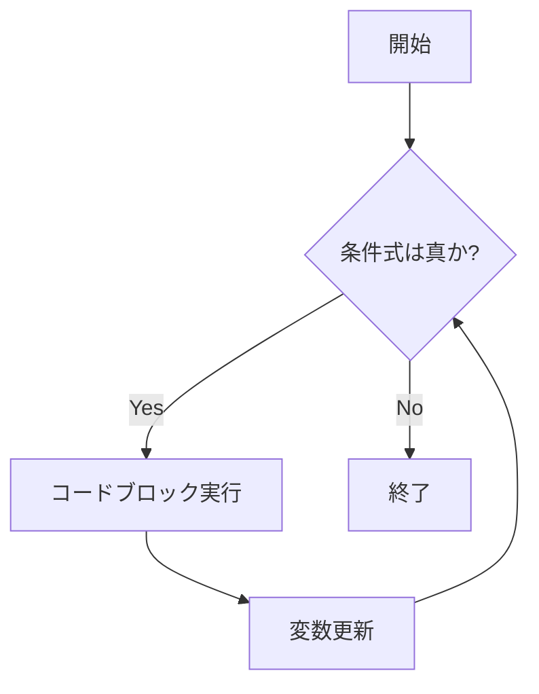
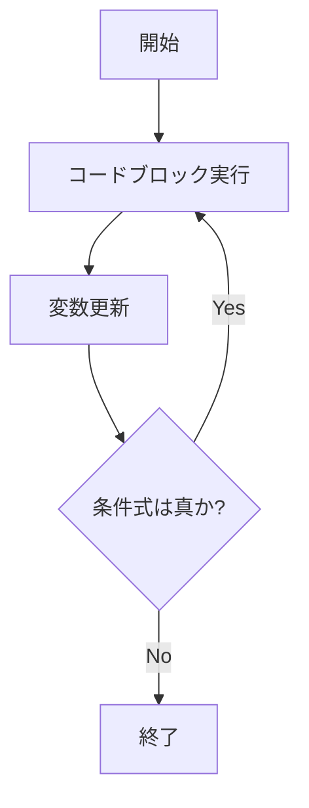
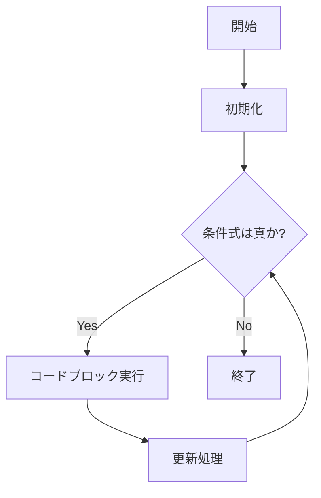
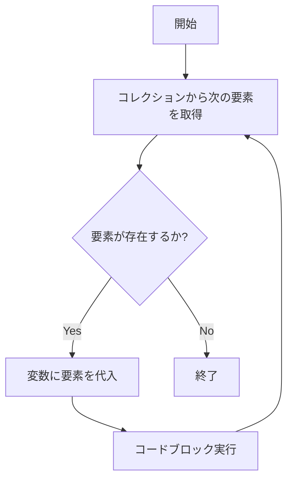
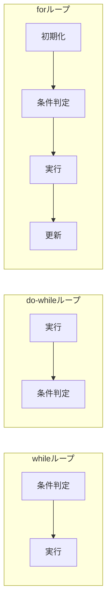
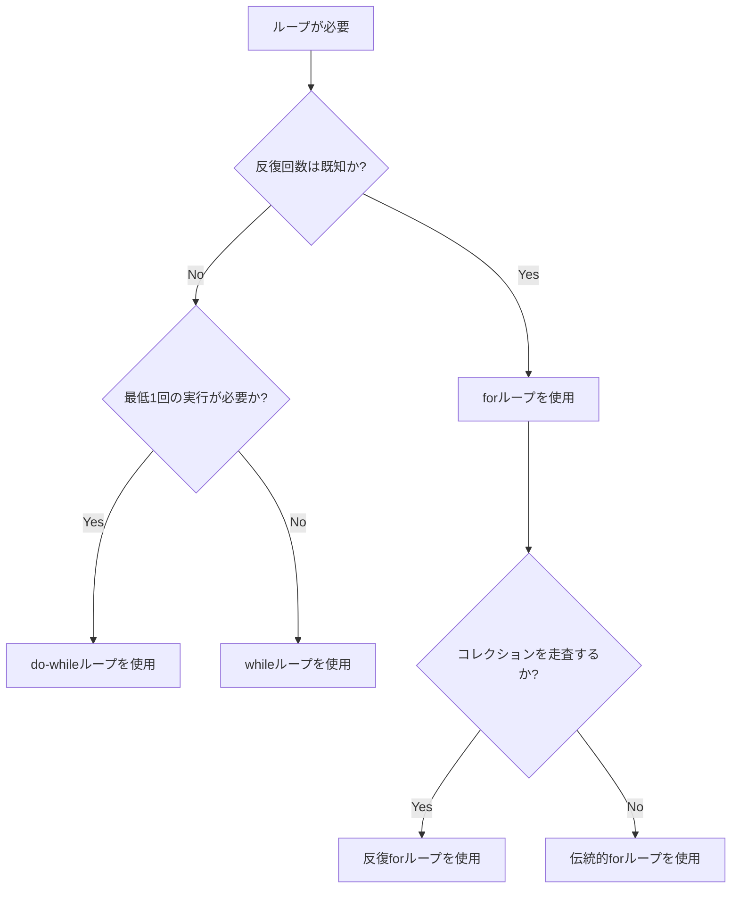

# Salesforce Apex ループ構文 (while, do-while, for)

## What's this file?
> [!NOTE]
> **What**
>
> Salesforce Apexにおけるループ構文（while, do-while, for）とは何かについて記載しています。

## Conclusion (忙しいとき向け)
> [!IMPORTANT]
> **What** : Salesforce Apexのループ構文とは何か
>
> **Answer** : Apexには3種類のループがある。whileループは条件が真の間実行、do-whileループは最低1回実行後に条件判定、forループは反復回数が既知の場合やコレクション走査に使用する。

## 目次

<details>
<summary>目次を開く</summary>

- [1. ループの種類と概要](#1-ループの種類と概要)
- [2. whileループ](#2-whileループ)
- [3. do-whileループ](#3-do-whileループ)
- [4. forループ](#4-forループ)
- [5. 各ループの比較](#5-各ループの比較)
- [6. 使い分けの指針](#6-使い分けの指針)

</details>

## 1. ループの種類と概要

Salesforce Apexには以下の3種類のループ構文が存在する：

| ループ種類 | 特徴 | 主な用途 |
|-----------|------|---------|
| while | 条件が真の間、繰り返し実行 | 終了条件が動的な場合 |
| do-while | 最低1回実行後、条件判定 | 必ず1回は実行したい場合 |
| for | 反復回数が既知/コレクション走査 | リストやSOQLクエリの処理 |

## 2. whileループ

### 構文

```apex
while (条件式) {
    // 実行するコード
}
```

### フローチャート



### 使用例

```apex
Integer i = 1;
while (i <= 5) {
    System.debug('カウント: ' + i);
    i++;
}
// 出力: カウント: 1, カウント: 2, ... カウント: 5
```

### 特徴
- 条件式が最初から偽の場合、コードブロックは**一度も実行されない**
- 無限ループを避けるため、ループ内で条件を変化させる処理が必要

## 3. do-whileループ

### 構文

```apex
do {
    // 実行するコード
} while (条件式);
```

### フローチャート



### 使用例

```apex
Integer count = 5;
do {
    System.debug('Count: ' + count);
    count--;
} while (count > 0);
// 出力: Count: 5, Count: 4, ... Count: 1
```

### 特徴
- 条件式が偽でも**最低1回はコードブロックが実行される**
- whileループとの主な違いは条件判定のタイミング

## 4. forループ

### 4.1 伝統的なforループ

#### 構文

```apex
for (初期化; 条件式; 更新処理) {
    // 実行するコード
}
```

#### フローチャート



#### 使用例

```apex
for (Integer i = 0; i < 5; i++) {
    System.debug('インデックス: ' + i);
}
// 出力: インデックス: 0, インデックス: 1, ... インデックス: 4
```

### 4.2 リスト/セット反復forループ

#### 構文

```apex
for (データ型 変数名 : コレクション) {
    // 実行するコード
}
```

#### フローチャート



#### 使用例

```apex
List<String> fruits = new List<String>{'りんご', 'みかん', 'ぶどう'};
for (String fruit : fruits) {
    System.debug('果物: ' + fruit);
}
// 出力: 果物: りんご, 果物: みかん, 果物: ぶどう
```

### 4.3 SOQLクエリforループ

#### 構文

```apex
for (sObject変数 : [SOQLクエリ]) {
    // 実行するコード
}
```

#### 使用例

```apex
for (Account acc : [SELECT Id, Name FROM Account LIMIT 10]) {
    System.debug('取引先名: ' + acc.Name);
}
```

#### 特徴
- Governor Limitsに準拠しつつ大量データを効率的に処理可能
- 内部的にはバッチ処理で200レコードずつ取得される

## 5. 各ループの比較



| 観点 | while | do-while | for |
|------|-------|----------|-----|
| 最低実行回数 | 0回 | 1回 | 0回 |
| 条件判定タイミング | ループ先頭 | ループ末尾 | ループ先頭 |
| 初期化の位置 | ループ外 | ループ外 | ループ構文内 |
| コレクション走査 | 手動管理 | 手動管理 | 構文でサポート |

## 6. 使い分けの指針



### 推奨される使用場面

- **whileループ**: 終了条件が動的に決まる場合、外部入力待ちなど
- **do-whileループ**: ユーザー入力の検証、最低1回の処理が必要な場合
- **伝統的forループ**: 反復回数が明確な場合
- **反復forループ**: List、Set、Mapのコレクションを走査する場合
- **SOQLforループ**: 大量レコードの処理、Governor Limits対策

## 関連
- [Salesforce公式: While Loops](https://developer.salesforce.com/docs/atlas.en-us.apexcode.meta/apexcode/langCon_apex_loops_while.htm)
- [Salesforce公式: Do-While Loops](https://developer.salesforce.com/docs/atlas.en-us.apexcode.meta/apexcode/langCon_apex_loops_do_while.htm)
- [Salesforce公式: For Loops](https://developer.salesforce.com/docs/atlas.en-us.apexcode.meta/apexcode/langCon_apex_loops_for.htm)
- [Trailhead: Apex Loops](https://trailhead.salesforce.com/content/learn/modules/apex-basics-for-admins/use-loops)
