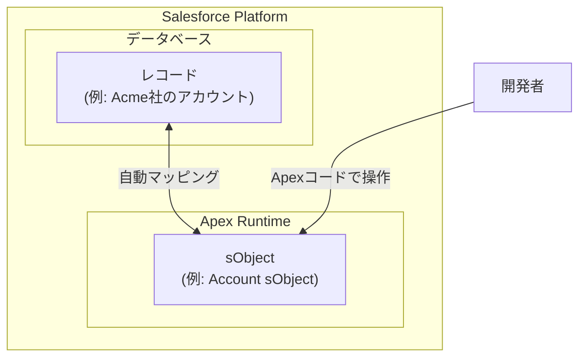
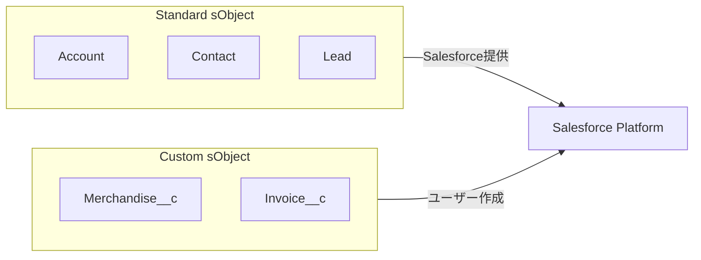
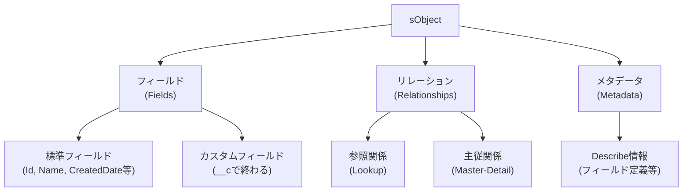

# Salesforce sObject

## What's this file?
> [!NOTE]
> **What**
>
> Salesforce sObjectとは何かについて記載しています。

## Conclusion (忙しいとき向け)
> [!IMPORTANT]
> **What** : Salesforce sObjectとは何か
>
> **Answer** : sObjectとは、Salesforceにおけるレコードを表現するデータ型であり、ApexコードからSalesforceデータベースのレコードを直接操作するための基本的な仕組みである。

## 目次

<details>
<summary>目次を開く</summary>

- [sObjectの概要](#sobjectの概要)
- [sObjectの種類](#sobjectの種類)
- [API名について](#api名について)
- [sObjectの構造](#sobjectの構造)
- [REST APIでの操作](#rest-apiでの操作)

</details>

## sObjectの概要

Salesforceにおいて、**sObject**（Salesforce Object）は、データベース内の1つのレコードを表現するデータ型である。

Apexは、JavaやC#などの他のプログラミング言語とは異なり、データベースと密接に統合されている。そのため、レコードにアクセスしたり、新しいレコードを挿入したりするためにデータベース接続を作成する必要がない。



## sObjectの種類

sObjectには大きく分けて2種類存在する。

### Standard sObject（標準オブジェクト）

Salesforceがあらかじめ用意している標準的なオブジェクト。ほとんどの企業で共通して必要とされる基本的なビジネスエンティティを構成する。

| オブジェクト | 説明 |
|-------------|------|
| Account | 取引先、企業、競合他社、パートナーなどを表す |
| Contact | リード、顧客、パートナー、従業員などの人物を表す |
| Lead | 潜在顧客を表す |
| Opportunity | 商談を表す |
| Case | 顧客からの問い合わせやサポートケースを表す |

### Custom sObject（カスタムオブジェクト）

組織独自のビジネス要件に合わせて作成するオブジェクト。API名の末尾には必ず `__c` が付く。



## API名について

Apexでは、sObjectやそのフィールドを参照する際に、ラベル名ではなく**API名**を使用する。

| 種類 | ラベル名 | API名 |
|------|---------|-------|
| 標準フィールド | Employees | NumberOfEmployees |
| カスタムオブジェクト | Merchandise | Merchandise__c |
| カスタムフィールド | Price | Price__c |

> [!TIP]
> カスタムオブジェクト・カスタムフィールドのAPI名には、必ず `__c` サフィックスが付与される。

## sObjectの構造

sObjectは以下の要素で構成される。



## REST APIでの操作

Salesforce REST APIでは、sObjectに対して以下の操作が可能である。

| リソース | 説明 | HTTPメソッド |
|---------|------|-------------|
| sObject Basic Information | レコードの作成 | POST |
| sObject Rows | レコードの取得・更新・削除 | GET, PATCH, DELETE |
| sObject Describe | オブジェクトのメタデータ取得 | GET |
| sObject Collections | 複数レコードの一括操作 | POST, PATCH, DELETE |

### エンドポイント例

```
# レコード取得
GET /services/data/vXX.0/sobjects/Account/{id}

# レコード作成
POST /services/data/vXX.0/sobjects/Account

# レコード更新
PATCH /services/data/vXX.0/sobjects/Account/{id}

# レコード削除
DELETE /services/data/vXX.0/sobjects/Account/{id}
```

## 関連

- [Work with sObjects in Apex - Trailhead](https://trailhead.salesforce.com/content/learn/modules/apex_database/apex_database_sobjects)
- [sObject Describe | REST API Developer Guide](https://developer.salesforce.com/docs/atlas.en-us.api_rest.meta/api_rest/resources_sobject_describe.htm)
- [sObject Basic Information | REST API Developer Guide](https://developer.salesforce.com/docs/atlas.en-us.api_rest.meta/api_rest/resources_sobject_basic_info.htm)
- [sObject Collections | REST API Developer Guide](https://developer.salesforce.com/docs/atlas.en-us.api_rest.meta/api_rest/resources_composite_sobjects_collections.htm)
