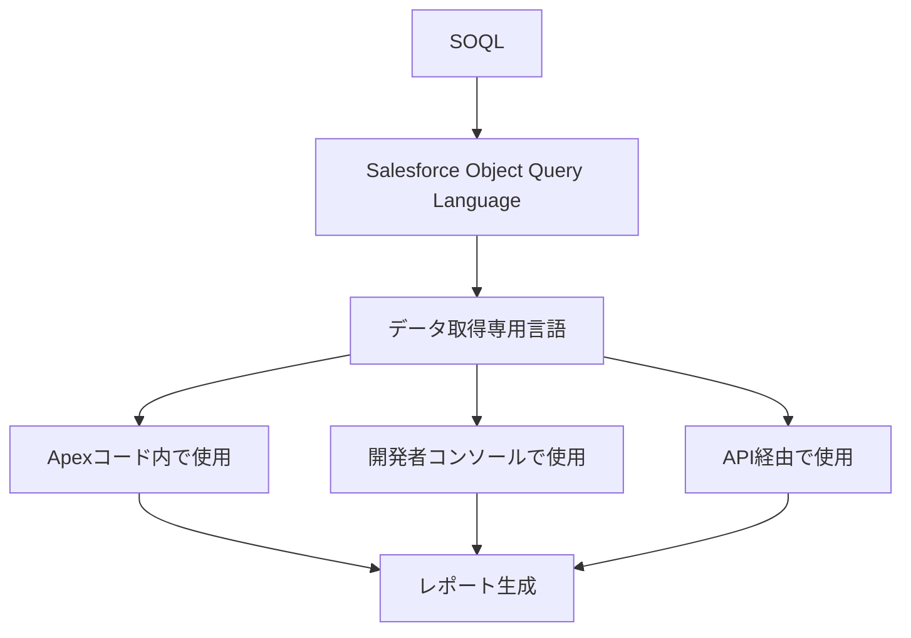
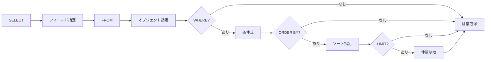
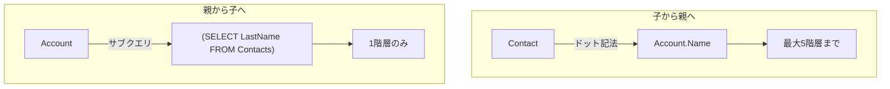
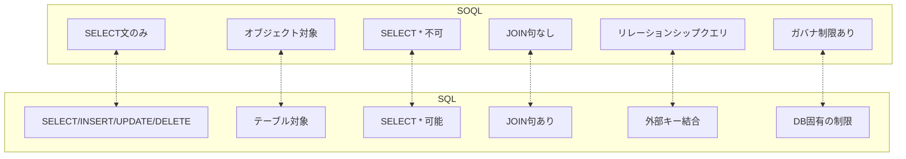

# Salesforce SOQL (Salesforce Object Query Language)

## What's this file?
> [!NOTE]
> **What**
>
> Salesforce SOQLとは何かについて記載しています。

## Conclusion (忙しいとき向け)
> [!IMPORTANT]
> **What** : Salesforce SOQLとは何か
>
> **Answer** : SOQL（Salesforce Object Query Language）とは、Salesforce組織のデータベースから特定の情報を検索・取得するために設計された専用クエリ言語です。SQLのSELECT文に似た構文を持ちますが、Salesforceのオブジェクト指向データモデルに最適化されています。

## 目次

<details>
<summary>目次を開く</summary>

- [SOQLの概要](#soqlの概要)
- [基本構文](#基本構文)
- [リレーションシップクエリ](#リレーションシップクエリ)
- [SQLとの違い](#sqlとの違い)
- [ガバナ制限](#ガバナ制限)
- [使用例](#使用例)

</details>

## SOQLの概要

SOQLは「Salesforce Object Query Language」の略で、「sock-el」または「soak-el」と発音されます。



### 主な特徴

| 特徴 | 説明 |
|------|------|
| クエリ専用 | SELECT文のみサポート（INSERT/UPDATE/DELETEは不可） |
| オブジェクト指向 | Salesforceオブジェクトを対象にクエリ |
| リレーションシップ対応 | 関連オブジェクト間のナビゲーションが可能 |
| ガバナ制限あり | マルチテナント環境のためリソース制限が存在 |

## 基本構文

### 必須句の構造

```soql
SELECT フィールド名1, フィールド名2
FROM オブジェクト名
WHERE 条件式
```

### 構文の流れ



### 利用可能な句

| 句 | 説明 | 例 |
|---|---|---|
| SELECT | 取得するフィールドを指定 | `SELECT Name, Email` |
| FROM | 対象オブジェクトを指定 | `FROM Contact` |
| WHERE | 条件を指定 | `WHERE Status = 'Active'` |
| ORDER BY | ソート順を指定 | `ORDER BY Name ASC` |
| LIMIT | 取得件数を制限 | `LIMIT 100` |
| OFFSET | スキップする件数を指定 | `OFFSET 10` |
| GROUP BY | グループ化 | `GROUP BY Industry` |
| HAVING | GROUP BYの結果をフィルタ | `HAVING COUNT(Id) > 5` |

> [!WARNING]
> **SELECT * は使用不可**
>
> SOQLでは`SELECT *`が使用できません。取得するフィールドを明示的に指定する必要があります。

## リレーションシップクエリ

SOQLの強力な機能として、リレーションシップをナビゲートできます。



### 子から親へのクエリ

```soql
SELECT Name, Account.Name, Account.Owner.Name
FROM Contact
```

### 親から子へのクエリ

```soql
SELECT Name, (SELECT LastName FROM Contacts)
FROM Account
```

## SQLとの違い



### 主要な違い

| 項目 | SOQL | SQL |
|------|------|-----|
| データ操作 | SELECT のみ | INSERT, UPDATE, DELETE も可能 |
| データ構造 | オブジェクト | テーブル |
| ワイルドカード | `%` | `*` |
| 引用符 | シングルクォート `'` のみ | ダブルクォートも可 |
| 結合方法 | リレーションシップクエリ | JOIN句 |

## ガバナ制限

Salesforceはマルチテナントプラットフォームのため、リソース使用に制限があります。

| 制限項目 | 値 |
|----------|-----|
| 単一クエリの返却レコード数 | 50,000件 |
| クエリ文字数制限 | 100,000文字 |
| トランザクションあたりのクエリ数 | 100回（同期） |
| Cursorクラス使用時の最大レコード数 | 50,000,000件 |

## 使用例

### 基本的なクエリ

```soql
-- 特定の名前のContactを取得
SELECT Name, Email FROM Contact WHERE FirstName = 'Stella'

-- ソートと件数制限
SELECT Name, Email FROM Contact ORDER BY Name ASC LIMIT 5
```

### 集計クエリ

```soql
-- 業種別のAccount数
SELECT COUNT(Id), Industry FROM Account GROUP BY Industry

-- ステータス別のCase数
SELECT Status, COUNT(Id) numCases FROM Case GROUP BY Status
```

### 通貨変換

```soql
SELECT Id, convertCurrency(Amount) FROM Opportunity
WHERE StageName = 'Negotiation/Review'
```

## 関連
- Salesforce Apex
- Salesforce DML（データ操作言語）
- Salesforce SOSL（Salesforce Object Search Language）
- Salesforce Developer Console
- Salesforce API
