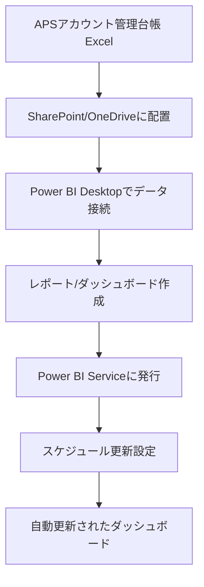

# Power BIでAPSアカウント管理台帳Excelを連携し管理を自動化する方法

## What's this file?

> [!NOTE]
> **How**
>
> どのように情シスのAPSアカウント管理台帳ExcelをPower BIで連携して管理を自動化するかについて記載しています。

## Conclusion (忙しいとき向け)

> [!IMPORTANT]
> **How** : どのように情シスのAPSアカウント管理台帳ExcelをPower BIで連携して管理を自動化するか
>
> **Answer** : SharePoint/OneDriveにExcelファイルを配置し、Power BIでデータソースとして接続。スケジュール更新を設定することで、手動作業なしにダッシュボードが自動更新される。

## 目次

目次を開く

- [全体フロー](#全体フロー)
- [Step 1: Excelファイルの準備](#step-1-excelファイルの準備)
- [Step 2: Power BIでのデータ接続](#step-2-power-biでのデータ接続)
- [Step 3: 自動更新の設定](#step-3-自動更新の設定)

## 全体フロー

## Step 1: Excelファイルの準備

### ファイル配置場所

| 配置場所 | メリット | デメリット |
|---------|---------|-----------|
| SharePoint Online | 組織での共有が容易 | Microsoft 365ライセンスが必要 |
| OneDrive for Business | 個人での管理が容易 | 共有設定が必要 |

### Excelファイルの構造化

- テーブル形式に変換
- ヘッダー行を1行目に配置
- 空白行・結合セルを排除
- データ型を統一

## Step 2: Power BIでのデータ接続

1. Power BI Desktop起動
2. 「データを取得」をクリック
3. SharePointフォルダーまたはWebを選択
4. 認証情報を入力
5. 対象Excelファイルを選択
6. テーブルを選択して読み込み

## Step 3: 自動更新の設定

1. Power BI Serviceにサインイン
2. 対象データセットの設定を開く
3. 「スケジュールされている更新」を選択
4. 更新頻度を設定（最大1日8回）
5. 資格情報を設定

| 更新頻度 | ユースケース |
|---------|-------------|
| 毎日1回 | 日次レポート確認 |
| 毎日2回 | 午前・午後でのモニタリング |

## 関連

- Power BI公式ドキュメント
- SharePoint Onlineとの連携ガイド
