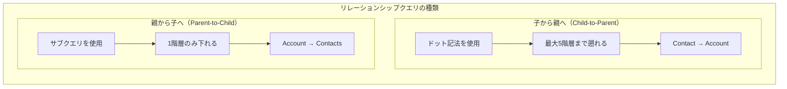
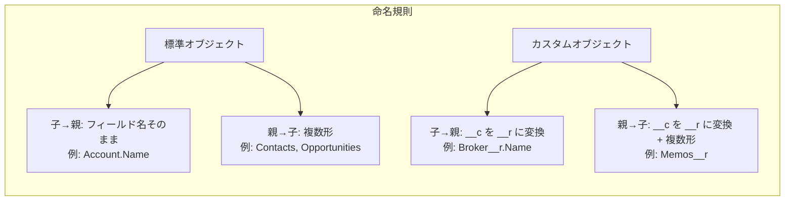

# Salesforce SOQLサブクエリとリレーションシップクエリとは

## What's this file?
> [!NOTE]
> **What**
>
> Salesforce SOQLサブクエリとリレーションシップクエリとは何かについて記載しています。

## Conclusion (忙しいとき向け)
> [!IMPORTANT]
> **What** : SOQLサブクエリとリレーションシップクエリとは何か
>
> **Answer** : オブジェクト間の親子関係を横断して、関連するレコードを1回のクエリで取得するためのSOQL構文。親→子（サブクエリ）と子→親（ドット記法）の2種類がある。

## 目次

<details>
<summary>目次を開く</summary>

- [Salesforce SOQLサブクエリとリレーションシップクエリとは](#salesforce-soqlサブクエリとリレーションシップクエリとは)
  - [What's this file?](#whats-this-file)
  - [Conclusion (忙しいとき向け)](#conclusion-忙しいとき向け)
  - [目次](#目次)
  - [概要](#概要)
  - [2種類のリレーションシップクエリ](#2種類のリレーションシップクエリ)
    - [子から親へのクエリ（Child-to-Parent）](#子から親へのクエリchild-to-parent)
    - [親から子へのクエリ（Parent-to-Child）](#親から子へのクエリparent-to-child)
  - [構文とルール](#構文とルール)
  - [実践例](#実践例)
  - [関連](#関連)

</details>

## 概要

SOQLリレーションシップクエリは、Salesforceオブジェクト間の親子関係を横断して、関連するデータを効率的に取得するためのクエリ手法です。

**一言で表すと：** 関連オブジェクトのデータを1回のクエリで取得する仕組み

### 詳細な定義

- 正式名称: SOQL Relationship Query / Subquery
- カテゴリ: Salesforce データ操作
- 用途: 関連レコードの効率的な取得

## 2種類のリレーションシップクエリ



### 子から親へのクエリ（Child-to-Parent）

子オブジェクトから親オブジェクトのフィールドにアクセスする際に使用します。

**特徴：**
- **ドット記法**を使用（例：`Account.Name`）
- **最大5階層**まで遡ることが可能
- カスタムオブジェクトは `__c` → `__r` に変換

**標準オブジェクトの例：**
```sql
SELECT Id, Name, Email, Account.Name, Account.Industry
FROM Contact
```

**カスタムオブジェクトの例：**
```sql
SELECT Address__c, Broker__r.Name, Broker__r.Email__c
FROM Property__c
```

### 親から子へのクエリ（Parent-to-Child）

親オブジェクトから子オブジェクトのレコードを取得する際に使用します。これが**サブクエリ**と呼ばれます。

**特徴：**
- **サブクエリ（ネストされたSELECT）**を使用
- **1階層のみ**下ることが可能（REST API経由では最大4階層）
- 子オブジェクト名は**複数形**を使用

**標準オブジェクトの例：**
```sql
SELECT Id, Name,
       (SELECT FirstName, LastName, Email FROM Contacts),
       (SELECT Name, StageName, Amount FROM Opportunities)
FROM Account
```

**カスタムオブジェクトの例：**
```sql
SELECT Id, Name,
       (SELECT Id, Title__c, Content__c FROM Memos__r)
FROM Contact
```

## 構文とルール



### サブクエリの制限事項

| 制限項目 | 説明 |
|---------|------|
| COUNT | サブクエリ内では使用不可 |
| FOR UPDATE | サブクエリ内では使用不可 |
| ORDER BY | サブクエリ内では使用不可 |
| LIMIT | サブクエリ内では使用不可 |
| セミ結合/アンチ結合 | WHERE句内で使用不可 |
| OR演算子 | サブクエリと組み合わせ不可 |

## 実践例

### 複合クエリの例

```sql
-- AccountとそのContacts、Opportunitiesを取得
SELECT Id, Name, Industry,
       (SELECT FirstName, LastName, Email
        FROM Contacts
        WHERE CreatedDate = THIS_YEAR),
       (SELECT Name, StageName, Amount
        FROM Opportunities
        WHERE StageName = 'Closed Won')
FROM Account
WHERE Industry IN ('Technology', 'Manufacturing')
ORDER BY Name
LIMIT 100
```

### 複数階層のクエリ（REST API経由）

```sql
-- 4階層までのネストされたクエリ（Summer '23以降）
SELECT Id, Name,
       (SELECT Id, Name,
               (SELECT Id, Name,
                       (SELECT Id, OrderNumber FROM WorkOrders)
               FROM Assets)
       FROM Contacts)
FROM Account
```

## 関連

### 参考資料
- [Salesforce公式 - Relationship Queries](https://developer.salesforce.com/docs/atlas.en-us.soql_sosl.meta/soql_sosl/sforce_api_calls_soql_relationships.htm)
- [Salesforce公式 - SOQL SELECT Syntax](https://developer.salesforce.com/docs/atlas.en-us.soql_sosl.meta/soql_sosl/sforce_api_calls_soql_select.htm)
- [Trailhead - Queries for Object Relationships](https://trailhead.salesforce.com/content/learn/modules/soql-for-admins/create-relationship-queries-with-standard-objects)
