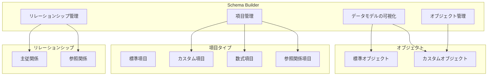
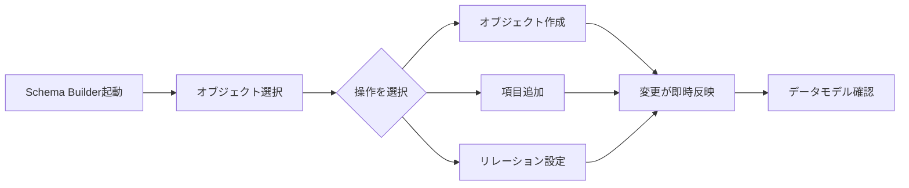

# Salesforce Schema Builder

## What's this file?
> [!NOTE]
> **What**
>
> Salesforce Schema Builderとは何かについて記載しています。

## Conclusion (忙しいとき向け)
> [!IMPORTANT]
> **What** : Salesforce Schema Builderとは何か
>
> **Answer** : Schema Builderは、Salesforceのデータモデルを視覚的に表示・編集できるツールで、ドラッグ＆ドロップでオブジェクトや項目、リレーションシップを管理できるGUIベースのデータモデリングツールである。

## 目次

目次を開く

- [概要](#概要)
- [主な機能](#主な機能)
- [リレーションシップの可視化](#リレーションシップの可視化)
- [Schema Builderのワークフロー](#schema-builderのワークフロー)
- [利用可能な操作](#利用可能な操作)
- [メリット](#メリット)
- [制限事項](#制限事項)

## 概要

Schema Builderは、Salesforce組織のデータモデルをグラフィカルに可視化・編集するためのツールである。管理者、開発者、アーキテクトがカスタムオブジェクト、リレーションシップ、項目を定義・管理することができる。

## 主な機能

### 1. ビジュアルデータモデリング
- 全ての標準オブジェクトとカスタムオブジェクトを一つのダイアグラムで表示
- オブジェクト間のリレーションシップを視覚的に確認可能

### 2. ドラッグ＆ドロップインターフェース
- コードを書かずにオブジェクト、項目、リレーションシップを作成
- 直感的な操作でデータモデルを構築

### 3. リアルタイム更新
- Schema Builderで行った変更は即座にSalesforce組織に反映
- 変更をリアルタイムでデプロイ可能

### 4. 項目レベルセキュリティ
- カスタム項目ごとに表示権限、編集権限、読み取り専用の設定が可能
- データガバナンスポリシーへの準拠を確保

## リレーションシップの可視化

Schema Builderでは、リレーションシップの種類を色で区別できる：

| 線の色 | リレーションシップ | 説明 |
|--------|-------------------|------|
| 赤線 | 主従関係 (Master-Detail) | 親レコード削除時に子レコードも削除される |
| 青線 | 参照関係 (Lookup) | 親レコード削除時に子レコードは残る |

## Schema Builderのワークフロー

## 利用可能な操作

### オブジェクト操作
- カスタムオブジェクトの作成・削除
- 標準オブジェクトの閲覧（編集は不可）

### 項目操作
- カスタム項目の作成・編集・削除
- 数式項目の作成
- 参照関係項目の作成

### 表示オプション
- Elements: 全ての項目、オブジェクト、接続をドロップダウンで表示
- Objects: カスタム、システム、標準オブジェクトを表示
- View Options: 要素名の表示、接続の非表示、凡例の非表示フィルター
- Auto-Layout: オブジェクトを自動的にレイアウト

## メリット

1. **時間の節約**: データモデルの設計・修正プロセスを簡素化
2. **コラボレーション向上**: ステークホルダーと共有できる明確な視覚的表現
3. **エラー削減**: 即時フィードバックにより項目やリレーションシップ作成の精度向上
4. **理解の促進**: 新しいチームメンバーがデータモデルを素早く理解可能

## 制限事項

- 標準オブジェクトの修正は不可（Salesforceプラットフォーム構造の一部のため）
- 現在のビューをダウンロード・エクスポートする機能は未搭載

## アクセス要件

- 「アプリケーションのカスタマイズ」権限を持つユーザーが利用可能
- Salesforce ClassicおよびLightning Experienceの両方で利用可能

## 関連
- [Salesforce Trailhead: Schema Builder Data Modeling](https://trailhead.salesforce.com/content/learn/modules/data_modeling/schema_builder)
- [Salesforce Ben: 5 Ways to Use Salesforce Schema Builder](https://www.salesforceben.com/5-ways-to-use-salesforce-schema-builder-for-data-modeling/)
- [Perficient: Schema Builder in Salesforce - A Comprehensive Guide](https://blogs.perficient.com/2024/12/19/schema-builder-in-salesforce-a-comprehensive-guide/)
